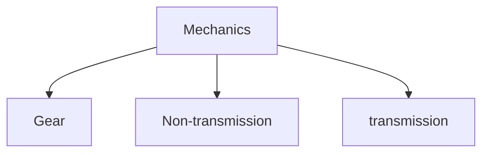

# Mechanical Principle

## Gear
1. [Gear](Mechanical_Principle/Gear/gear/Gear.md)
2. [Gear Train](Mechanical_Principle/Gear/Gear_Train/Gear_Train.md)
3. [Involute equation](Mechanical_Principle/Gear/Involute_equation/Involute_equation.md)
4. [Involute Polar coordinates](Mechanical_Principle/Gear/Involute_Polar_coordinates/Involute_Polar_coordinates.md)
5. [Gear geometry](Mechanical_Principle/Gear/Gear_geometry/Gear_geometry.md)
6. [Special Angle](Mechanical_Principle/Gear/Special_Angle/Special_Angle.md)

## transmission
1. [Sprocket](Mechanical_Principle/transmission/Sprocket/Sprocket.md)
2. [Thread](Mechanical_Principle/transmission/Thread/Thread.md)
3. [pulley](Mechanical_Principle/transmission/Pulley/pulley.md)
4. [Belt pulley](Mechanical_Principle/transmission/Belt_pulley/Belt_pulley.md)
5. [Cam](Mechanical_Principle/transmission/Cam/Cam.md)
6. [Friction wheel](Mechanical_Principle/transmission/Friction_wheel/Friction_wheel.md)

## Non-transmission
1. [bearings](Mechanical_Principle/Non-transmission/bearings/bearings.md)
2. [Keys and Pins](Mechanical_Principle/Non-transmission/Keys_and_Pins/Keys_and_Pins.md)
3. [Spring](Mechanical_Principle/Non-transmission/Spring/Spring.md)
4. [linkage](Mechanical_Principle/Non-transmission/linkage/linkage.md)
5. [Periodic motion mechanism](Mechanical_Principle/Non-transmission/Periodic_motion_mechanism/Periodic_motion_mechanism.md)
6. [brakes](Mechanical_Principle/Non-transmission/Brakes/brakes.md)

## more
[Machining](Mechanical_Principle/more/Machining)
