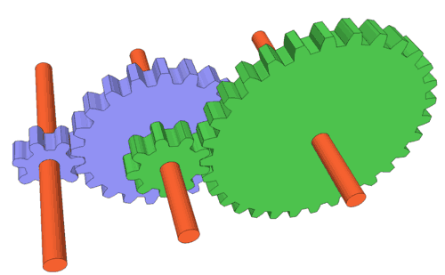

# Gear Train

## Type of mechanical transmission element

## Speed Ratio

**Simple Gear Train**

>https://grabcad.com/library/simple-gear-train-3

$$T_AN_A = T_BN_B$$

$$\frac{T_A}{T_B} = \frac{N_B}{N_A}$$

* Increase speed : $\frac{N_{out}}{N_{in}}>1$
* Constant speed : $\frac{N_{out}}{N_{in}}>1$
* Reduce speed : $\frac{N_{out}}{N_{in}}>1$

$$\tau = r\times F$$

$$F_A = F_B$$

$$\frac{T_A}{T_B} = \frac{\tau_A}{\tau_B} = \frac{N_B}{N_A}$$

**Compound Gear Train**

>https://woodgears.ca/gear/ratio.html

$$T_AN_A = T_BN_B$$

$$T_CN_C = T_DN_D$$

$$N_B = N_C$$

$$\frac{T_A}{T_B} = \frac{N_B}{N_A}$$

$$\frac{T_C}{T_D} = \frac{N_D}{N_C}$$

$$\frac{T_A}{T_B}\frac{T_C}{T_D} = \frac{N_B}{N_A}\frac{N_D}{N_C} = \frac{N_D}{N_A}$$

* Worm : Number of Threads >> $T$

**Epicyclic Gear Train**

>https://ww2.mathworks.cn/help/sdl/ref/planetarygear.html

$$\frac{N_A-N_m}{N_B-N_m} = \frac{T_B}{T_A}$$

**Compound Epicyclic Gear Train**

>https://ww2.mathworks.cn/help/sdl/ref/compoundplanetarygear.html

$$\frac{N_A-N_m}{N_Z-N_m} = \frac{T_BT_DT_F...T_Z}{T_AT_CT_E...T_Y}$$
