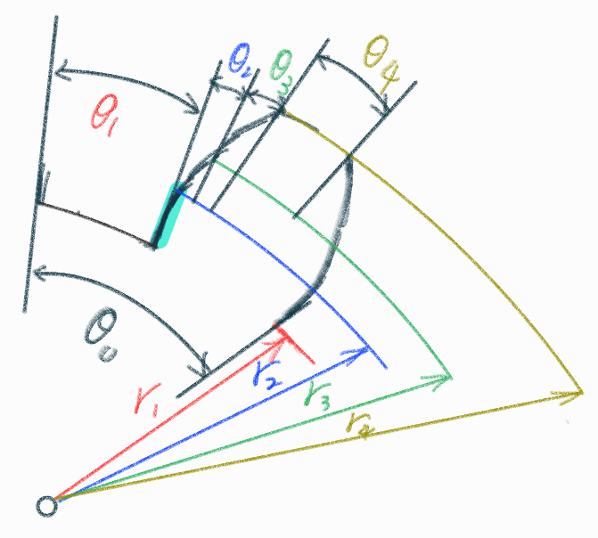
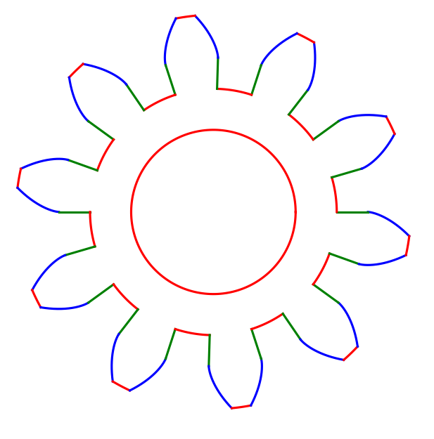
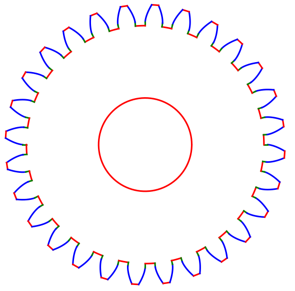

# Gear geometry
## Parameter
<div style="text-align: center;">

</div>

* $\theta_0$ : circular pitch Angle
* $\theta_1$ : Bottom Angle
* $\theta_2$ : Involute Angle(base circle to pitch circle)
* $\theta_3$ : Involute Angle(pitch circle to addendum circle)
* $\theta_4$ : Top Angle
* $r_1$ : root circle radius
* $r_2$ : base circle radius
* $r_3$ : pitch circle radius
* $r_4$ : tip circle radius

## Geometric relations

$$\theta_0 = \frac{2\pi}{T} = \frac{360^o}{T}\qquad-(0)$$

$$\theta_1+2\theta_2+2\theta_3+\theta_4\qquad-(1)$$

$$\theta_1+2\theta_2 = \theta_4+2\theta_3\qquad-(2)$$

* by Involute
$\theta = \tan^{-1}(\frac{1+\phi\tan \phi}{\tan \phi-\phi})$
$\phi = (\sqrt{(\frac Rr)^2-1})$

$$\theta = \tan^{-1}(\frac{1+(\sqrt{(\frac Rr)^2-1})\tan(\sqrt{(\frac Rr)^2-1})}{\tan(\sqrt{(\frac Rr)^2-1})-(\sqrt{(\frac Rr)^2-1})})$$

$$\theta = \tan^{-1}(\frac{1+(\sqrt{(\frac Rr)^2-1})\tan(\sqrt{(\frac Rr)^2-1})}{\tan(\sqrt{(\frac Rr)^2-1})-(\sqrt{(\frac Rr)^2-1})})\qquad-(3)$$

$$r_2,r_3,r_4\Longrightarrow(3)$$

$$\theta_2 = \tan^{-1}(\frac{1+(\sqrt{(\frac {r_3}{r_2})^2-1})\tan(\sqrt{(\frac {r_3}{r_2})^2-1})}{\tan(\sqrt{(\frac {r_3}{r_2})^2-1})-(\sqrt{(\frac {r_3}{r_2})^2-1})})\qquad-(4)$$

$$\theta_2+\theta_3 = \tan^{-1}(\frac{1+(\sqrt{(\frac {r_4}{r_2})^2-1})\tan(\sqrt{(\frac {r_4}{r_2})^2-1})}{\tan(\sqrt{(\frac {r_4}{r_2})^2-1})-(\sqrt{(\frac {r_4}{r_2})^2-1})})\qquad-(5)$$

$$\frac{\theta_0}{2} = \theta_1+2\theta_2 = \theta_4+2\theta_3$$

$$(0)\Longrightarrow\frac{2\pi}{2T} = \frac\pi T = \theta_    1+2\theta_2 = \theta_4+2\theta_3\qquad-(6)$$

$$(4)\Longrightarrow(6)\qquad2(4)+\theta_1=\frac{\pi}{T}\qquad-(7)$$

$$(5)\Longrightarrow(6)\qquad2(5)+\theta_4 = \frac\pi T\qquad-(8)$$

$$\theta_1 = \frac\pi T-2(4)\qquad-(7)$$

$$\theta_4 = \frac\pi T-2(5)-(4)\qquad-(8)$$

$$\theta_2 = (4)$$

$$\theta_3 = (5)-(4)\qquad-(9)$$

* module
$M = \frac DT$
$D = 2r_3$

$$M = \frac{r_3*2}{T}$$

$$r_3 = TM/2\qquad-(10)$$

$$r_2 = \cos(\frac\pi9)r_3 = \cos(\frac\pi9)MT/2\qquad-(11)$$

$$r_1 = (T-2.5)M/2\qquad-(12)$$

$$r_4 = (T+2)M/2\qquad-(13)$$

$$(10),(11)\Longrightarrow(4)\qquad-(14)$$

$$(10),(11),(13)\Longrightarrow(7)\qquad-(15)$$

$$(10),(11)\Longrightarrow(8)\qquad-(16)$$

$$(10),(11),(13)\Longrightarrow(9)\qquad-(17)$$

$$\theta_i = \theta_i+\theta,\qquad S = r\theta\qquad-(18)$$

Topland : $R = r_4,\theta_i>\theta>\theta_i+\theta_4\qquad-(19)$
Bottomland : $R = r_1,\theta_i>\theta>\theta_i+\theta_1\qquad-(20)$
straight line : $r_2>R>r_3,\theta = (\theta_i+\pi M)\qquad-(21)$
Involute Left : $R = \theta\Longrightarrow(6),\theta_i>\theta = \theta_i+\theta_2+\theta_3\qquad-(22)$
Involute right : $R = -\theta\Longrightarrow(6),\theta_i>\theta = \theta_i+\theta_2+\theta_3\qquad-(23)$

$$(18)\Longrightarrow(20)\to(21)\to(22)\to(19)\to(23)\to(21)\to(20)\to...$$

## Code

```python
import matplotlib.pyplot as plt # Import plotting module
import math # Import math module
import numpy as np # Import numerical module

#===================================================================(Compute radius and angle from number of teeth and module)
def involutetheta (R, r): # Involute function
    phi = ((R/r)**2 - 1)**(1/2)
    theta = np.arctan((np.tan(phi) - phi) / (1 + phi * np.tan(phi)))
    return theta

T = int(input('T:')) # Number of teeth
M = float(input('M:')) # Module
rh = float(input('D:')) # Bore diameter

theta0 = 2 * np.pi / T # Circular pitch
halftheta0 = theta0 / 2 # Tooth thickness or tooth space

r1 = (T - 2.5) * M # Root circle radius
r2 = T * M * np.cos(np.pi / 9) # Base circle radius
r3 = T * M # Pitch circle radius
r4 = (T + 2) * M # Addendum circle radius

theta2 = involutetheta(r3, r2) # Involute angle: base to pitch circle
theta3 = involutetheta(r4, r2) - theta2 # Involute angle: pitch to tip circle
theta1 = halftheta0 - 2 * theta2 # Bottom flank angle
theta4 = halftheta0 - 2 * theta3 # Top flank angle

print('teeth =', T)
print('Modulus =', M)
print('pitch =', theta0)
print('tooth space =', halftheta0)
print('tooth width =', halftheta0)
print('root diameter =', r1)
print('basic diameter =', r2)
print('pitch diameter =', r3)
print('tip diameter =', r4)
print('radius at tooth tip =', 0.236 * M)

N = r4 # View limit

#===================================================================(Define polar gear tooth profile drawing functions)

# Left involute flank
def draw_involute_1(i):
    Rinvolute1 = np.linspace(r4, r1, 200)
    if r2 > r1:
        Rinvolute1 = np.linspace(r4, r2, 200)
    thetainvolute1 = -involutetheta(Rinvolute1, r2)
    plt.polar(thetainvolute1 + theta0 * i, Rinvolute1, N, color="blue")

# Radial line from root to base circle (left side)
def draw_line_1(i):
    if r2 > r1:
        L = np.linspace(r2, r1, 2)
        theta = np.zeros_like(L)
        plt.polar(theta + theta0 * i, L, N, color="green")

# Root fillet (bottom)
def draw_bottomland(i):
    thetabottomland = np.linspace(0, theta1, 50)
    R = np.full_like(thetabottomland, r1)
    plt.polar(thetabottomland + theta0 * i, R, N, color="red")

# Radial line from root to base circle (right side)
def draw_line_2(i):
    if r2 > r1:
        L = np.linspace(r2, r1, 2)
        theta = np.full_like(L, theta1)
        plt.polar(theta + theta0 * i, L, N, color="green")

# Right involute flank
def draw_involute_2(i):
    Rinvolute2 = np.linspace(r1, r4, 200)
    if r2 > r1:
        Rinvolute2 = np.linspace(r2, r4, 200)
    thetainvolute2 = involutetheta(Rinvolute2, r2) + theta1
    plt.polar(thetainvolute2 + theta0 * i, Rinvolute2, N, color="blue")

# Top land (tip arc)
def draw_topland(i):
    thetatopland = np.linspace(theta1 + theta2 + theta3, theta1 + theta2 + theta3 + theta4, 50)
    R = np.full_like(thetatopland, r4)
    plt.polar(thetatopland + theta0 * i, R, N, color="red")

# Draw shaft hole
def draw_hole(r):
    thetahole = np.linspace(0, 2 * np.pi, 200)
    rhole = np.full_like(thetahole, r)
    plt.polar(thetahole, rhole, N, color="red")

#===================================================================(Generate plot)
print('detail:', end='')
print(T, M, theta0, halftheta0, halftheta0, r1, r2, r3, r4, theta1, theta2, theta3, theta4, 0.236 * M, sep=",")

fig = plt.figure(linewidth=1, figsize=(5, 5))
plt.subplot(polar=True)

for i in range(T):
    draw_involute_1(i)
    draw_line_1(i)
    draw_bottomland(i)
    draw_line_2(i)
    draw_involute_2(i)
    draw_topland(i)

draw_hole(rh)

plt.axis('off')
plt.show()
```

## Generate graphics

<div style="text-align: center;">



</div>
