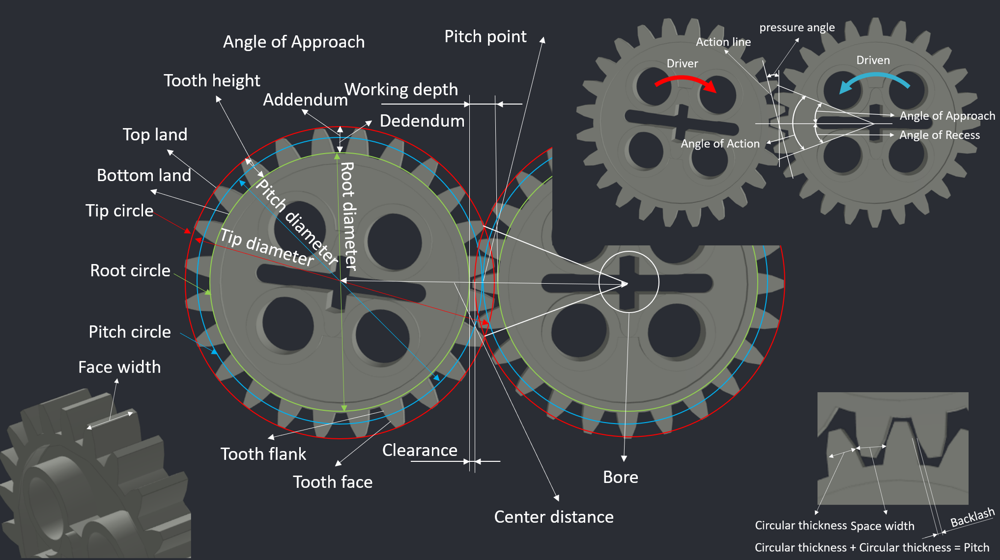
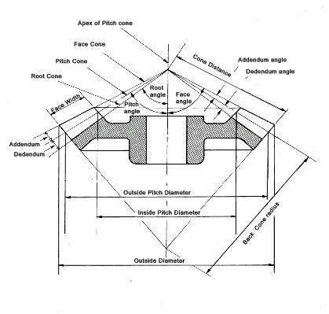
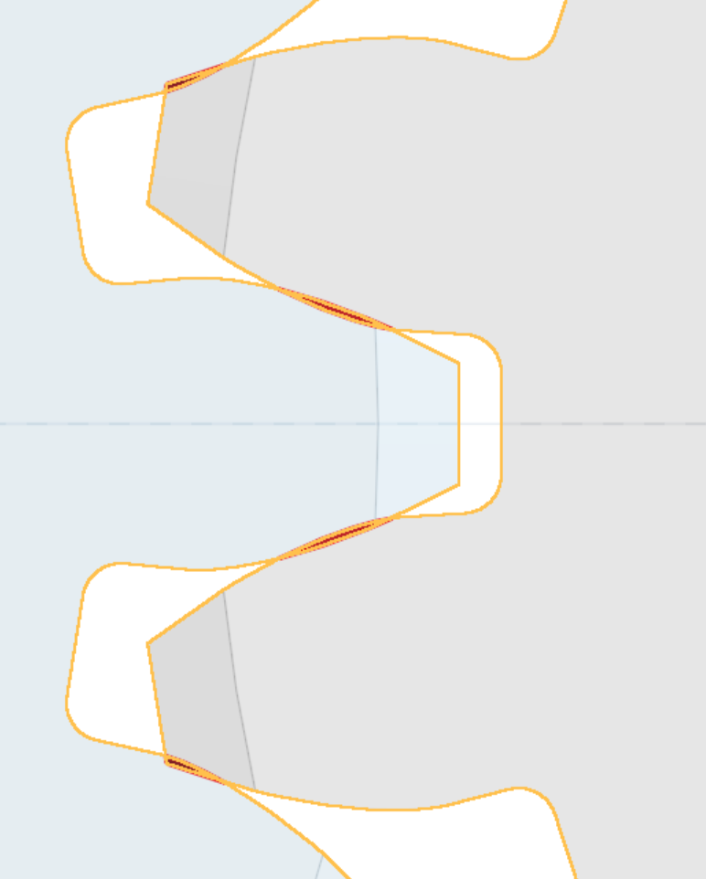
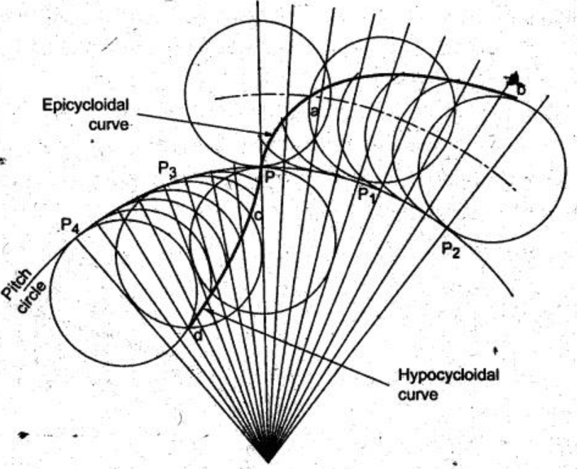

# gear

## Gear parts

## Gear parameters

* Module : $M$
* Pitch diameter : $D$
* Teeth : $T$
* Diametral Pitch : $DP$
* Pitch : $p$

$$M = \frac{D}{T}$$

$$DP = \frac TD$$

$$p = (\pi D)/T = \pi M$$

$$p\times DP = \pi$$

## Gear contact

* Arc of action : $S$

$$S = r\phi$$

$$\text{contact} = \frac{r\phi}{p}>1.4$$

## Standard involute spur gear geometry and calculation formula

|     Gear parts      |             Formula              |
|:-------------------:|:--------------------------------:|
|   Pitch diameter    |            $D_p = TM$            |
|    Pitch radius     |           $R_p = TM/2$           |
| Pitch circumference |          $C_p = TM\pi$           |
|    Tip diameter     |          $D_t = (T+2)M$          |
|     Tip radius      |         $R_t = (T+2)M/2$         |
|  Tip circumference  |        $C_t = (T+2)M\pi$         |
|    Root diameter    |         $D_r = (T-2.5)M$         |
|     Root radius     |        $R_r = (T-2.5)M/2$        |
| Root circumference  |       $C_r = (T-2.5)M\pi$        |
|    Base diameter    |  $D_b = \cos(\frac{\pi}{9})TM$   |
|     Base radius     | $R_b = \cos(\frac{\pi}{9})TM/2$  |
| Base circumference  | $C_b = \cos(\frac{\pi}{9})TM\pi$ |
|      Addendum       |        $Add = 1\times M$         |
|      Dedendum       |       $Ded = 1.25\times M$       |
|    Tooth height     |        $h = 2.25\times M$        |
|      Clearance      |        $c = 0.25\times M$        |
|    Working depth    |           $2\times M$            |
|        Pitch        |             $\pi M$              |
| Circular thickness  |            $\pi M/2$             |
|     Space width     |            $\pi M/2$             |
|    Fillet radius    |      $R_f = 0.236\times M$       |
|   Center distance   |       $cd = M(T_A+T_B)/2$        |
|   Diametral Pitch   |          $DP = 25.4/M$           |

## Bevel gear parts

>https://roymech.org/

## Transmission characteristics of gear

* Tangential speed is equal

$$v_A = v_B$$

$$S = \frac{D_A\phi_A}{2} = \frac{D_B\phi_B}{2}$$

$$\frac{\phi_B}{\phi_A} = \frac{N_A}{N_B} = \frac{\omega_A}{\omega_B} = \frac{D_A}{D_B} = \frac{R_A}{R_B} = \frac{T_A}{T_B}$$

## Involute gear

> Two involute gears, the left driving the right: Blue arrows show the contact forces between them downward force applied by the left gear and upward resistance by the right gear. The force line (or line of action) runs along the long leg of dashed blue line which is a tangent common to both base circles. The involutes here are traced out in converse fashion: points of contact move along the stationary force-vector "string" as if it was being unwound from the left rotating base circle, and wound onto the right rotating base circle. In this situation, there is no force, and so no contact needed, along the opposite [lower left to upper right] common tangent (not shown). In other words, if the teeth were slightly narrower while everything else remained the same there would be a gap above each tooth on the left gear, because downward force is being applied by it.
>https://en.wikipedia.org/wiki/Involute_gear

Top land : **Red**
Involute : **Blue**
Radial Line : **green**
Bottom land : **yellow**

## Gear mesh interference

>Gear interference is the act of when the involute portion of one tooth contacts the mating gear tooth, the non-involute section (below the base circle). This causes a mechanical wear condition, hence the term, interference.
>https://covalomotion.com/gear-mesh-interference/

## Gear Involute Interference Formulas

* Pinion number of teeth : $N_P$
* Gear number of teeth : $N_G$
* Depth of teeth : $k$
* Pressure angle : $\phi$
* Gear ratio : $m$

**Idler gear**

$$N_p = \frac{2k}{3\sin^2\phi}(1+\sqrt{1+3\sin^2\phi})$$
**Non-idler gear**
$$N_P = \frac{2k}{(1+2m)\sin^2\phi}(m+\sqrt{m^2+(1+2m)\
sin^2\phi})$$
**Not incorporating the gear ratio**
$$N_G = \frac{N_p^2\sin^2\phi-4k^2}{4k-2N_p\sin^2\phi}$$

**Minimum number of teeth**

$$N_P = \frac{2k}{\sin^2\phi}$$

## Eliminate interference

* Reduce tip circle
* Reduce tip extension
* Increase pressure angle
* Increase center distance
* Increase Side reduction
* Use cycloidal gear

## Cycloidal gear

> https://mech.poriyaan.in/topic/conjugate-profiles-31896/#google_vignette

* Epicycloid : $D_E$
* Hypocycloid : $D_H$

$$D_H\leq D/2$$

$$D_{E1} = D_{H2}$$

$$D_{E2} = D_{H1}$$
