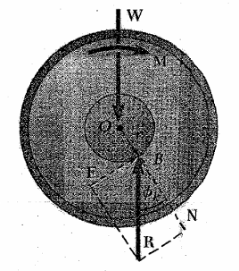

# Bearings

## Friction

### Sliding friction

$$f_s = \mu_kN$$

### Rolling friction

* rolling resistance constant : $C_{rr}$
$$f_r = C_{rr}N$$
* Surface subsidence : $Z$
* Roller diameter : $d$
$$C_{rr} = \sqrt{Z/d}$$

## Axle friection (journal bearings)

$$\sum F_y = 0$$

$$N = W$$

$$\sum M = 0$$

$$M = Nd$$

* offset position : $d$

## Disk friction (thrust bearing)

$$\Delta N = (F/A)\Delta A$$

$$= (F/\pi(R^2_1-R^2_2))\Delta A$$

$$\Delta f = \mu_k\Delta N$$

$$\Delta M = r\Delta f = r\mu_kF\Delta A/\pi(R^2_1-R^2_2)$$

$$M = \int dM = \frac{\mu_kF}{\pi(R^2_1-R^2_2)}\int dA$$

$$= \frac{\mu_kF}{\pi(R^2_1-R^2_2)}\int_0^{2\pi}\int_{R_1}^{R_2r}r^2\ dr\ d\theta$$

$$= \frac{\mu_kF}{\pi(R^2_1-R^2_2)}\int_0^{2\pi}1/3(R_1^3-R_2^3)\ d\theta$$

$$\frac{2\mu_kF(R^3_1-R^3_2)}{3\pi(R^2_1-R^2_2)}$$

if $R_2 = 0$ and $R_2 = R$
$$M = 2/3\mu_kFR$$

$$M_{max} = 2/3\mu_sFR$$
