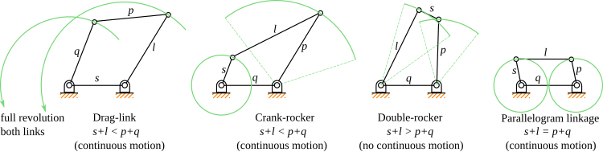

# Linkage

## Four-bar linkage

## Quick return mechanism

$$t_\text{total} = t_\text{in}+t_\text{out}$$

$$t_\text{in} =t_\text{total}\cdot\frac\theta\pi$$

$$t_\text{out} = t_\text{total}(1-\frac\theta\pi)$$

## Degrees of freedom

* Number of Pairs : $P$
* Number of Linkage : $L$
**fixed**
$$P=  \frac32L-2$$
**Single degree of freedom**
$$P>\frac32L-2$$
**Multiple degrees of freedom**
$$P<\frac32L-2$$