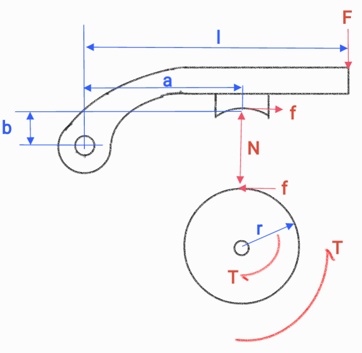
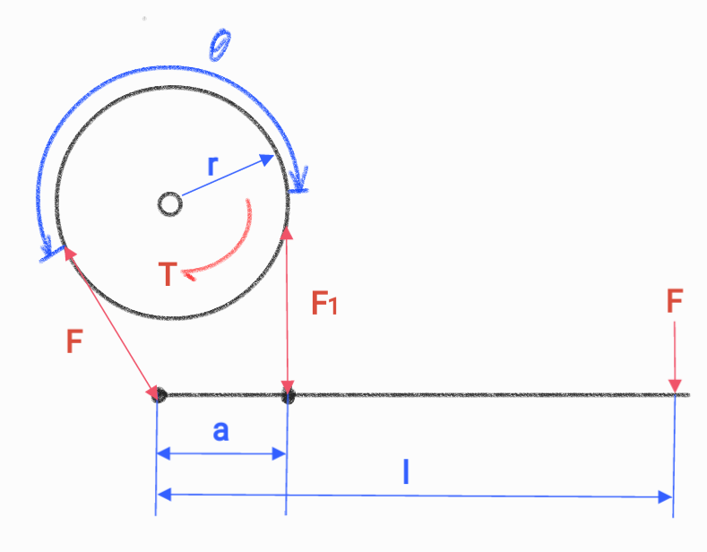
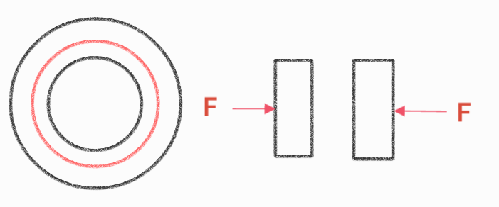

# Brakes

A brake converts mechanical energy into heat through friction. The equations relate applied force, contact geometry, braking torque, and the heat that must be dissipated.

## Block brake

$$\tau = fr = \mu Nr$$

$$\sum M_o = 0\qquad Na-fb-Fl = 0$$

$$\frac{\tau}{\mu r}a-\frac{\tau}{r}b-Fl = 0$$

$$\boxed{F = \frac{\tau(a-\mu b)}{\mu rl}}$$

**reverse**

$$\boxed{F = \frac{\tau(a-\mu b)}{\mu rl}}$$

* if $a-\mu b<0$, self lock

## Band brake

$$\frac{F_1}{F_2} = e^{\mu\theta}$$

$$\tau = (F_1-F_2)r$$

$$F_1 = \frac{\tau e^{\mu\theta}}{F(e^{\mu\theta}-1)}$$

$$F_2 = \frac{\tau}{r(e^{\mu\theta}-1)}$$

$$\sum M_o = 0\qquad F_2a-Fl = 0$$

$$\frac T{r(e^{\mu\theta}-1)}a-Fl = 0$$

$$\boxed{F = \frac{Ta}{rl(e^{\mu\theta}-1)}}$$

**reverse**

$$\boxed{F = \frac{Tae^{\mu\theta}}{rl(e^{\mu\theta}-1)}}$$

## Disc brake

$$D_m = \frac{D_o+D_i}{2}$$

$$\tau = f\frac{D_m}2 = \mu F\frac{D_m}2$$

$$\boxed{F = \frac{2\tau}{\mu D_m}}$$

## Brake cooling

$$W = fS = \mu FS$$

$$K = \frac12mv^2$$

## Braking power

$$\sigma = \frac FA$$

$$F = \sigma A$$

$$f = \mu F = \mu\sigma A$$

$$P = fv = \mu\sigma Av$$
