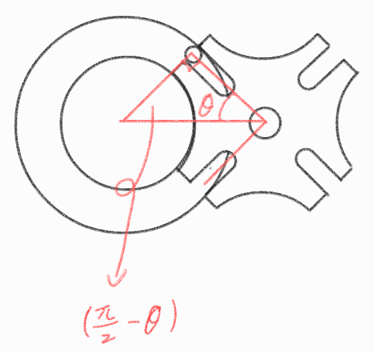

# Periodic motion mechanism

Intermittent mechanisms alternate between motion and dwell. The relationships below describe how gear engagement and Geneva-drive geometry set the timing of each cycle.

## Periodic motion gear

* Time : $t$
* Teeth : $T$

$$t_A\frac{T_B}{T_A} = t_B$$

## Geneva drive

>https://static.sdcpublications.com/multimedia/978-1-58503-767-4/files/krb/krb_gen_page3.htm

* Number of separators : $N > 4$

### Transmission angle

* transmission angle : $\theta_\text{on}$
* Non-transmission angle : $\theta_\text{off}$

$$\frac{2\pi}{2N} = \theta$$

$$\theta_\text{on} = 2(\frac\pi2-\theta) = \pi-\frac{2\pi}N = \pi(1-\frac2N)$$

$$\theta_\text{off} = 2\pi-\pi(1-\frac2N)$$

$$= \pi(2-(1-\frac2N)) =\pi(1+\frac2N)$$

### Transmission time

* transmission time : $t_\text{on}$
* Non-transmission time : $t_\text{off}$

$$t_\text{on} : \theta_\text{off} = \pi(1-\frac2N) : \pi(1+\frac2N)$$

$$\omega = \frac t{2\pi}$$

$$\boxed{t_\text{on} = \frac t{2\pi}(\pi(1-\frac2N)) = \frac t2-\frac tN}$$

$$\boxed{t_\text{off} = \frac t{2\pi}(\pi(1+\frac2N)) = \frac t2+\frac tN}$$

