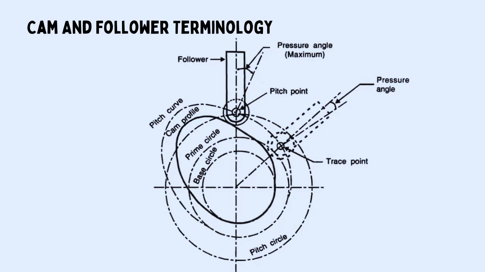
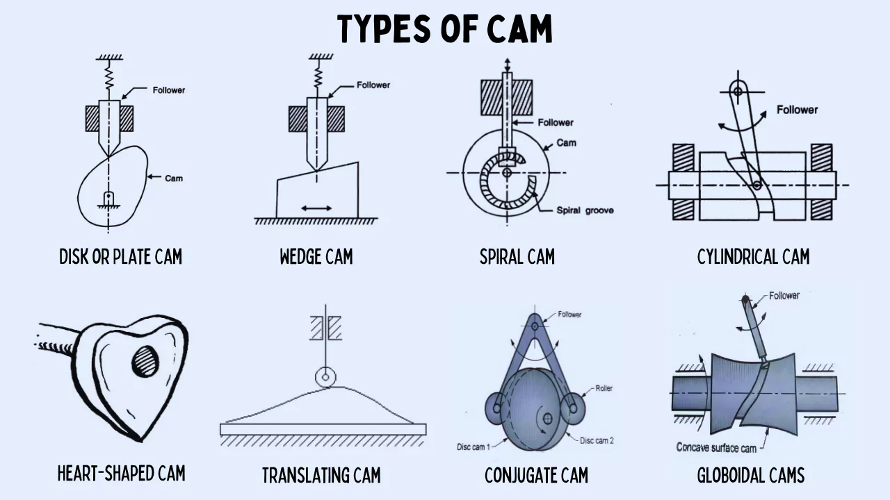
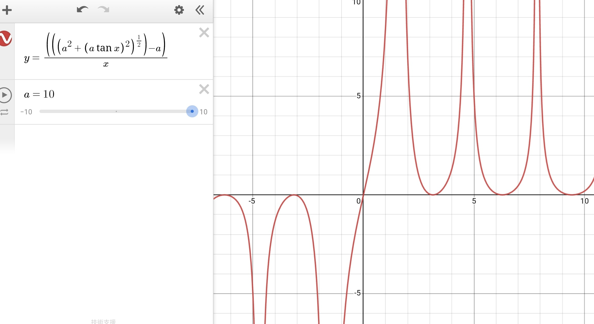

# Cam and follower

>https://www.theengineeringchoice.com/

## Position Velocity Acceleration

$$S = r\theta$$

$$v = \frac{dS}{dt} = \omega\frac{dr}{dt}$$

$$\frac{d\theta}{dt} = \omega = \text{constant}$$

$$a = \frac{dv}{dt} = \omega\frac{d^2r}{dt^2}$$

## Tilt angle relation

$$v = \frac{s}{t}$$

$$\Delta S = r_\max-r$$

$$\Delta S= \sqrt{r^2+(r\tan\theta_\max)^2}-r$$

$$r(\theta)= \sqrt{r^2+(r\tan\theta33)^2}-r$$

* $\omega$ is a constant

$$v(\theta) = \frac{\sqrt{r^2(r\tan\theta)^2}-r}{\omega}$$

