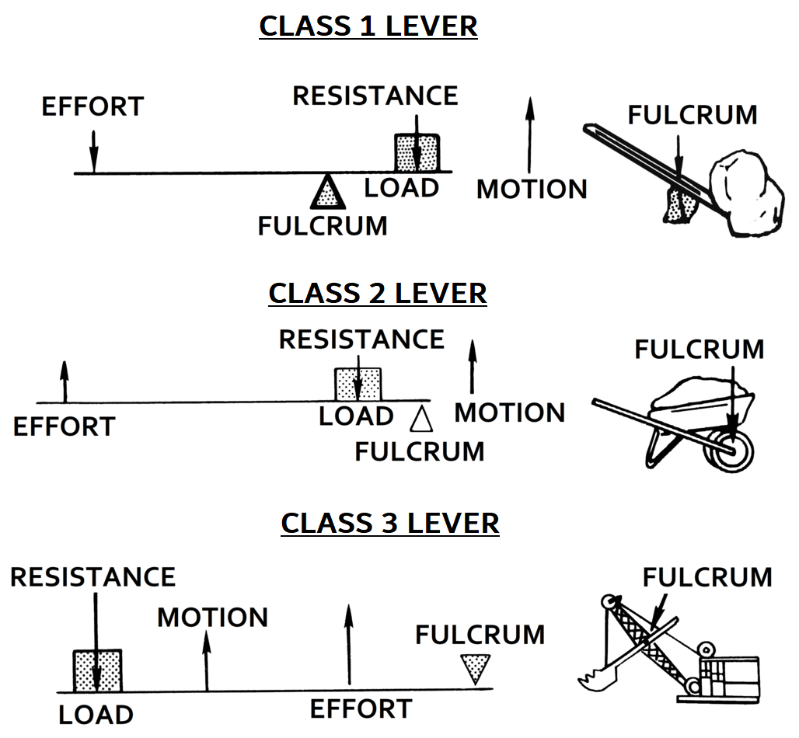
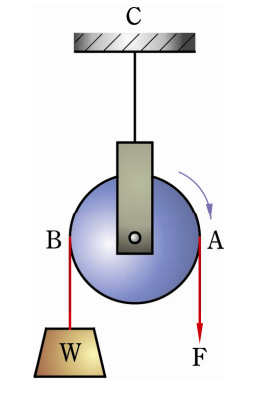
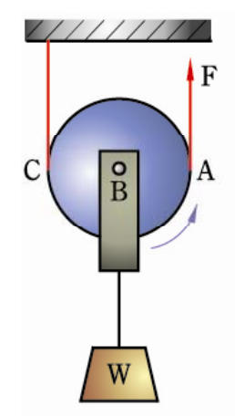
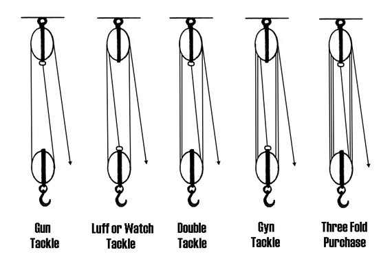
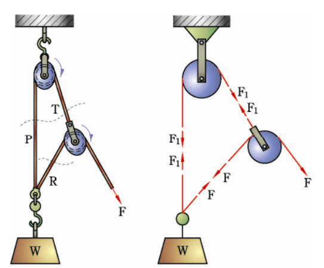
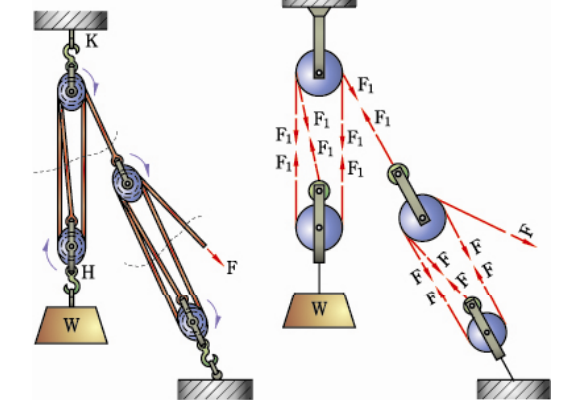
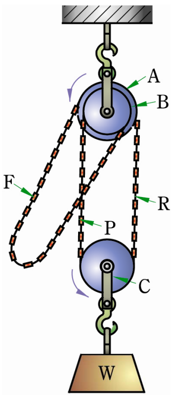

# Pulley

Levers and pulley systems trade input travel for output force. Identify the moving parts and supporting rope segments before applying the mechanical-advantage relationships.

## Lever

>https://en.wikipedia.org/wiki/Lever

$$\text{IMA} = \frac WF$$

### Class 1 lever

$$\text{IMA} = \frac WF \in R$$

### Class 2 lever

$$\text{IMA} = \frac WF > 1$$

### Class 3 lever

$$\text{IMA} = \frac WF < 1$$

## Pulley type

### Fixed pulley (Class 1 lever)

$\text{IMA}  = 1$

$$\frac WF = \frac{v_F}{v_w} = 1$$

### Movable pulley (Class 2 lever)

$\text{IMA}  = 2$

$$\frac WF = \frac{v_F}{v_w} = 2$$

### Movable pulley (Class 3 lever)

$\text{IMA}  = 1/2$

$$\frac WF = \frac{v_F}{v_w} = \frac12$$

## Block and tackle

### Gun tackle pulleys

$$\text{IMA} = \frac WF =\frac {2F}{F} = 2$$

>https://en.wikipedia.org/wiki/Block_and_tackle

* Number of line : $n$

$$\text{IMA} = \frac WF =\frac {nF}{F} = n$$

### Spanish burton

$$\text{IMA} = \frac WF =\frac {2F+F}{F} = 3$$

**Multi-spanish burton**

* Number of movable pulleys : $n$

$$\boxed{M = 2^{(n+1)}-1}$$

### Luff upon luff

number of line : $m$,$n$

$$M = \frac WF = mn$$

### Differential pulley block

The smaller the difference between $D$ and $d$, the larger $F$

$$F(\pi D) = \frac W2(\pi D)-\frac W2(\pi d)$$

$$FD = \frac W2(D-d)$$

$$\boxed{M = \frac WF = \frac{2D}{D-d}}$$

