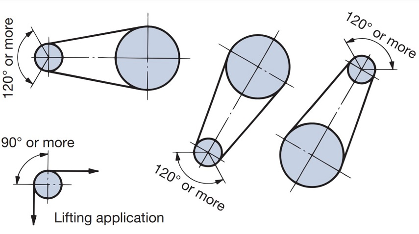

# Sprocket

A chain drive transfers motion through sprocket teeth engaging the chain. These notes connect tooth geometry, center distance, chain length, and transmitted power.

## contact angle

> https://tt-net.tsubakimoto.co.jp/tecs/engd/cdc/engd_cdc_tri_sue.as

$$\theta_A,\theta_B>120^o$$

## Chain length

$$D = \frac P{\sin\theta}$$

$$D = \frac{PT}\pi$$

$$\theta = \frac\pi T$$

$$\boxed{L = \frac\pi2(D_1+D_2)+2C\frac{(D_1-D_2)^2}{4C}}$$

$$n = \frac LP$$

## Chain tension effect

$$r_{\min} = r\cos\theta$$

$$\Delta r = r(1-\cos\theta)$$

$$v_{\min} = r\cos\theta2\pi N$$

$$v_{\max} = r2\pi N$$

## Power

Power measures the rate of energy transfer. Use the translational or rotational expression that matches the mechanism.

$$\boxed{P = Fv = F\frac{\pi DN}{60}}$$

$$PS = \frac{P}{735} = \frac{FV}{735} = \frac{F\pi DN}{44100}$$
