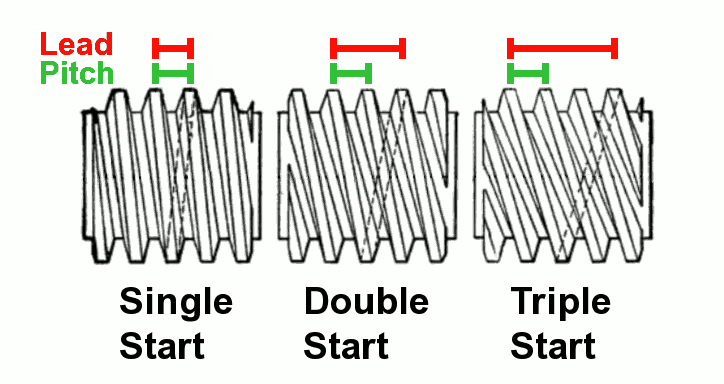
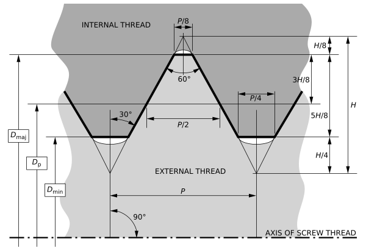

# Thread

Screw threads convert rotation into axial travel and force. Distinguish pitch from lead, especially for multiple-start threads, before applying the geometry and friction relationships.

## Lead

* Lead : $L$
* Diameter : $D$
* Pitch : $P$
* Lead angle : $\theta$
* Helix angle : $\phi$
* start : $n$

$$\tan\theta = \frac L{\pi D}$$

$$\tan \phi = \frac{\pi D}L$$

$$\boxed{P = \frac Ln}$$

## Basic profile

> https://en.wikipedia.org/wiki/Screw_thread

$$h = \frac34H = \frac34\times\frac P2\times\tan60^o$$

$$= \frac34\times\frac P2\times\sqrt{3} = \frac{3\sqrt3}8P \simeq 0.6495P$$

## Thread ideal mechanical advantage

* mechanical advantage of slope

$$\text{IMA}_\text{slope} = \frac{F_\text{out}}{F_\text{in}} = \frac F{F\sin\theta} = \frac1{\sin\theta} = \csc\theta$$

* mechanical advantage of Thread

$$F_\text{in}\cos\theta = F_\text{out}\sin\theta$$

$$M = \frac{F_\text{out}}{F_\text{in}} = \frac{\cos\theta}{\sin\theta} = \frac1{\tan\theta} = \cot\theta$$

## Friction

Choose the contact model and direction of impending or actual sliding before assigning the friction force.

$$f = \mu N$$

$$N = W\cos\theta+F\sin\theta$$

$$N = F_\text{out}\cos\theta+F_\text{in}\sin\theta$$

$$N = F_\text{in}\cot\theta\cos\theta+F_\text{in}\sin\theta$$

$$f = \mu F_\text{in}(\cot\theta\cos\theta+\sin\theta)$$

## Applications

1. Transmits high power
1. Fixes components
1. Precisely controls distance
