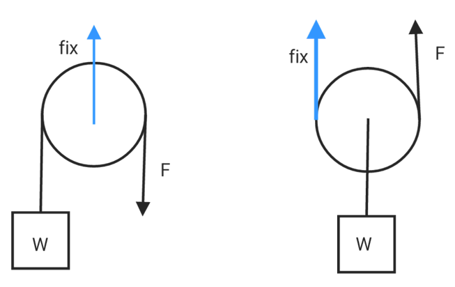
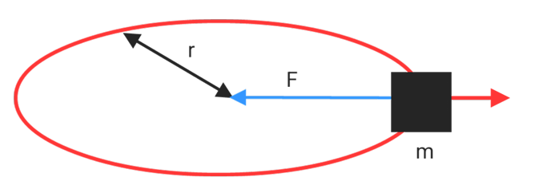
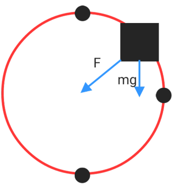
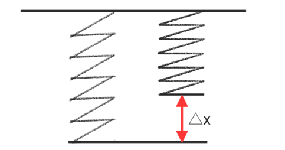
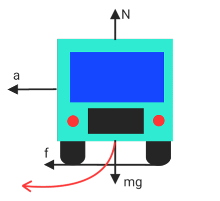
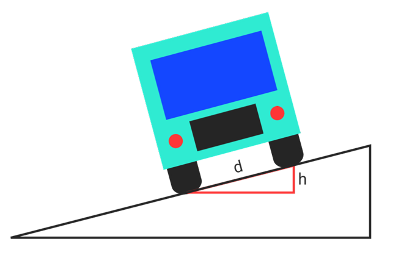

# Force & motion

## Newton's laws of motion

1. if $F = 0$ , then $v_i = v_f$
2. $F = ma$
3. $F_{ab} = -F_{ba}$

## Pulley

**Fixed pulley**
$$T = w$$

$$F_{fix} = 2T$$
**Movable pulley**
$$T = \frac w2$$

$$F_{fix}= T$$

## Circular motion

**Horizontal**

$$F = ma = m\frac{v^2}{r}$$

**Vertical**

$$T_{top} = F+w = ma+mg$$

$$T_{top} = m(\frac{v^2}{r}+g)$$

$$v_{top} = \sqrt{gr}$$

$$T_{mid} = F = ma$$

$$T_{mid} = \frac{mv^2}{r}$$

$$v_{mid} = \sqrt{3gr}$$

$$T_{bottom} = F-w = ma-mg$$

$$T_{bottom} = m(\frac{v^2}{r}-g)$$

$$v_{bottom} = \sqrt{5gr}$$

## Spring

$$F = k\Delta x$$

$$mg = k\Delta x$$

$$x = \frac{mg}{k}$$

* consider Spring height : $x_i$

$$x = x_i+\frac{mg}{k}$$

* consider spring mass : $m_s$
[why ??](../../../Special/spring.md)

$$x = x_i+\frac{mg}{k}+\frac{m_sg}{2k}$$

## Vehicle turning

$$F = f$$

$$w = N$$

$$\mu N = ma$$

$$\mu mg = m\frac{v^2}{r}$$

$$v = \sqrt{\mu gr}$$

## Superelevation

$$\frac{F}{sin(\theta)} = \frac{w}{sin(90^o-\theta)}$$

$$\frac{ma}{sin(\theta)} = \frac{mg}{sin(90^o-\theta)}$$

* when $\theta >> 1$ , then $cos(\theta) \simeq 1$ 
$$a = gsin(\theta)$$

$$\frac{v^2}{r} = g\frac{h}{d}$$

* height : $h$
* Track : $d$

$$h = \frac{dv^2}{gr}$$
