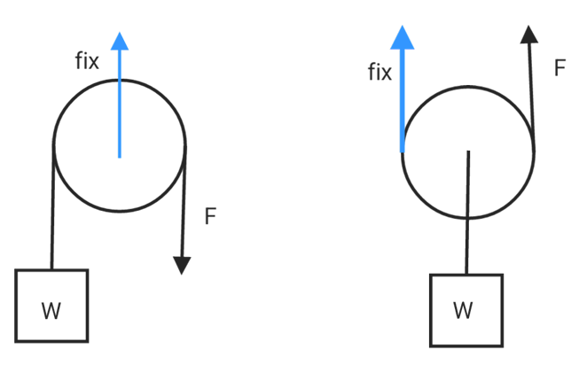
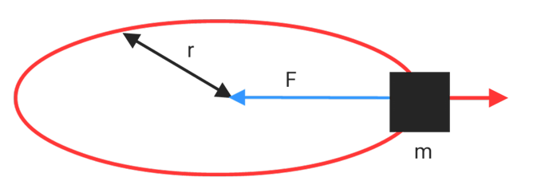
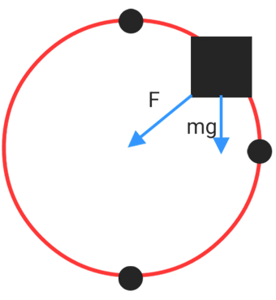
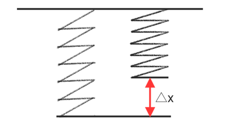
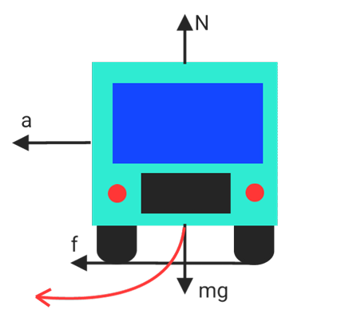
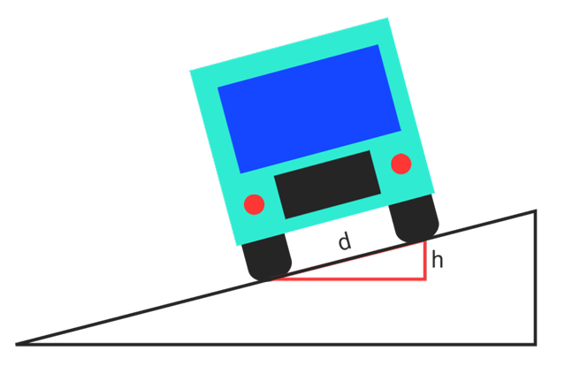

# Force & motion

These notes apply force balances to common mechanical situations such as pulleys, springs, and curved motion. Draw a free-body diagram and choose positive directions before substituting into the equations.

## Newton's laws of motion

1. if $F = 0$ , then $v_i = v_f$
2. $F = ma$
3. $F_{ab} = -F_{ba}$

## Pulley

**Fixed pulley**

$$T = w$$

$$F_{fix} = 2T$$

**Movable pulley**

$$T = \frac w2$$

$$F_{fix}= T$$

## Circular motion

**Horizontal**

$$F = ma = m\frac{v^2}{r}$$

**Vertical**

$$T_{top} = F+w = ma+mg$$

$$T_{top} = m(\frac{v^2}{r}+g)$$

$$\boxed{v_{top} = \sqrt{gr}}$$

$$T_{mid} = F = ma$$

$$T_{mid} = \frac{mv^2}{r}$$

$$\boxed{v_{mid} = \sqrt{3gr}}$$

$$T_{bottom} = F-w = ma-mg$$

$$T_{bottom} = m(\frac{v^2}{r}-g)$$

$$\boxed{v_{bottom} = \sqrt{5gr}}$$

## Spring

$$F = k\Delta x$$

$$mg = k\Delta x$$

$$x = \frac{mg}{k}$$

* consider Spring height : $x_i$

$$\boxed{x = x_i+\frac{mg}{k}}$$

* consider spring mass : $m_s$

$$\boxed{x = x_i+\frac{mg}{k}+\frac{m_sg}{2k}}$$

## Vehicle turning

$$F = f$$

$$w = N$$

$$\mu N = ma$$

$$\mu mg = m\frac{v^2}{r}$$

$$\boxed{v = \sqrt{\mu gr}}$$

## Superelevation

$$\frac{F}{sin(\theta)} = \frac{w}{sin(90^o-\theta)}$$

$$\frac{ma}{sin(\theta)} = \frac{mg}{sin(90^o-\theta)}$$

* when $\theta >> 1$ , then $cos(\theta) \simeq 1$

$$a = gsin(\theta)$$

$$\frac{v^2}{r} = g\frac{h}{d}$$

* height : $h$
* Track : $d$

$$\boxed{h = \frac{dv^2}{gr}}$$

