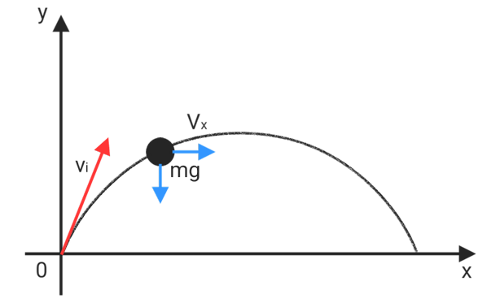
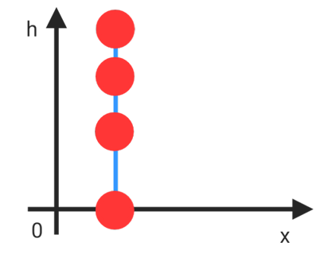
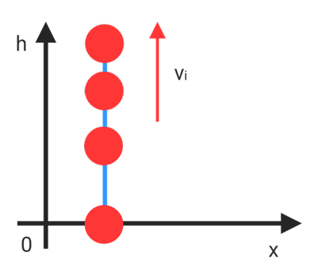
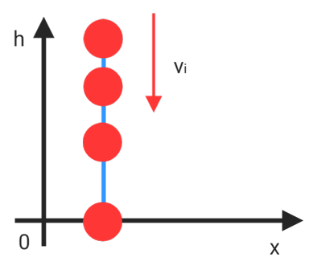
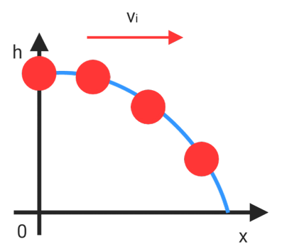
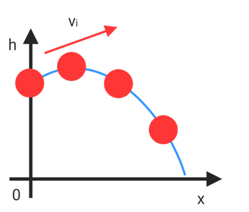
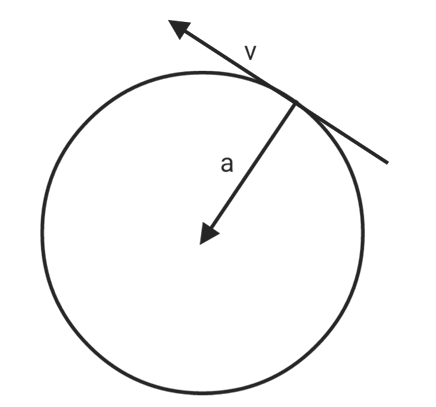

# curved motion & rotation

## projectile

* when $v_y = 0$ , $y = y_{max}$
* $t_{up} = t_{down} = \frac{v_isin(\theta)}{g}$

$$v_{xi} = v_icos(\theta)$$

$$v_{yi} = v_isin(\theta)$$

$$v = \sqrt{v_x^2+v_y^2}$$

$$\theta_i = tnn^{-1}\frac{v_{yi}}{v_{xi}}$$

$$t_{tt} = 2t_{up} = 2t_{down} = \frac{v_isin(\theta_i)}{g}$$

* total time : $t_{tt}$

$$y_{max} = \frac{v_i^2sin(\theta_i)}{2g}$$

* if $\theta = 90^o$ then $y_{max} = \frac{v_i^2}{2g}$

$$x = \frac{v_i^2sin(2\theta_i)}{g}$$

* $x_{f}(\theta_i)$ is same as $x_f(90^o-\theta_i)$
* if $\theta = 45^o$ , $v_i^2/g = x$ so $4y_{max} = x_f$

$$\frac{y_{max}}{x_f} = \frac{tan(\theta)}{4}$$

$$\frac{x_1}{sin(2\theta_1)} = \frac{x_2}{sin(2\theta_2)}$$

## different projectile cases

1. $v_{xi} = 0$ , $v_{yi} = 0$ , $y_i = y_{max}$

$$a = g$$

$$y_{max} = \frac12gt^2$$

$$v_{max} = gt$$

2. $v_{xi} = 0$ , $v_{yi} < 0$ , $y_i = y_{max}$

$$a = g$$

$$y_{max} = \frac12gt^2+v_it$$

$$v_{max} = v_i+gt$$

3. $v_{xi} = 0$ , $v_{yi} > 0$ , $y_i = 0$

$$a = g$$

$$y_{max} = \frac18gt^2$$

$$v_{max} = v_i$$

$$path = 2y_{max} = \frac14gt^2$$

* if $y_1 = y_2$ then $v_1 = v_2$

4. $v_{xi} \not= 0$ , $v_{yi} = 0$ , $y_i = y_{max}$

$$a = g$$

$$y_{max} = \frac12gt^2$$

$$t = \sqrt{2H/g}$$

$$x_f = v_it = v_i\sqrt{2H/g}$$

$$v_{max} = \sqrt{v_i^2+(gt)^2}$$

5. $v_{xi} \not= 0$ , $v_{yi} < 0$ , $y_i = y_{max}$

$$a = g$$

$$y_{max} = v_{yi}t+
\frac12gt^2$$

$$x_f = v_{xi}t$$

$$v_{max} = \sqrt{v_{xi}^2+(v_{yi+}gt)^2}$$

## rotation

unit $1\ rpm = \frac{2\pi}{60}\ rad/sec = 60\ rps$

$$\omega = \dot\theta = \frac{d\theta}{dt}$$

$$\alpha = \dot\omega = \ddot\theta = \frac{d^2\theta}{dt^2}$$

$$r\theta = S$$

$$r\omega = v$$

$$r\alpha = a$$

| linear motioa | rotation |
|:---:|:---:|
|$$\omega = \omega_i+\alpha t$$|$$v = v_i+at$$|
|$$\theta = \theta_i+\omega_it+\frac12\alpha t^2$$|$$x = x_i+v_it+\frac12at^2$$|
|$$\omega^2 = \omega_i+2\alpha\Delta\theta$$|$$v^2 = v_i^2+2a\Delta x$$|

**if $\omega$ is a constant**

$$T = \frac{2\pi}{\omega}$$

$$f = \frac{\omega}{2\pi}$$

## Circular motion

$$a_t = \frac vt = \frac {r\omega}t = r\alpha$$

$$a_c = \frac{v^2}{r} = v\omega = r\omega^2 = \frac{4\pi^2r}{t^2}$$

$$a_{tt} = \sqrt{a_c^2+a_t^2} = \sqrt{(r\alpha)^2+(r\omega^2)^2} = r\sqrt{\omega^4+\alpha^2}$$
