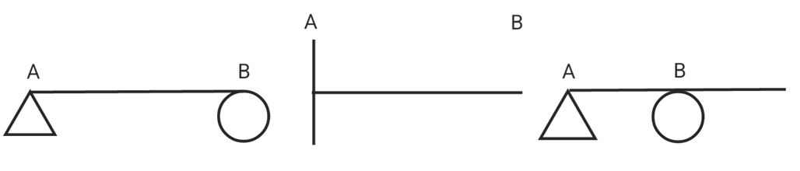
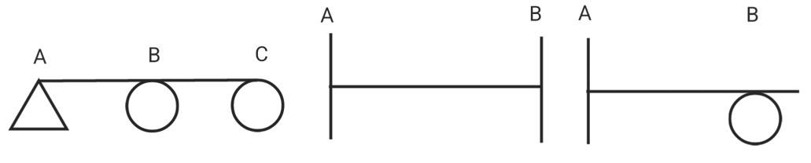
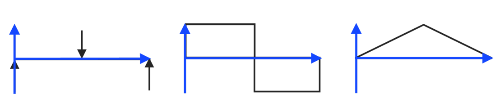
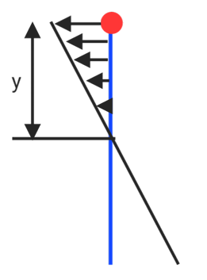
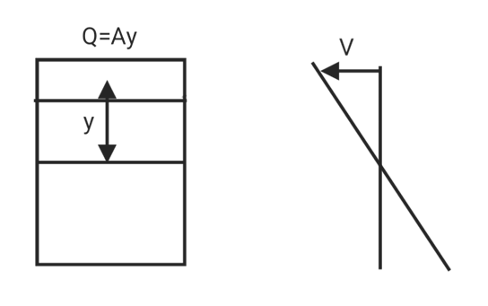
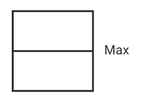
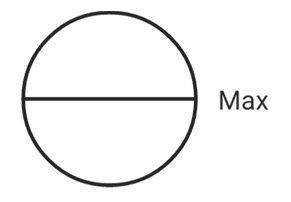
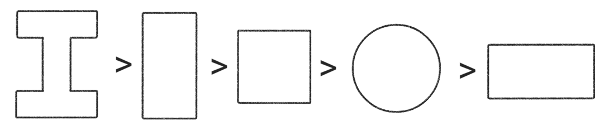

# Bending moment

## Types of beams

### Statically determinate beam

1. Simply supported beam
1. Cantilever beam
1. Overhanging beam

### Statically indeterminate beam

1. Continuous beam
1. Fixed beam
1. Restrained beam

## Shear force & bending moment

$$V = \int F(x)dx$$

$$M = \int V(x)dx$$

## Bending stress in beam

$$\sigma = \frac{My}{I}$$

## Shear stress in beam

$$\tau = \frac{VQ}{Ib}$$

* **Rectangular beam**

$$\tau_\max = \frac{3V}{2A}$$

* **Circular beam**

$$\tau_\max = \frac{4V}{3A}$$

## Complex cross section of beam

* Strength under the same cross-sectional area
H-shaped > rectangular > square > circular