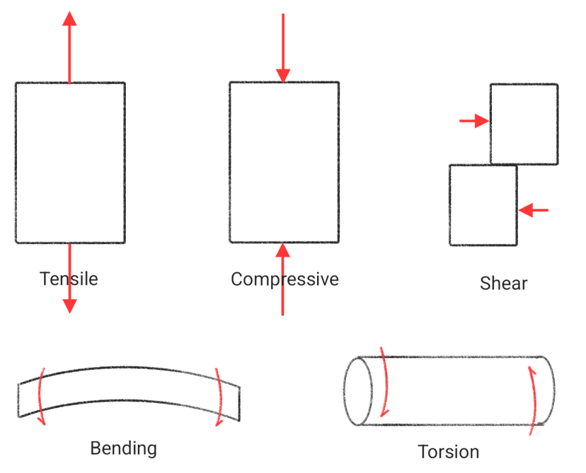
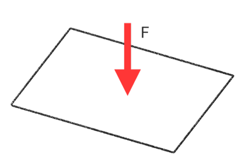
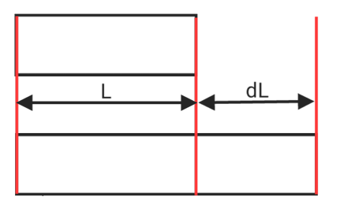
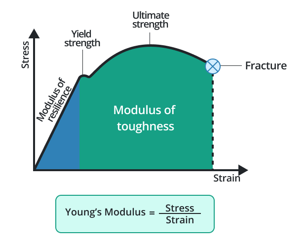

# Compressive stress & Tensile stress

## Stress and strain

**Type of Stress**

* Tensile stress
* Compressive stress
* Shear stress
* Bending
* Torsion

$$\text{Stress} = \frac FA$$

$$\sigma = \frac PA$$

unit :
* $1 MPa = 10^6Pa = 10^6N/m^2 = 1N/mm^2$
* $1 GPa = 10^9Pa = 10^3N/mm^2 = 1kN/mm^2$
* $1Pa = 1.02\times 10^{-5}kg/cm^2$
* $1MPa = 10.2kg/cm^2$

$$\text{strain} = \frac{dL}{L}$$

$$\varepsilon = \frac\delta L$$
## Elastic modulus

$$E = \frac{P/A}{\delta/L} = \tan(\theta)$$

$$\sigma = E\varepsilon$$

$$\delta = \frac{PL}{AE}$$

## Internal Force

$$\sum F_{int} = F_{int_1}+F_{int_2}+...+F_{int_n} = 0$$

## Safety Factor

$$SF > 1$$

* Ductile Materials
$$SF_{DM} = \frac{\text{Yield stress}}{\text{Allowable stress}}$$
* Brittle materials
$$SF_{BM} = \frac{\text{Ultimate stress}}{\text{Allowable stress}}$$