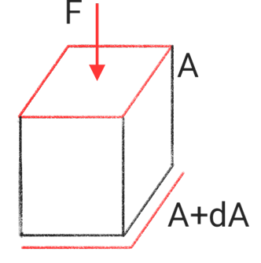
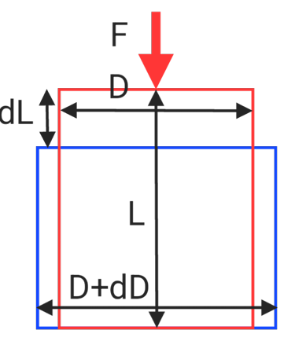

# Poisson's ratio $\nu$

$$\nu = \frac{\varepsilon_1}{\varepsilon_2} = \frac{\frac{dL_1}{L_1}}{\frac{dL_2}{L_2}}$$
* Force direction : $L_2\ \text{direction}$
## Poisson's ratio range
$$0<\nu<0.5$$

if The volume will not change $dV = 0$

**Axle**
$\text{Axial strain} = \frac{dL}L$
$\text{Radial strain} = \frac{dD}D$
$$LA = (L-dL)(A+dA)$$

$$L\frac{\pi}{4}D^2 = (L-dL)\frac{\pi}{4}(D+dD)^2$$

$$LD^2 = (L-dL)(D^2+2DdD+dD^2)$$

$$dD^2 \to 0$$

$$LD^2 = LD^2-dLD^2+L2DdD+2DdDdL$$

$$dDdL\to 0$$

$$dLD^2 = L2DdD$$

$$\frac{dL}{L} = 2\frac{dD}{D}$$

$$\frac12 = \frac{\frac{dD}{D}}{\frac{dL}{L}} = \frac{\varepsilon_D}{\varepsilon_L}$$

$$\nu_\max = \frac12$$

## Multi-directional stress and strain

**One direction force**
$$\frac{dx}x = \frac{P_x}{AE}$$

$$\frac{dy}y = -\nu\frac{dx}x = -\nu\frac{P_x}{AE}$$

$$\frac{dz}z  = -\nu\frac{dx}x = -\nu\frac{P_x}{AE}$$

**Multiple directional forces**
$$\frac{dx}x = \sum^n_{i = 1}\frac{P_i\vec x}{A_{yz}E}-\nu\frac{P_i\vec y}{A_{xz}E}-\nu\frac{P_i\vec z}{A_{xyE}}$$

$$\varepsilon_x = \frac{\sigma_x-(\sigma_y+\sigma_z)\nu}{E}$$

## Forces in multiple directions are equal

$$P_x = P_y = P_z = P$$

$$\frac{dx}{x} = \frac PE(\frac1{P_x}-\nu(\frac{1}{P_y}+\frac{1}{P_z}))$$

## Uniform pressure

$$\sigma_x = \sigma_y = \sigma_z = \sigma$$

$$\frac{dx}x = \frac{\sigma}{E}(1-2\nu)$$
