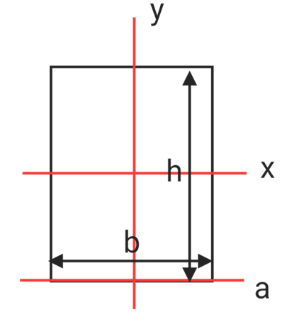
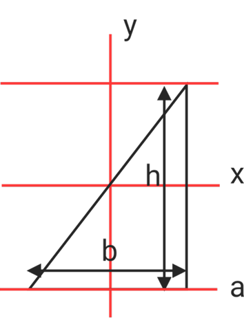
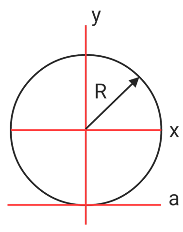
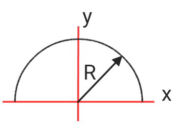
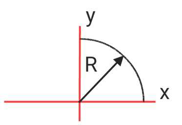

# Second moment of area

## Common formulas

* Second moment of area : $I =\int r^2dA$
* parallel axis theorem : $I_s = I_x+AL^2$
* Section Modulus : $Z = \frac{I_x}{y_\max}$
* Radius of Gyration : $K = \sqrt{\frac{I}{A}}\ ,I = AK^2$
* Polar Second moment of area : $J = I_x+I_y$
* Polar Radius of Gyration : $K_J = \sqrt{\frac{J}{A}}$

## Second moment of area of different shapes

* **rectangle**

$$I_x = \frac{bh^3}{12}$$

$$I_y = \frac{hb^3}{12}$$

$$I_a = \frac{bh^3}{3}$$

* **triangle**

$$I_x = \frac{bh^3}{36}$$

$$I_y = \frac{hb^3}{36}$$

$$I_a = \frac{bh^3}{12}$$

$$I_b = \frac{bh^3}{4}$$
* **circle**

$$I_x = I_y = \frac{\pi R^4}{4}$$

$$I_a = \frac54\pi R^4$$
* **half circle**

$$I_x = I_y = \frac{\pi R^4}{8}$$
* **Quarter circle**

$$I_x = I_y = \frac{\pi R^4}{16}$$