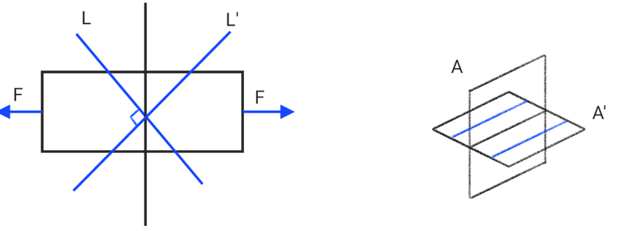
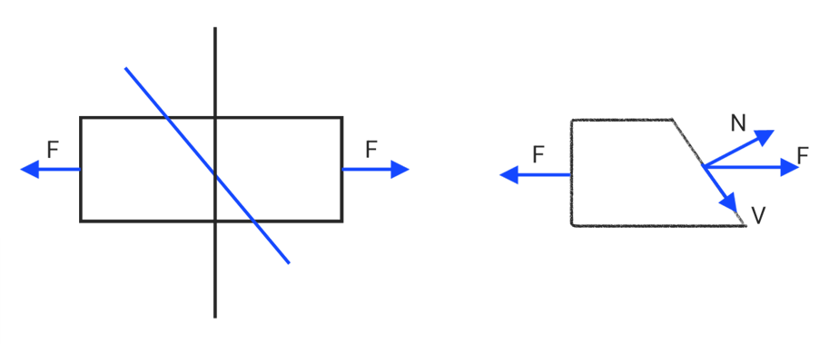
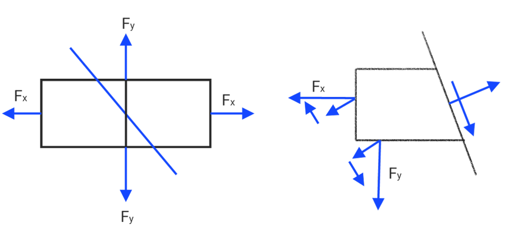
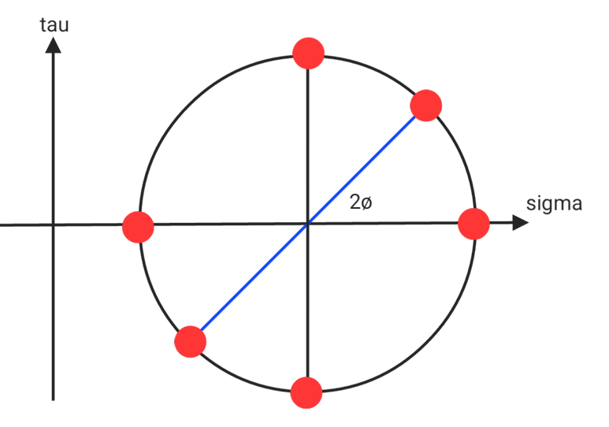
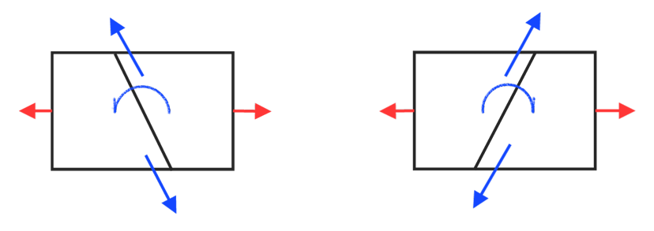

# Shear

$$\tau = \frac PA$$

$$\gamma = \frac\delta L$$

* Shear stress : $\tau$
* Shear strain : $\gamma$ ( unit : rad )

## Example

* Stamping press

$$A_{tt} = \pi Dt$$

$$\tau = \frac{P}{\pi dt}$$

* rivet single shear

$$A_{tt} = \frac\pi4d^2$$

$$\tau = \frac p{\frac14\pi d^2}$$

* rivet double shear

$$A_{tt} = \frac\pi4d^2$$

$$\tau = \frac p{\frac12\pi d^2}$$

## Elastic modulus &  Shear modulus of elasticity

$$G = \frac{E}{2(1+\mu)}$$

$$E_v = \frac{E}{3(1-2\mu)}$$

$$\frac9E = \frac3G+\frac1K$$

## Plane and Shear Stress

$$A' = \frac A{\cos\theta}$$

$$N = P\cos\theta$$

$$V = P\sin\theta$$

$$\sigma = \frac PA$$

$$\sigma_\theta = \frac N{A'} = \frac{P\cos\theta}{A/\cos\theta} = \frac PA\cos^2\theta = \sigma_x\cos^2\theta$$

$$\tau_\theta = \frac V{A'} = \frac{P\sin\theta}{N/\cos\theta} = \frac PA\sin\theta\cos\theta = \frac P{2A}\sin2\theta = \frac{\sigma_x}{2}\sin2\theta$$

$$\sigma'_\theta = \frac PA\cos^2(\frac\pi2+\theta) = \sigma_x\sin^2\theta$$

$$\tau'\theta = \frac PA\sin(\frac\pi2+\theta)\cos(\frac\pi2+\theta) = \frac{-P}{2A}\sin2\theta = \frac{-\sigma}{2}\sin2\theta$$

$$\sigma_\theta+\sigma'_\theta = \sigma_x = \frac PA$$

$$\tau'_\theta+\tau_\theta = 0$$

$$\tau_\theta = -\tau'_\theta$$

* principal plane : a plane within a stressed body where the shear stress is zero, and only normal stresses (tension or compression).

$\theta = 0, \cos^2\theta = 1, \sin2\theta = 0, \sigma_\theta = \sigma_x = \sigma_\max, \tau = 0$

$\theta = 90^o, \cos^2\theta = 0, \sin2\theta = 0, \sigma_\theta = 0, \tau_\theta = 0$

* Maximum shear stress plane : 

$\theta = 45^o, \cos^2\theta = \frac12, \sin2\theta = 1,\sigma_\theta = \frac12\sigma_x, \tau_\theta = \frac12\sigma_x = \tau_\max$

## Incline shear stress

* **Uniaxial**

$$\sigma_\theta = \sigma_x\cos^2\theta$$

$$\tau_\theta = \frac{-\sigma_x}{2}\sin2\theta$$

$$\sigma'_\theta = \sigma_x\sin^2\theta$$

$$\tau'_\theta = \frac{-\sigma_x}{2}\sin2\theta$$

$$\sigma_\theta+\sigma'_\theta = \sigma_x = \frac PA$$

$$\tau'_\theta+\tau_\theta = 0$$

$$\tau_\theta = -\tau'_\theta$$

* if $\theta = 45^o$ Pure shear occurs and $2\tau_\theta = P$
* if $\theta = 90^o$, $\max\sigma_\theta$
* if $\theta = 0$, $\min\sigma_\theta$
* **Biaxial**

$$\sum F_n = \sigma_\theta A-\sigma_xA\cos\theta-\sigma_\theta A_2\sin\theta = 0$$

$$\sigma_\theta = \sigma_x\cos^2\theta+\sigma_y\sin^2\theta$$

$$\sum F_t = \tau_\theta A-\sigma_xA_1\sin\theta+\sigma_yA_2\cos\theta = 0$$

$$\tau_\theta = (\sigma_x-\sigma_y)\sin\theta\cos\theta$$

$$\cos^2\theta = \frac12(1+\cos2\theta)$$

$$\sin^2\theta = \frac12(1-\cos2\theta)$$

$$\sin\theta\cos\theta = \frac12\sin2\theta$$

$$\sigma_\theta = \frac12(\sigma_x+\sigma_y)+\frac12(\sigma_x-\sigma_y)\cos2\theta$$

## Mohr's Circle

$$O(x,y) = (\frac12(\sigma_x+\sigma_y),0)$$

$$r = \frac12(\sigma_x-\sigma_y)$$

$$\sigma_\theta = O_x+r\cos2\theta = \frac12(\sigma_x+\sigma_y)+\frac12(\sigma_x-sigma_y)\cos2\theta$$

$$\tau_\theta = r\sin2\theta = \frac12(\sigma_x-\sigma_y)\sin2\theta$$

$$\sigma'_\theta = O_x-r\cos2\theta = \frac12(\sigma_x+\sigma_y)-\frac12(\sigma_x-\sigma_y)$$

$$\tau'_\theta = -r\sin2\theta = \frac12(\sigma_x\sigma_y)\sin2\theta$$

$$\tau_\theta = \frac12(\sigma_x-\sigma_y)sin2\theta$$

| $\theta$ | $\cos2\theta$ | $\sin2\theta$ |       $\sigma_\theta$        |        $\tau_\theta$         |
|:--------:|:-------------:|:-------------:|:----------------------------:|:----------------------------:|
|  $0^o$   |      $1$      |      $0$      |   $\sigma_x = \sigma_\max$   |             $0$              |
|  $45^o$  |      $0$      |      $1$      | $\frac12(\sigma_x+\sigma_y)$ | $\frac12(\sigma_x-\sigma_y)$ |
|  $90^o$  |     $-1$      |      $0$      |   $\sigma_y = \sigma_\max$   |             $0$              |

## Pure shear

$$\sigma_x = -\sigma_y, \theta = 45^o$$

$$|\sigma_x| = |\sigma_y| = \tau_\theta = \frac12(\sigma_x-\sigma_y)$$

## Complementary Stress

$$\theta' = \frac\pi2+\theta$$

$$\sigma'_\theta = \frac12(\sigma_x+\sigma_y)-\frac12(\sigma_x-\sigma_y)\cos2\theta$$

$$\tau'_\theta = -\frac12(\sigma_x-\sigma_y)\sin2\theta$$

$$\sigma_\theta+\sigma'_\theta = \sigma_x+\sigma_y$$

$$\tau'_\theta+\tau_\theta = 0$$

$$-\tau_\theta = \tau'_\theta$$
