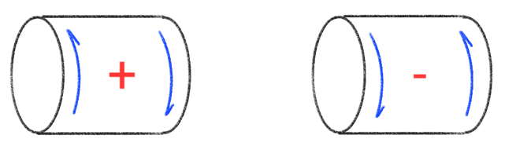
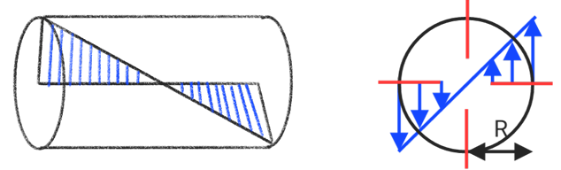
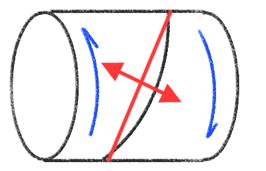
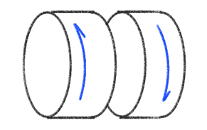

# Torsion

Torsion describes the deformation of a member subjected to a twisting moment. Relate torque to shear stress and angle of twist using the cross-section and material assumptions stated below.

* Right-hand thread is positive (+) when it is loosened
* right-hand thread is negative (-) when it is tightened

## Torsional stress & shear strain

$$r = \frac{R\phi}{L} = R\theta$$

$$\theta = \frac{\phi}{L}$$

$$\tau \propto R$$

$$\frac{\tau}{R} = \frac{\tau_1}{R_1} = \frac{\tau_2}{R_2} = \frac{\tau_{max}}{R_{tt}}$$

$$\tau = \frac{TR}{J}$$

$$J = \frac{\pi R^4}{2}$$

$$\boxed{\phi = \frac{TL}{GJ}}$$

## Material properties

tensile strength : $\sigma_{T\ ult}$
Compressive strength : $\sigma_{C\ ult}$
Shear strength : $\tau_{ult}$

* **Brittle**
$\sigma_{T\ ult} \simeq \sigma_{C\ ult} > \tau_{ult}$

* **Ductile**
$\sigma_{C\ ult} > \tau_{ult} > \sigma_{T\ ult}$

|Properties|     Ductile materials     |     Brittle materials     |
|:--------:|:-------------------------:|:-------------------------:|
| Material |           Steel           |          cement           |
| strength | Tensile=Compression>Shear | Compression>Shear>Tensile |

## Power and material relationship

$$P = T\omega$$

$$\frac{P_1}{P_2} = \frac{T_1}{T_2} = \frac{d^3_1}{d^3_2}$$

$$A \propto V \propto m \propto D^2$$

* Hollow axles are stronger than solid axles of the same area $(A_1 = A_2)$
