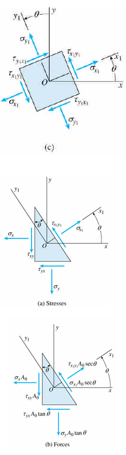
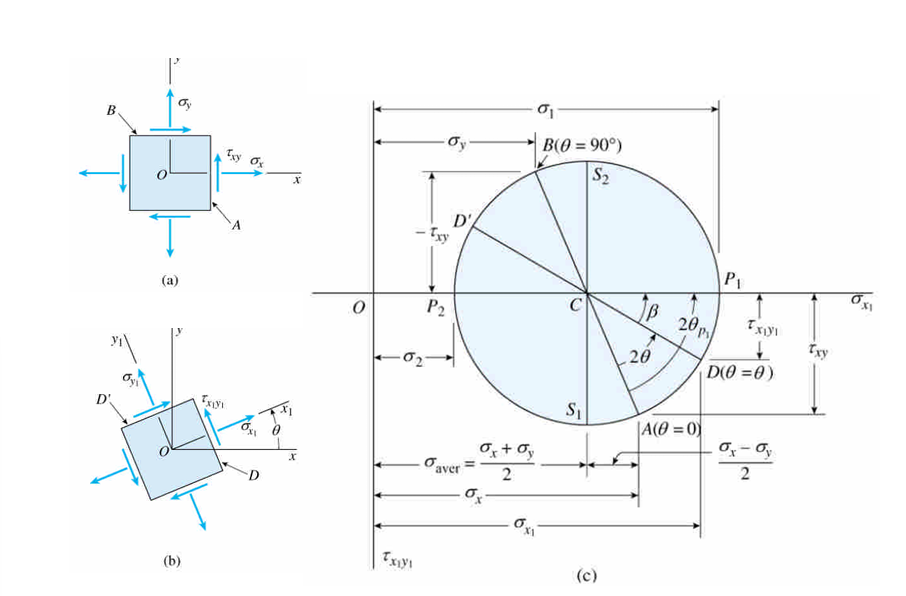
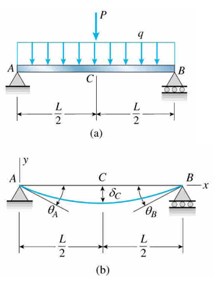

# Analysis of Stresses and Strains

* axial load :
$\sigma = P/A$
* torsional load in circular shaft :
$\tau = T\rho/I_p$
* bending moment and shear force in beam :
$\sigma = My/I$
$\tau = (VQ)/(Ib)$

## Plane Stress

$$\sigma_{x1}A_0\sec\theta-\sigma_xA_0\cos\theta-\tau_{xy}A_0\sin\theta-\sigma_yA_0\tan\theta\sin\theta-\tau_{xy}A_0\tan\theta\cos\theta = 0$$

$$\tau_{x1y1}A_0\sec\theta+\sigma_xA_0\sin\theta-\tau_{xy}A_0\cos\theta-\sigma_yA_0\tau\theta\cos\theta+\tau_{yx}A_0\tan\theta\sin\theta = 0$$

$$\sigma_{x1} = \sigma_x\cos^2\theta+\sigma_y\sin^2\theta+2\tau_{xy}\sin\theta\cos\theta$$

$$\tau_{x1y1} = -(\sigma_x-\sigma_y)\sin\theta\cos\theta+\tau_{xy}(\cos^2\theta-\sin^2\theta)$$

****

from trigonometric identities : 
$$\cos^2\theta = \frac12(1+\cos2\theta)$$

$$\sin^2\theta = \frac12(1-\cos2\theta)$$

$$\sin\theta\cos\theta = \frac12\sin2\theta$$

$$\sigma_{x1} = \frac{\sigma_x+\sigma_y}{2}+\frac{\sigma_x-\sigma_y}{2}\cos2\theta+\tau_{xy}\sin2\theta$$

$$\tau_{x1y1} = -\frac{\sigma_x-\sigma_y}{2}\sin2\theta+\tau_{xy}\cos2\theta$$

$$\sigma_{y1} = \frac{\sigma_x+\sigma_y}{2}-\frac{\sigma_x-\sigma_y}{2}\cos2\theta-\tau_{xy}\sin2\theta$$

$$\sigma_x+\sigma_y = \sigma_{x1}+\sigma_{y1}$$

## Mohr's Circle for Plane Stress

$$(\sigma_{x1}-\frac{\sigma_x+\sigma_y}{2})^2+\tau_{x1y1}^2 = (\frac{\sigma_x-\sigma_y}{2})^2+\tau_{xy}^2$$

$$\sigma_{avg} = \frac{\sigma_x+\sigma_y}{2}$$

$$R^2 = (\frac{\sigma_x-\sigma_y}{2})^2+\tau_{xy}^2$$

$$(\sigma_{x1}-\sigma_{avg})^2+\tau_{x1y1}^2 = R^2$$

$$R = ((\sigma_{x1}-\sigma_{avg})^2+\tau_{x1y1}^2)^\frac12$$

## Differential Equations of the Deflection Curve

$$\kappa = \frac{M}{EI}$$

$$\frac{d\theta}{dx} = \frac{d^2y}{dx^2} = \frac{M}{EI}$$

$$\frac{dM}{dx} = V$$

$$\frac{d^3y}{dx^3} = \frac V{EI}$$

$$\frac{dV}{dx} = -q$$

$$\frac{d^4y}{dx^4} = -\frac{q}{EI}$$

$$EI\nu'' = M\qquad EI\nu''' = V\qquad EI\nu'''' = -q$$

$$\kappa = \frac{\nu''}{(1+\nu''^2)^{3/2}}$$

## Method of Superposition

the slope and deflection due to uniform load of intensity

$$\delta = \frac{5qL^4}{384EI}$$

$$\theta_A = \theta_B = \frac{qL^3}{24EI}$$