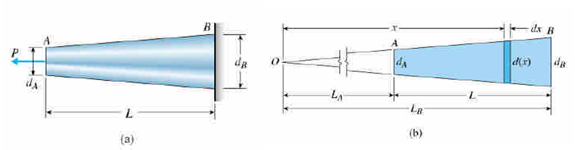
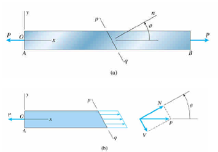

# Axial Loaded Members

$$\delta = \varepsilon L = \frac{\sigma L}{E} = \frac{PL}{AE}$$

* stiffness (spring constant) : $k$
* flexibility (compliance) : $f$

$$fk = 1$$

$$k = \frac{EA}{L}$$

$$f = \frac{L}{EA}$$

## Stress and Deformation

$$\sum F = 0$$

$$\delta = \sum_i\delta_i = \int_0^L\frac{N(x)\ dx}{EA(x)}$$

## Tapered bar

$$d(x) = \frac{d_Ax}{L_A}$$

$$A(x) = \frac{\pi(dx)^2}{4} = \frac{\pi d_A^2x^2}{4L_A^2}$$

$$\delta = \int\frac{N(x)dx}{EA(x)} = \int^{L_B}_{L_A}\frac{P\ dx(4L_A^2)}{E\pi d_A^2x^2} = \frac{4PL_A^2}{\pi Ed^2_A}\int^{L_B}_{L_A}\frac{dx}{x^2}$$

$$= \frac{4PL_A^2}{\pi Ed^2_A}(\frac{1}{L_A}-\frac{1}{L_B}) = \frac{4PL_A^2}{\pi Ed^2_A}\frac{L_B-L_A}{L_AL_B}$$

$$= \frac{4PL}{\pi Ed^2} = \frac{PL}{AE}$$

## Thermal Effects, Misfits and Prestrains

$$\varepsilon_T = a\Delta T$$

$$\delta_T = \varepsilon_TL = a(\Delta T)L$$

## Stresses on Inclined Sections

$$N = P\cos\theta V = P\sin\theta$$

$$A_1 = A/\cos\theta$$

$$\sigma_\theta = \frac{P\cos\theta}{A/\cos\theta} = \sigma_x\cos^2\theta = \sigma_x(1+\cos2\theta)/2$$

$$\tau_\theta = -\frac{V}{A_t} = \frac{P\sin\theta}{A/\cos\theta} = -\sigma_x\sin\theta\cos\theta = -\frac{\sigma_x}{2}\sin2\theta$$

$$\sigma_\max = \sigma_x$$

$$\tau_\max = \sigma_x/2$$

## Strain Energy

$$dW = Pd\delta$$

$$U = W = \int P\ d\delta$$

### in linear elastic range

$$U = W = \frac{P\delta}{2}$$

$$U = \frac{P^2L}{2EA} = \frac{EA\delta^2}{2.L}$$