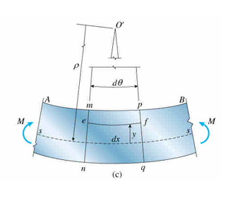
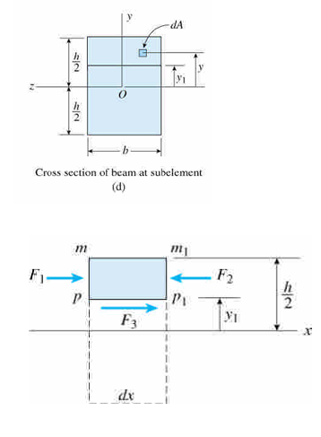

# Shear Forces and Bending Moment

## Loads, Shear Forces, and Bending Moments in Beam

### Loads & Shear Forces

* Loads : $q$
* Shear Force : $V$
$$\sum F_y = 0$$

$$-q\ dx = dV$$

$$-\int q\ dx = V$$

### Shear Forces & Bending Moments

$$\sum M = 0$$

$$dM = Vdx$$

$$M = \int V\ dx$$

## Curvature of a Beam

$$\kappa = 1/\rho$$

$$\rho d\theta = ds\simeq dx$$

$$\kappa = \frac{d\theta}{dx}$$

## longitudinal line

$$L_1 = (\rho-y)d\theta =  dx-\frac y\rho dx$$

$$\Delta_{ef} = L_1 - dx = -\frac y\rho dx$$

$$\varepsilon_x = \frac{\Delta_{ef}}{dx} = -\frac{y}{\rho} = -\kappa y$$

## Stress in Beams

$$dM = -\sigma_x ydA$$

$$M = -\int\sigma_x ydA$$

$$M = E\kappa I$$

* moment of inertia of the cross-sectional
area : $I = \int y^2 dA$

$$\kappa = 1/\rho = \frac{M}{EI}$$

$$\sigma_x = -E\kappa y = -Ey\frac{M}{EI} = -\frac{My}{I}$$

## Shear Stress in Beam

$$\tau b\ dx = \Delta F = \int\frac{My}{I}dA-\int\frac{My-dMy}{I}dA$$

$$\tau = \frac{dM}{dx}\frac1{Ib}\int y\ dA = \frac{V}{Ib}\int y\ dA$$

$$Q = \int y\ dA$$

$$\tau = \frac{VQ}{Ib}$$
