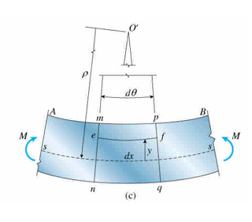
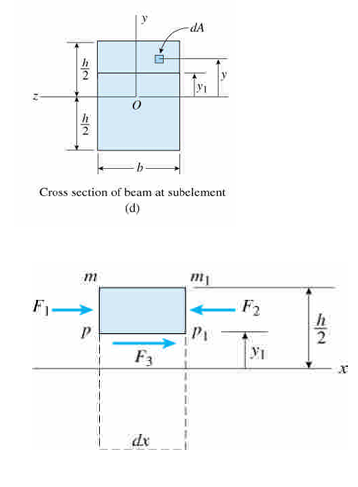

# Shear Forces and Bending Moment

Beam loading produces internal shear forces and bending moments that vary along the span. Their relationships lead to stress and curvature estimates for the selected beam model.

## Loads, Shear Forces, and Bending Moments in Beam

### Loads & Shear Forces

* Loads : $q$
* Shear Force : $V$

$$\sum F_y = 0$$

$$-q\ dx = dV$$

$$-\int q\ dx = V$$

### Shear Forces & Bending Moments

$$\sum M = 0$$

$$dM = Vdx$$

$$M = \int V\ dx$$

## Curvature of a Beam

$$\kappa = 1/\rho$$

$$\rho d\theta = ds\simeq dx$$

$$\kappa = \frac{d\theta}{dx}$$

## longitudinal line

$$L_1 = (\rho-y)d\theta =  dx-\frac y\rho dx$$

$$\Delta_{ef} = L_1 - dx = -\frac y\rho dx$$

$$\varepsilon_x = \frac{\Delta_{ef}}{dx} = -\frac{y}{\rho} = -\kappa y$$

## Stress in Beams

$$dM = -\sigma_x ydA$$

$$M = -\int\sigma_x ydA$$

$$M = E\kappa I$$

* moment of inertia of the cross-sectional
area : $I = \int y^2 dA$

$$\kappa = 1/\rho = \frac{M}{EI}$$

$$\sigma_x = -E\kappa y = -Ey\frac{M}{EI} = -\frac{My}{I}$$

## Shear Stress in Beam

$$\tau b\ dx = \Delta F = \int\frac{My}{I}dA-\int\frac{My-dMy}{I}dA$$

$$\tau = \frac{dM}{dx}\frac1{Ib}\int y\ dA = \frac{V}{Ib}\int y\ dA$$

$$Q = \int y\ dA$$

$$\boxed{\tau = \frac{VQ}{Ib}}$$

