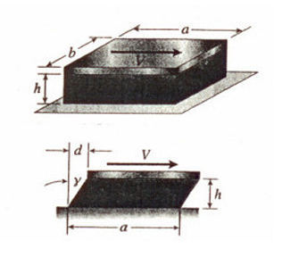

# Tension, Compression & Shear

## stress and strain

* area : $A$
* force : $P$
* stress : $\sigma$

$$\sigma = \frac PA$$

* lenght : $l$
* elongation : $\delta = l_f-l_i$
* strain : $\varepsilon$

## Single-point force
$P(x,y)$ represent the point in the cross section where the line of action of the forces intersects the  cross section the moments of the force
$$M_x = P\bar y$$

$$M_y = P\bar x$$

$$M_x = P\bar y = \int\sigma y\ dA$$

$$M_y = P\bar x = \int\sigma x\ dA$$

$$\bar y = \int y\ dA/A$$

$$\bar x = \int x\ dA/A$$

## True strain & stress
* True strain : $\varepsilon_T$
* True stress : $\sigma_T$

$$d\varepsilon_T = \frac{dL}{L}$$

$$\varepsilon_T = \int_{L_0}^L\frac{dL}{L} = \ln\frac{L}{L_0}$$

$$\frac{L}{L_0} = 1+\varepsilon$$

$$\varepsilon_t = \ln(\varepsilon+1)$$
****

$$\sigma_T = P/A$$

$$A\not=A_0$$

$$A_0L_0 = AL$$

$$\frac{L}{L_0} = \frac{A_0}{A} = 1+\varepsilon$$

$$\sigma_T = \sigma(1+\varepsilon)$$
## Linear Elasticity, Hooke's Law and Poisson's Ratio
* Poisson's Ratio : $\nu$
* modulus of elasticity : $E$

$$\sigma = E\varepsilon$$

$$\nu = \frac{\varepsilon'}{\varepsilon}$$

##  Shear Stress and Strain
* Shear force : $V$
* Shear Stress : $\tau$
* shear modulus of elasticity : $G$
* shear strain : $\gamma$

$$\tau = V/A$$

$$\tau = G\gamma$$

$$G=  \frac{E}{1(+\nu)}$$

## deformation

$$\tau = \frac{V}{ab}$$

$$\gamma = \frac{\tau}{G} = \frac{V}{abG}$$

$$d = h\tan\gamma = h\tan(\frac{V}{abG})$$

$$h\tan(\frac{V}{abG})\simeq h\gamma = \frac{hV}{abG}$$
## safety factor
$$SF = \frac{\text{Actual strength}}{\text{Required strength }}$$

$$\sigma_\text{allow} = \sigma/SF$$

$$P_\text{allow} = \sigma_\text{allow}A$$

