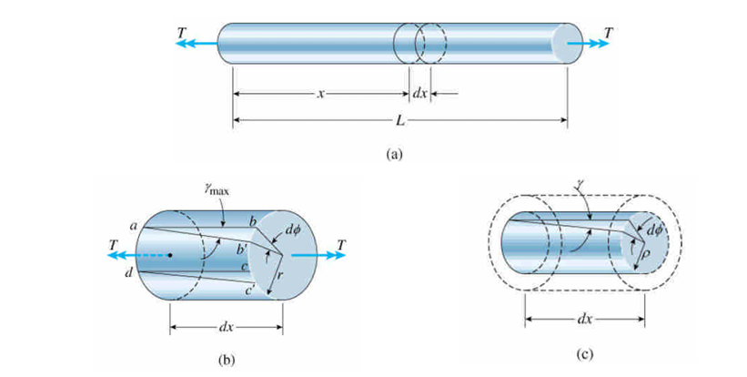
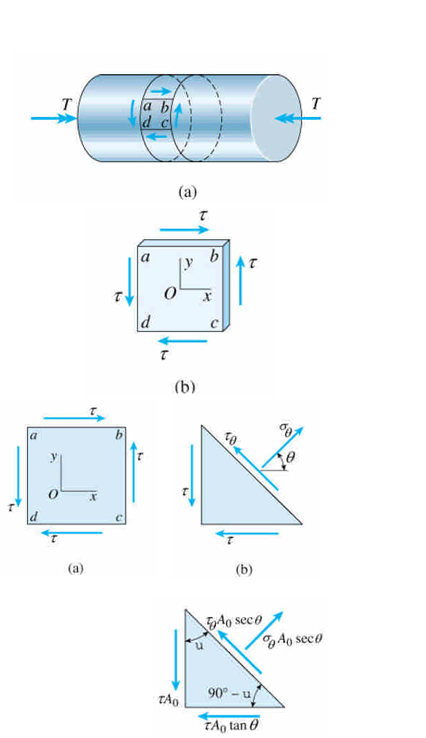

# Torsion

## Torsion

$$T = Pd$$

$$\gamma_\max = \frac{bb'}{ab} = \frac{rd\phi}{dx}$$

$$\theta = \phi/L$$

$$\gamma_\max = r\phi/L$$

$$\gamma = \rho\theta = \rho\gamma_\max/r$$

## shear modulus of elasticituy (G)

$$\tau = G\gamma$$

$$\tau_\max = Gr\theta$$

$$\tau = G\rho\theta = \frac{\rho}{r}\tau_\max$$

$$dM = \tau\rho dA$$

$$T = \int dM = \int\rho\tau dA = \int G\theta\rho^2dA = G\theta I_p$$

$$I_p = \frac{\pi r^4}{2}$$

$$\theta = T/(GI_p)$$

$$\phi = \theta L = \frac{TL}{GI_p}$$

* torsional flexibility : $f = \frac{L}{GI_p}$
* torsional stiffness : $k = \frac{GI_p}{L}$

$$\tau = G\rho\theta = G\rho\frac{T}{GI_p} = \frac{T\rho}{I_p}$$
## Stresses and Strains in Pure Shear

$$\sigma_\theta A_0\sec\theta = \tau A_0\sin\theta+\tau A_0\tan\theta\cos\theta$$

$$\sigma_\theta = 2\tau\sin\theta\cos\theta = \tau\sin2\theta$$

$$\tau_\theta A_0\sec\theta = \tau A_0\cos\theta-\tau A_0\tan\theta\sin\theta$$

$$\tau_\theta = \tau(\cos^2\theta-\sin^2\theta) = \tau\cos2\theta$$

|  $\tau$   | $\theta$  |
|:---------:|:---------:|
|  $\tau$   |    $0$    |
|  $-\tau$  | $\pm90^o$ |
| $\pm\tau$ | $\pm45^o$ |

$$\varepsilon_\max = \frac{\sigma_\max}{E}-\frac{\nu\sigma_\min}{E} = \frac{\tau}{E}(1+\nu) = \gamma/2$$