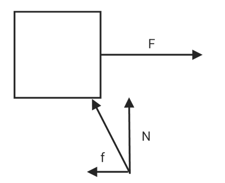
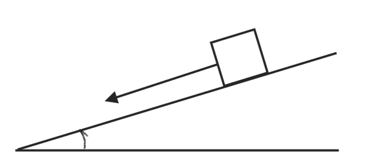
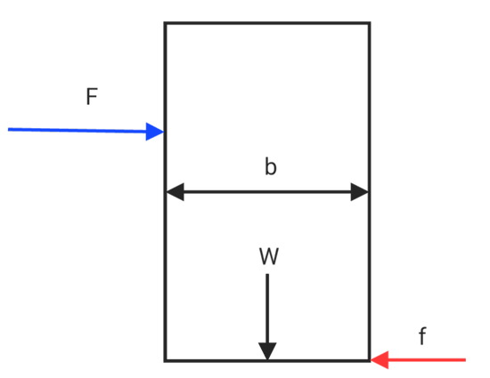
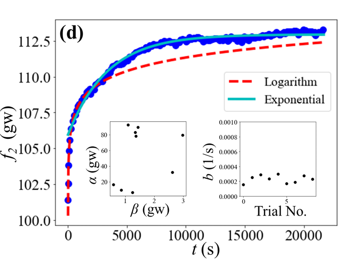

# Friction

$$f = \mu N$$
* $\mu>0$
$$f_s = \mu_sN$$

$$f_k = \mu_kN$$
## Friction Angle & Repose Angle

Maximum static friction
* Repose Angle : $\phi$
* Friction Angle : $\theta$

$$\mu_s = tan(\phi)$$

$$tan(\phi) = \frac{f_s}{N}$$

$$f_{smax} = \mu_s N$$

$$\sum F_{yi} = 0$$

$$N = wcos(\theta)$$

$$\sum F_{xi} = 0$$

$$f_s = wsin(\theta)$$

$$tan(\phi) = \frac{wsin(\theta)}{wcos(\theta)} = \mu_s$$

$$tan(\phi) = tan(\theta)$$

## Friction conditions

1. rest
$$F = f_s$$
2. Maximum static friction
$$F = f_{smax} = \mu_sN$$
3. Movement
$$f_k = \mu_kN$$

## topple over

if center of mass is center of shape.
* height : $h$
* Bottom length : $b$
$$\sum F_y = 0$$

$$N = w = mg$$

$$\sum F_x = 0$$

$$F-f = 0$$

$$F = \mu N = \mu mg$$

$$\sum \tau = 0$$

$$wb/2 = Fh$$

$$mgb/2 = \mu mgh$$

$$h = \frac b{2\mu}$$

## Slope and Horizontal force

**Push uphill**
$$F \ge w\frac{tan(\phi)+tan(\theta)}{1-tan(\phi)tan(\theta)}$$

$$F \ge w\ tan(\phi+\theta)$$

**Pull downhill**

$$F \ge w\frac{tan(\phi)-tan(\theta)}{1+tan(\phi)tan(\theta)}$$

$$F \ge w\ tan(\phi-\theta)$$

## Friction occurs both horizontally and vertically

Maximum static friction
**variable**

1. $\theta$
2. $N_A$
3. $N_B$
4. $f_A$
5. $f_B$

**condition**

1. $\sum F_x = 0$
2. $\sum F_y = 0$
3. $\sum \tau = 0$
4. $f_A = \mu_AN$
5. $f_B = \mu_BN$

## Statically indeterminate system

* if the friction is not Maximum static friction.

There are more reaction forces in these systems than equilibrium equations, so they cannot be uniquely determined. This means that they are sensitive to small perturbations because there are "infinitely many solutions".
**Balancing equations:**
$$N_B = f_A$$

$$N_A+f_B = w$$

$$\frac w2(Lcos(\theta)-dsin(\theta)) = f_2Lcos(\theta)+N_2Lsin(\theta)$$

* weight : $w$
* length : $L$
* width : $d$
**Friction force vs. time**

$$f_B = ae^{−bt}+c$$

* As time goes by, the friction value will become less regular.

