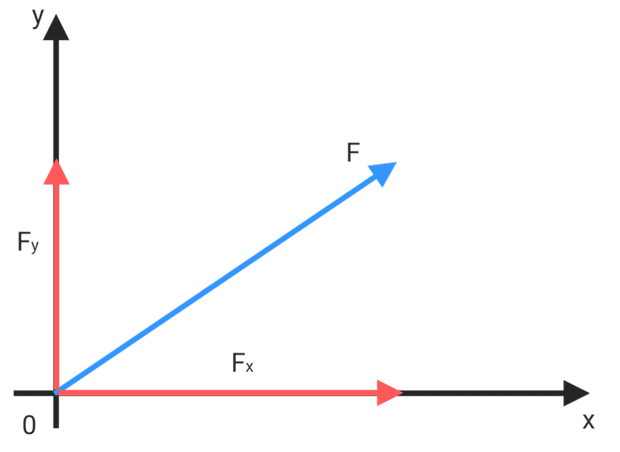
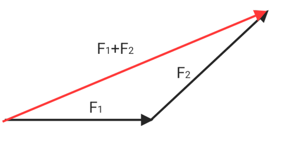
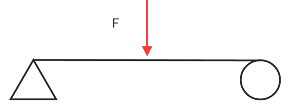
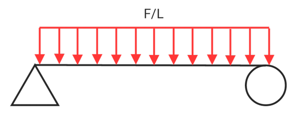
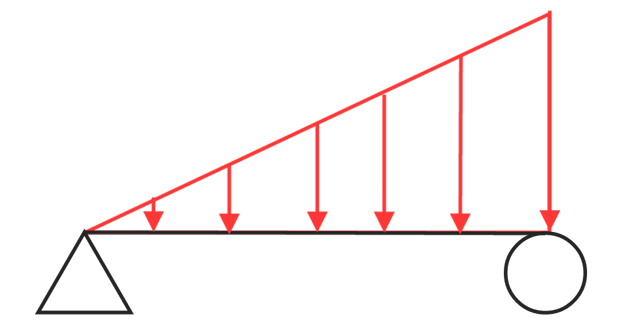
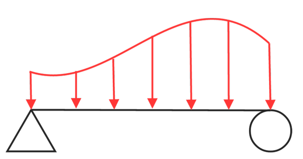
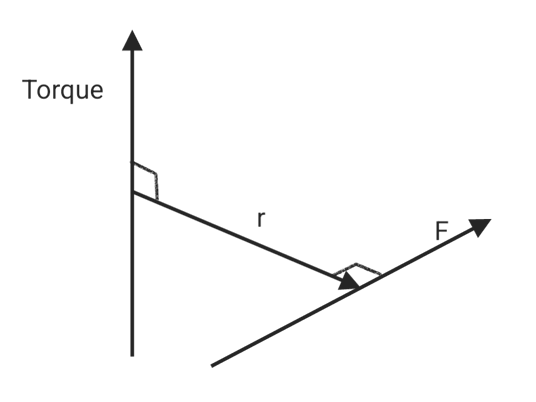
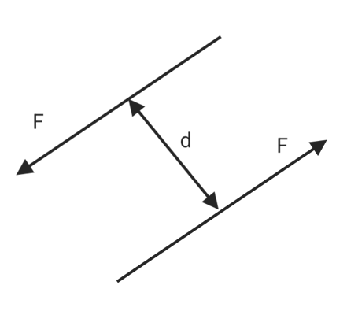
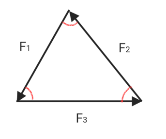

# Plane force system

## Force Decomposition

$$F_x = Fcos(\theta)$$

$$F_y = Fsin(\theta)$$

$$\frac{F}{r} = \frac{F_x}{x} = \frac{F_y}{y}$$

## Forces synthesis

* **Two forces**
$$F = F_A+F_B$$

$$F_B = F-F_A$$

$$F_A = F-F_B$$

$$F_{tt} = \sqrt{(F_A+F_Bcos(\theta))^2+(Fsin(\theta))^2}$$

$$= \sqrt{F_A^2+2F_AF_Bcos(\theta)+F_B^2cos(\theta)+F_B^2sin(\theta)}$$

$$F_{tt} = \sqrt{F_A^2+F_B^2+2F_AF_Bcos(\theta)}$$

$$\alpha = tan^{-1}\frac{F_Bsin(\theta)}{F_A+F_Bcos(\theta)}$$

* **Multiple force**
$$F_{tt} = \sqrt{(\sum F_{xi})^2+(\sum{F_{yi}})^2}$$

$$F_x = \sum F_i\vec x$$

$$F_y = \sum F_i\vec y$$

$$\theta = tan^{-1}\frac{\sum F_{yi}}{\sum F_{xi}}$$

$$P(x,y) = (\frac{\sum (F_{xi}x_i)}{F_{xi}},\frac{\sum (F_{yi}y_i)}{F_{yi}})$$

## Two support points Load force

* **point load**

$$F_A+F_B = w$$

* **uniformly distributed load**

$$F_A = \int_0^L\frac wLdx =\frac w2$$

* **uniformly varying load**

$$F_A = \int_0^L\frac wL\frac{x}{L}dx = \frac w3$$

* **unevenly varying load**

$$F_A = \frac wL\int_0^L(\frac{x}{L})^n+(\frac{x}{L})^{n-1}+...dx$$

## Couple & Torque

$$\tau = F\times r$$

$$C = F\times d$$

* **Decomposition**
$$Fr = F_xy+F_yx$$
* **synthesis**
$$\tau_{tt} = \sum(F_i\times r_i)$$
* $r_1,r_2,r_3 \le r_{tt}$

## Force and moment balances

**Balance of 2 forces**
$$\vec F_A = -\vec F_B$$

$$\vec F_A+\vec F_B = 0$$
**Balance of 3 forces**

* Lami's theorem

$$\frac{F_A}{sin(A)} = \frac{F_B}{sin(B)} = \frac{F_C}{sin(C)}$$

**Balance of Multi-force**
$$\sum F_{xi} = 0$$

$$\sum F_{yi} = 0$$

$$\sum \tau_{i} = 0$$
