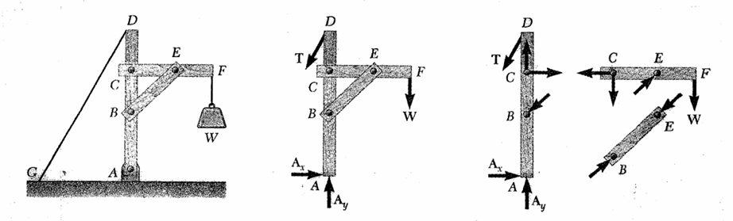
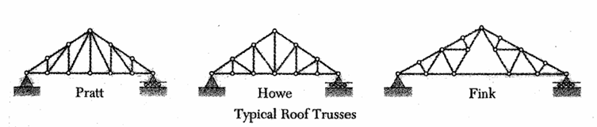

# Analysis of structures

## Stable structure analysis

One truss with two joint
$$m = 2n-3$$

$$2n = m+3$$

* number of joint : $n$
* number of Truss : $m$

## Mechanism analysis

$$P = \frac32N-2$$

* number of pairs : $P$
* number of link : $N$

structure : $2P > 3N-4$
mechanism (Kinematic chain) : $2P = 3N-4$
No constraints : $2P < 3N-4$

## Space Stable structure analysis

$$m = 3n-6$$

* number of joint : $n$
* number of Truss : $m$

## Equilibrium

* statically indeterminate :
$$\text{unknowns}>\text{equation}$$
* nonrigid :
$$\text{unknowns}<\text{equation}$$
