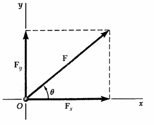
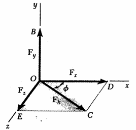
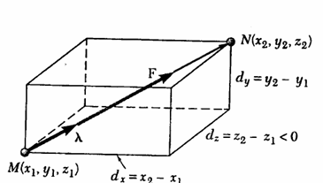

# Statics of particles

## Force on a particle (several concurrent force)

* concurrent force : all force pass through a point.
* coplanar force force : contained in the same plane.

**Common solutions**

1. Law of sines :
$$F^2 = F_1^2+F_2^2-2F_1F_2cos(\theta)$$
2. Law of cosines :

$$\frac{F_1}{sin(\theta_1)} = \frac{F_2}{sin(\theta_2)} = \frac{F_3}{sin(\theta_3)}$$

## xy components of a  force

$F$ may be resolved into a component $F_x$ and $F_y$ .
$$F = F_x+F_y$$

* x component $F_x$:

$$F_x = |F_x|\vec x$$

$$F_x = Fcos(\theta)$$

* y component $F_y$:

$$F_y = |F_y|\vec y$$

$$F_y = sin(\theta)$$

* angle $\theta$ :

$$tan(\theta) = \frac{F_y}{F_x}$$

* Force $F$ :

$$F^2 = F_x^2+F_y^2$$

## Addition of force by summing x and y components

$$F = F_x+F_y$$

$$F_x = \sum F_{xi}$$

$$F_y = \sum F_{yi}$$

$$\theta = tan^{-1}(F_y/F_x)$$

## Equilibrium of a particle

$$F_{tt} = \sum F_i = 0$$

$$\sum(F_{xi}+F_{yi}) = 0$$

$$\sum F_{xi} + \sum F_{yi} = 0$$

$$\sum F_{xi} = 0$$

$$\sum F_{yi} = 0$$

* If the resultant force acting on a particle is zero, the particle will remain at reat (Follow Newton's first law of motion)

## Force on different planes

* **on plane hv**

$$F = F_h+F_v$$

* $F_h$ : vertical component of $F$
* $F_v$ : horizotal compmnent of $F$

$$F_h = Fcos(\theta)$$

$$F_v = Fsin(\theta)$$

* **on plane xy**

Plane hv is perpendicular to plane xy, Only $F_v$ parallel to the xy plane.

$$F = F_x+F_y$$

* x compmnent

$$F_x = F_hcos(\phi)$$

$$F_x = Fcos(\theta)cos(\phi)$$

* y compmnent

$$F_y = F_v$$

## Force in space

$$F = F_x+F_y+F_z$$

$$F^2 = F_x^2+F_y^2+F_x^2$$

$$= F^2cos^2(\theta_x)+F^2cos^2(\theta_y)+F^2cos^2(\theta_z)$$

* thus $cos^2(\theta_x)+cos^2(\theta_y)+cos^2(\theta_z) = 1$

***

$$cos(\theta_x) = F_x/F$$

$$cos(\theta_y) = F_y/F$$

$$cos(\theta_z) = F_z/F$$

$$F = F_x\vec x+F_y\vec y+F_z\vec z$$

$$= F(cos(\theta_x)\vec x+cos(\theta_y)\vec y+cos(\theta_z)\vec z) = F\vec\lambda$$

$$\vec\lambda = \frac1F(F_x\vec x+F_y\vec y+F_z\vec z)$$

## Addition of force in space

$$F = F_x+F_y+F_z = \sum F_i$$

$$F_x = \sum F_{xi}$$

$$F_y = \sum F_{yi}$$

$$F_z = \sum F_{zi}$$

## Equilibrium of a particle in space

$$F_{tt} = \sum F_i = 0$$

$$F_x = \sum F_{xi} = 0$$

$$F_y = \sum F_{yi} = 0$$

$$F_z = \sum F_{zi} = 0$$
