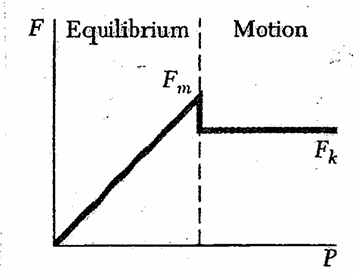
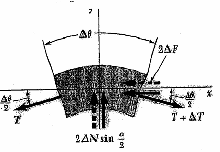
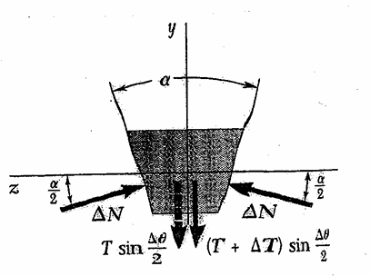

# Friction

## The of Dry friction

**motion impending**

$$f_s = F$$

$$f_{max} = \mu_s N$$

* not reach the maximum friction $$f_s \not=F$$

**on motion**
$$f_k = \mu_kN$$

$$F = f_k$$

## Coeffcient of friction

$$\mu_s = F/N$$

1. $\theta = 0$ on friction
2. $\theta<\phi_s$

$$N = Wcos(\theta) \qquad F = Wsin(\theta)$$

$$tan(\phi) = F/N = cos(\theta)/sin(\theta) = tan(\theta) <tan(\phi_s)$$

no motion
3. $\theta = \phi_s$
$$N = Wcos(\theta) \qquad F = Wsin(\theta)$$

$$tan(\phi) = F/N = cos(\theta)/sin(\theta) = tan(\theta) = tan(\phi_s)$$

$$f = f_{max}
 = F = \mu_sN$$
4. $\theta>\phi_s$
$$N = Wcos(\theta)$$

$$f_{max} = \mu_sN = Ntan(\phi_s)<Ntan(\theta)$$

$$F = f_k = \mu_kN$$
## Square threaded screw

$$\theta = tan^{-1}(\frac{P}{2\pi r})$$

* lead angle : $\theta$
* lead : $L$
single-threaded screw $L = P$
double-threaded screw $L = 2P$
triple-threaded screw $L = 3P$

**self-locking**
$$\phi_s>\theta$$
## Axle friection (journal bearings)

$$\sum F_y = 0$$

$$N = W$$

$$\sum M = 0$$

$$M = Nd$$
* offset position : $d$

## Disk friction (thrust bearing)

$$\Delta N = (F/A)\Delta A$$

$$= (F/\pi(R^2_1-R^2_2))\Delta A$$

$$\Delta f = \mu_k\Delta N$$

$$\Delta M = r\Delta f = r\mu_kF\Delta A/\pi(R^2_1-R^2_2)$$

$$M = \int dM = \frac{\mu_kF}{\pi(R^2_1-R^2_2)}\int dA$$

$$= \frac{\mu_kF}{\pi(R^2_1-R^2_2)}\int_0^{2\pi}\int_{R_1}^{R_2r}r^2\ dr\ d\theta$$

$$= \frac{\mu_kF}{\pi(R^2_1-R^2_2)}\int_0^{2\pi}1/3(R_1^3-R_2^3)\ d\theta$$

$$\frac{2\mu_kF(R^3_1-R^3_2)}{3\pi(R^2_1-R^2_2)}$$

if $R_2 = 0$ and $R_2 = R$

$$M = 2/3\mu_kFR$$

$$M_{max} = 2/3\mu_sFR$$

## Belt Friction

$$\sum F_x = 0$$

$$(T+\Delta T)cos(\Delta\theta/2)-Tcos(\theta/2)-\mu_s\Delta N = 0$$

$$\sum F_y = 0$$

$$\Delta N-(T+\Delta T)sin(\Delta\theta/2)-Tsin(\Delta\theta/2) = 0$$

$$\Delta T\cos(\Delta\theta /2)-\mu_s(2T+\Delta T)\sin(\Delta\theta/2)= 0$$

$\Delta\theta$, $\Delta N$, $\Delta F$, $\Delta T\to 0$
 and $\cos(\Delta\theta/2)\to 1$

$$\lim_{{\Delta\theta} \to {0}}\frac{sin\Delta\theta/2}{\Delta\theta/2} = \lim_{{\Delta\theta\to0}}\frac{1/2cos(\Delta\theta/2)}{1/2(\Delta\theta/2)} = 1$$

$$dT/d\theta-\mu_sT=0$$

$$\int_{T_1}^{T_2}\frac{dT}{T} = \mu_s\int_0^{\phi}d\theta$$

$$ln(T_2)-ln(T_1) = \mu_s\phi$$

$$ln(T_2/T_1) = \mu_s\phi$$

$$T_2/T_1 = e^{\mu_s\phi}$$

**V-shaped**

$$dT/T = \mu_sd\theta/sin(\beta/2)$$

$$T_2/T_1 = ^{\mu_s\phi /sin(\beta/2)}$$
