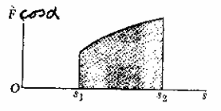
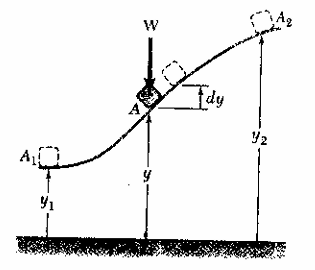
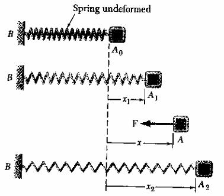

# Energy

## work of a force

**force**

$$dU = F\cdot dr = F\ ds \ cos(a)$$

$$= F_x\ dx+F_y\ dy+F_z\ dz$$

$$U_{i \to f} = \int_{i}^f(F_x\ dx+F_y\ dy+F_z\ dz)$$

**weight**

$$dU = -W\ dy$$

$$U = -W\Delta y = -mg\Delta y$$

**spring**

$$F = kx$$

$$dU = -F\ dx$$

$$U = \int kx\ dx = \frac12k(\Delta x)$$

**gravitational force**
$$F = \frac{GMm}{r^2}$$

$$dU = -F\ dr = -\frac{GMm}{r^2}\ dr$$

$$U = \int_i^f dU = \frac{GMm}{r_f}-\frac{GMm}{r_i}$$

## Kinetic energy

$$K = \frac12mv^2$$

## Poewr and efficiency

$$P = \frac{dU}{dt} = \frac{F\cdot dr}{dt} = F\cdot v$$

$$\eta = \frac{\text{output work}}{\text{input work}}<1$$

## Conservative Force

$$W_{1 \to 2} = E_1-E_2$$

$$U_1+K_1 = U_2+K_2$$
