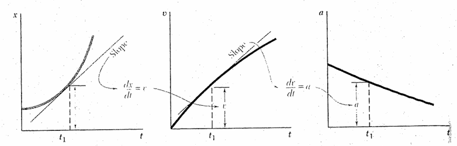
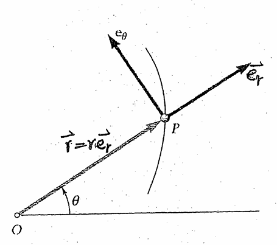

# Kinematics of particles

## Linear motion of particles

* **position**
$$x(t) = a_1t^n+a_2t^{n-1}+a_3t^{n-2}+...+a_nt^{0}$$
* **velocity**
$$v = \frac{dx}{dt} = \dot x$$

$$\int v(t)\ dt = x(t)$$

* **acceleration**
$$a = \frac{dv}{dt} = \dot v = \frac{d^2x}{dt^2}=  \ddot x$$

$$\int a(t)\ dt = v(t)$$

$$\int\int a(t)\ dt = x(t)$$

* **jeck**
$$j = \frac{da}{dt} = \dot a = \frac{d^2v}{dt^2}=  \ddot v$$

$$\frac{d^3x}{dt^3} = \dddot x$$

$$\int j(t)\ dt = a(t)$$

$$\int\int j(t)\ dt = v(t)$$

$$\int\int\int j(t)\ dt = x(t)$$

## Formula without time

$$v = \frac{dx}{dt}$$

$$a = \frac{dv}{dt}$$

$$\int a\ dx = \int v\ dx$$

## 3D motion

* **velocity**

$$v_x = \dot x \qquad v_y = \dot y \qquad v_z = \dot z$$

* **acceleration**

$$a_x = \dot v_x = \ddot x$$

$$a_y = \dot v_y = \ddot y$$

$$a_z = \dot v_z = \ddot z$$

* **jeck**

$$j_x = \dot a_x = \ddot v_x = \dddot x$$

$$j_y = \dot a_y = \ddot v_y = \dddot y$$

$$j_z = \dot a_z = \ddot v_z = \dddot z$$

## Motion Component

$$s = \sqrt{x^2+y^2}$$

$$ds = \sqrt{dx^2+dy^2}$$

### x Component

$$v_x = v(s)\frac{dx}{ds}$$

$$v_x = v(s)\frac{dx}{\sqrt{dx^2+dy^2}}$$

$$v_x = v(s)\frac{1}{\sqrt{1^2+\frac{dy}{dx}^2}}$$

$$v_x = v(s)\frac{1}{\sqrt{1^2+dy'^2}}$$

### y Component

$$v_y = v(s)\frac{dy}{ds}$$

$$v_y = v(s)\frac{dy}{\sqrt{dx^2+dy^2}}$$

$$v_y = v(s)\frac{\frac{dy}{dx}}{\sqrt{1^2+\frac{dy}{dx}^2}}$$

$$v_y = v(s)\frac{y'}{\sqrt{1^2+dy'^2}}$$

## Radial and transverse component

unit vector along radial direction : $e_r$
unit vector along transverse direction : $e_\theta$

* $e_r \perp e_\theta$

$$\frac{de_r}{d\theta} = e_{\theta} \qquad \frac{de_\theta}{d\theta} = e_r$$

$$\frac{e_r}{dt} = \frac{de_r}{d\theta}\frac{\theta}{t} = e_\theta\frac{d\theta}{dt}$$

$$\frac{e_\theta}{dt} = \frac{de_\theta}{d\theta}\frac{\theta}{t} = -e_t\frac{d\theta}{dt}$$

$$\dot e_t = \dot\theta e_\theta \qquad\dot e_\theta = -\dot\theta e_r$$

## Particle motioin(polar coordinate)

$$\vec r = re_r$$

$$\vec v = \dot{\vec x} = \frac{d\vec r}{dt} = \dot re_r+r\dot e_r = \dot re_r+r\dot\theta e_\theta$$

$$\vec a = \dot{\vec v} = \frac{d\vec v}{dt} = \frac{d(\dot re_r+r\dot\theta e_\theta)}{dt}$$

$$= (\ddot re_r+\dot r\dot e_r)+(\dot r\dot\theta e_r+r\ddot\theta e_\theta+r\dot \theta\dot e_\theta)$$

$$= (\ddot r-r\dot\theta^2)e_r+(r\ddot\theta+2\dot r\dot\theta)e_\theta$$

***
velocity : $v_r = \dot r$

Angular velocity : $v_\theta = r\dot\theta$

Tangential acceleration, Centripetal acceleration : $a_r = \ddot r-r\dot\theta^2$

Angular acceleration, Coriolis acceleration : $a_\theta = r\ddot\theta+2\dot r\dot\theta$

### Curve radius

$$S = r\theta$$

$$r = \frac{S}{\theta}$$

$$r = \frac{ds}{d\theta} = \frac{\frac{ds}{dx}}{\frac{d\theta}{dx}}$$

***

$$\frac{dy}{dx} = \tan\theta$$

$$\theta = \arctan \frac{dy}{dx}$$

$$\frac{d\theta}{dx} = \frac{d\arctan y'}{dx}$$

$$\frac{d\arctan y'}{dx} = \frac{y''}{1+y'^2}$$

***

$$S = \sqrt{x^2+y^2}$$

$$\frac{dS}{dx} = \sqrt{1^2+\frac{dy}{dx}^2}$$

$$\frac{dS}{dx} = \sqrt{1^2+dy'^2}$$

$$r = \frac{\sqrt{1+dy'^2}}{\frac{y''}{1+y'^2}} = \frac{(1+dy'^2)^{\frac{3}{2}}}{y''}$$
