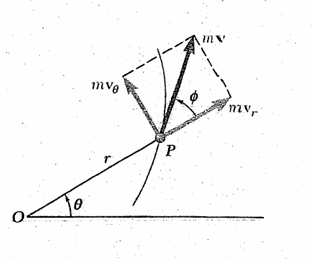
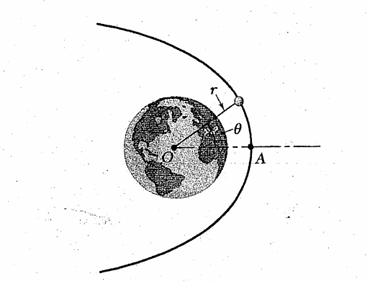
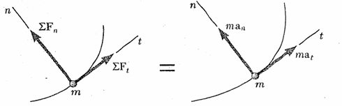
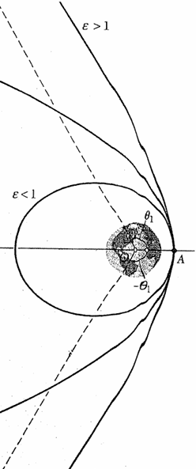

# Kinetics of particles

## Newton's second law of motion

$$F = ma$$

* if $F = 0$ then $a = 0$
if $v_i = 0$ : particle is remain at rest.
if $v_i \not= 0$ : particle move with the constant speed in a straight line (Newton's $1^{\text{st}}$ law).

$$\sum F_x = ma_x = m\ddot x$$

$$\sum F_y = ma_y = m\ddot y$$

$$\sum F_z = ma_z = m\ddot z$$

$$\sum F_r = ma_r = m(\ddot r-r\dot\theta^2)$$

$$\sum Ｆ_\theta = ma_\theta = m(r\ddot\theta+2\dot r\dot\theta)$$

## Momentum of particles

$$p = mv$$

$$F = \dot p = \frac{d(mv)}{dt}$$

if $m \not= \text{constant}$, $F = ma+\dot mv$

* **conservation of momentum**
$$p_{xi} = p_{xf} \qquad p_{yi} = p_{yf} \qquad p_{zi} = p_{zf}$$

$$p_x = mv_{xi} = mv_{xf}$$

$$p_y = mv_{yi} = mv_{yf}$$

$$p_z = mv_{zi} = mv_{zf}$$

* **Coefficient of restitution**

$$e = \frac{v_b-v_a}{v_b'-v_a'}$$

* **Elastic Collision**

$$v_a+v_a' = v_b+v_b'$$

$$e = 1$$

## Augular momentum of particles

$$L = I\omega$$

$$L = mr^2\omega = mr^2\dot\theta$$

$$L = \vec rm\vec v$$

$$\dot L = \dot r\times mv+r\times m\dot v$$

$$= v\times mv+r\times ma$$

$$= r\times\sum F = \sum M$$

* **conservation of augular momentum**

$$L_{xi} = L_{xf} \qquad L_{yi} = L_{yf} \qquad L_{zi} = L_{zf}$$

$$L_x = m\omega_{xi} = m\omega_{xf}$$

$$L_y = m\omega_{yi} = m\omega_{yf}$$

$$L_z = m\omega_{zi} = m\omega_{zf}$$

* **motion under a central force**
$\dot L = 0$ then $L$ is a constant.

$$L = r\times mv = mr^2\dot\theta = \text{constant}$$

* $m$ is a constant, $r$ and $v$ must $\perp L$.

$$dA = \frac12r^2\ \theta$$

$$\frac{dA}{dt} = \frac12r^2\dot\theta = \text{constant}$$

## Newton's law of gravitation

$$F_g = G\frac{Mm}{r^2}$$

* $G \simeq 6.673\times10^{-11}$

$$W = mg = \frac{GMm}{r^2}$$

$$GM = gr^2$$

$$g = \frac{GM}{r^2}$$

* $R_e \simeq 6.37\times10^6 \qquad g \simeq 9.81$

## Trajectory of a particle under a central force

$$\sum F = ma$$

$$m(\ddot r-r\dot\theta^2) = -F$$

$$m(r\ddot\theta+2\dot r\dot\theta) = 0$$

* Angular momentum per unit mass : $l$

$$L/m = \frac{I\omega}{m} = l$$

$$l = r^2\dot\theta = \text{constant}$$

$$\dot\theta = l/r^2$$
**velocity**
$$\dot r = \frac{dr}{dt} = \frac{dr}{d\theta}\dot\theta = \frac{l}{r^2}\frac{dr}{d\theta} = -l\frac{d}{d\theta}(\frac1r)$$

* Radial velocity : $\dot r$

$$\dot r = \frac{dr}{dt} = \frac{dr}{d\theta}\dot\theta = \frac{l}{r^2}\frac{dr}{d\theta}$$

$$l = r^2\omega$$

$$\vec v_r = \omega\frac{dr}{d\theta} = \frac{d}{d\theta}(\frac{-l}r)$$

**acceleration**

$$\ddot r = \frac{d\dot r}{dt} = \frac{d\dot r}{d\theta}\dot\theta = \frac{l}{r^2}\frac{d}{d\theta}(-l\frac{d}{d\theta}(\frac1r)) = -\frac{l^2}{r^2}\frac{d^2}{d\theta^2}(\frac1r)$$

* Radial acceleration : $\ddot r$
* let $u = 1/r$

$$\ddot r = -l^2u^2\frac{d^2u}{d\theta^2}$$

$$\frac{l}{r} = r\omega = v_t$$

$$\vec a_r = \frac{v_t^2}{r}\frac{d^2}{d\theta^2}$$

***
$$\ddot r = r\dot\theta^2-\frac Fm = \frac1ul^2u^4-\frac Fm = -l^2u^2\frac{d^2u}{d\theta^2}$$

$$\frac{d^2u}{d\theta^2}+u = \frac{F}{ml^2u^2}$$

$$\frac{d^2u}{d\theta^2}+u = u$$

## Space mechanics

$$F = GMm/r^2 = GMmu^2$$

* mass of the earth : $M$
* mass of the things on earth : $m$
* the radius of the Earth : $r$

$$\frac{d^2u}{d\theta^2}+u = \frac{GM}{l^2} = \text{constant}$$

$$u = \frac1r = \frac{GM}{l^2}+Ccos(\theta)$$

* constant : $C$

$$\varepsilon = \frac{C}{GM/l^2} = \frac{Cl^2}{GM}$$

eccentricity : $\varepsilon$

$$\frac1r = \frac{GM}{l^2}(1+\varepsilon cos(\theta))$$
the equation represents 4 possible trajectories

1. $\varepsilon = 0$
The circular trajectory appears
$r = \frac{l^2}{GM} = \text{constant}$
2. $0 < \varepsilon < 1$
The elliptical trajectory appears
3. $\varepsilon = 1$
The parabolic trajectory appears
4. $1 < \varepsilon$

The hyperbolic trajectory appears

$$l = rv = r^2\dot\theta$$

$$W = mg = GMm/r^2$$

when $\theta = 0$ and $\varepsilon = 1$
$$\frac1r = \frac{GM}{l^2}(1+1)$$

$$l^2 = 2GMr$$

$$l = vr$$

$$v^2r^2 = 2GMr$$

$$v_{esc} = (2GM/r)^{1/2} = (2gR^2/r)^{1/2}$$

if $R = r$

$$v_{esc} = (2gR)^{1/2}$$

1. if $v > v_{esc}$ , $\varepsilon > 1$ : hyperbolic　
2. if $v = v_{esc}$ , $\varepsilon > 1$ : parabola
3. if $v < v_{esc}$ , $\varepsilon > 1$ : ellipse

## Elliptical trajectory

$$dA/dt = l/2$$

$$dA = l/2\ dt$$

$$\pi ab = A = \int dA = l/2\int\ dt = l\Delta t/2$$

$$\Delta = 2\pi ab/l$$

$$r_{max}+r_{min} = 2a$$

$$a = (r_{max}+r_{min})/2$$

$$b^2 = a^2-(a-r_{min})^2$$

$$= 2ar_{min}-r_{min}^2 = r_{min}(2a-r_{min}) = r_{min}r_{max}$$

$$\Delta t = \frac{2\pi(r_{min}+r_{max})(r_{min}r_{max})^{1/2}}{2l}$$

$$\Delta t = \frac{\pi(r_{min}+r_{max})(r_{min}r_{max})^{1/2}}{l}$$
