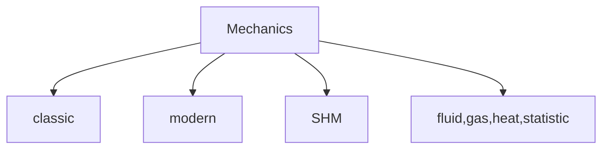

# Mechanics (Physics)

@DH3868
:::success
## Classic
1. [Linear motion](https://hackmd.io/NCiLkYKnRZa_ZcYjlwqXgg)
1. [2,3D motion](https://hackmd.io/O3_JfNgZQqWG0mNFFssczg)
1. [Newton's laws of motion](https://hackmd.io/z-FRJZNuT3WmNinkE61X0g)
1. [Force & motion ](https://hackmd.io/iVZhndnGSximkERcn61N4A)
1. [Kinetic energy & work & potential energy](https://hackmd.io/m3Puv614SqGbRi5_d88log)
1. [Center of Mass & Momentum](https://hackmd.io/QFRAFgEySaWBVeyBK-zRjw)
1. [Rotation](https://hackmd.io/n-nAgnYOQf-1b3eiCFOiPQ)
1. [Roll & Angular Momentum](https://hackmd.io/-c9n9L4VTTSRt84Unjpy4Q)
1. [Elasticity & Balance](https://hackmd.io/xsc_VcBFTH-PDFKm98V2Vw)
1. [Gravity](https://hackmd.io/T3VmyFelQL-NJ4sQKKTGdQ)
:::
:::info
## Fluid & Gas & Heat & statistic
1. [Fluid](https://hackmd.io/9LKzSDEBQAyy6-NpeDFtSA)
1. [ideal fluid](https://hackmd.io/096AUQm1Taq98uD9MfQ7eQ)
1. [Fluid properties](https://hackmd.io/QQTm6LwvTF-nrsvPubcS2w)
1. [Zeroth & First Laws of Thermodynamics](https://hackmd.io/pCFarKGVRFGthtvHVYe6tQ)
1. [Kinetic theory of gases](https://hackmd.io/hpfMMzq5SACPecke6xQQpA)
1. [Entropy & Second Law of Thermodynamics](https://hackmd.io/SxRejJrzStqnwVeGESaz-Q)
1. [ black hole thermodynamics](https://hackmd.io/ghzPXCs3SpmGHUEyuY3YZA)
1. [What is statistical mechanics ?](https://hackmd.io/Pim41w-qSsi2YxWfMKB_ew)
:::
:::danger
## SHM
1. [Oscillation](https://hackmd.io/-tIJbtiaR-iSaB6kGRgF9w)
1. [Simple Harmonic Oscillation](https://hackmd.io/0sXCYKfMRQ6mWLOu7cKLFQ)
1. [simple harmonic pendulum](https://hackmd.io/q5N7fhrfR8yz8SOfTWSStQ)
1. [Damping harmonics motion](https://hackmd.io/fWqU96XdT2KS4SK798fSxQ)
1. [Resonance](https://hackmd.io/9bjjhuSlQQecSWf8BP8D7w)
1. [Wave](https://hackmd.io/CMWCkcxjS5arPMWlh5x4JQ)
1. [Wave interference](https://hackmd.io/-ljFbSh9SQeKST0khrQpVQ)
1. [Sound wave](https://hackmd.io/aO-kOVc0SrKNH3MQK4r1VQ)
:::
:::warning
## Modern
1. [Relativity](https://hackmd.io/StkGoIUtSQS1bOzlObTqrw)
1. [Fundamental interaction & Nuclear physics](https://hackmd.io/KVthDWjnSKS6slHlBQSR-w)
:::
****
:::spoiler **Math tools**
1. [Vector](https://hackmd.io/7aE62HNwT_a063nY-lr9Hg)
1. [Mathematical formula](https://hackmd.io/4ZY1LRZfR-2JASASMAHrNg)
1. [Physics notations](https://hackmd.io/tH-DXQs2QHWSvg5PEJEZxw)
1. [Constants](https://hackmd.io/PQdt-_geR8-tkNDRFdBDzQ)
1. [Greek alphabet](https://hackmd.io/rsVJbpc5QFWEXk62S-alfw)
:::
:::spoiler **General Physics**
1. [Force & motion ](https://hackmd.io/tD5lA619TC2YtpWj9n1ZHg)
1. [Heat](https://hackmd.io/GfG8OeQoSB-ZPoEnXCLlcQ)
1. [Wave](https://hackmd.io/aUd9FnYFRhWwYv2xGNFvxw)
1. [Light](https://hackmd.io/d57WmBiwS4Gsg67gYKYUMA)
1. [Electricity](https://hackmd.io/Q90jyjiOQOyVa_h2TqsaBg)
:::
:::spoiler **Important formula** 
1. [Mechanics](https://hackmd.io/spKQ07Q-Td25RRghSWpx9g)
1. [Energy](https://hackmd.io/DJLcQOFERYCrmlwpzFJfvQ)
:::
:::spoiler **Special**
1. [spring](/bkcNhrbuRreR-OI7OkTOJQ)
1. [Maxwell-Boltzmann distribution](/BL9CLkpUQY-TAHmx-w0Z3g)
1. [Energy & Coefficient of restitution](/2hz1NLTtQwSdnrbFQj2iBA)
:::
