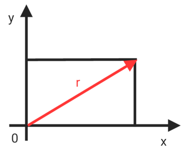
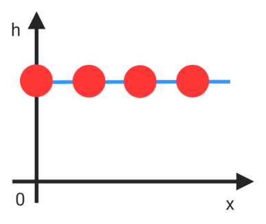
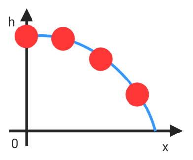
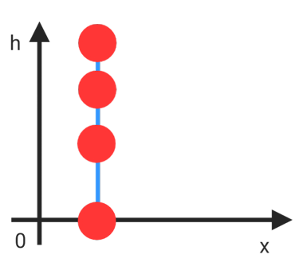
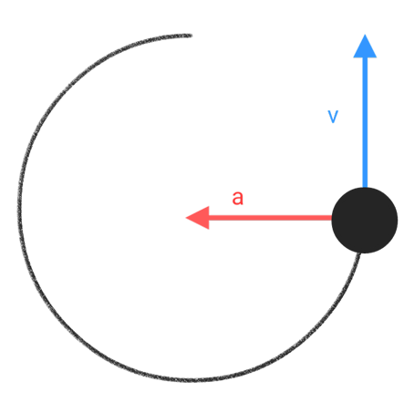
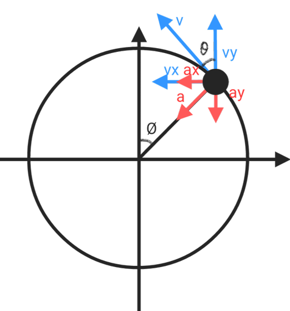
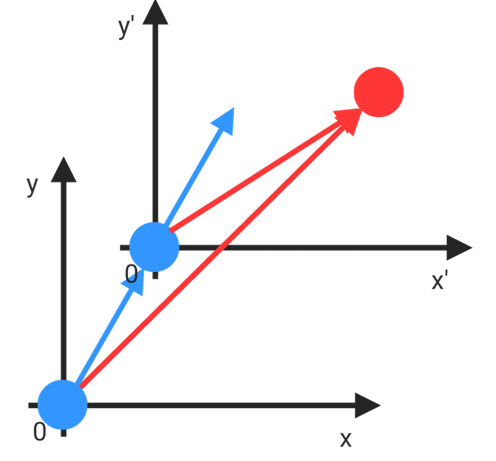

# 2,3D motion

Motion in two or three dimensions is described with position, velocity, and acceleration vectors. The examples separate components to analyze projectiles, circular motion, and relative motion.

position vector $= \vec{r}$

$$\vec{r} = x\vec{i}+y\vec{j}+z\vec{k}$$

## Moving distance

$$\boxed{r = \sqrt{x^2 + y^2 + z^2}}$$

$$Δ\vec{r} = \vec{r_f}-\vec{r_i}$$

$$Δ\vec{r}= (x_f-x_i)\vec{i}+(y_f-y_i)\vec{j}+(z_f-z_i)\vec{k}$$

## Velocity

Velocity is the time derivative of position. Its direction distinguishes it from scalar speed.

$$v = \frac{dr}{dt}$$

$$\vec{v}= v_x\vec{i}+v_y\vec{j}+v_z\vec{k}$$

$$vx = \frac{dx}{dt}\qquad vy = \frac{dy}{dt}\qquad vz = \frac{dz}{dt}$$

## Acceleration

Acceleration is the time derivative of velocity. A change in direction can produce acceleration even at constant speed.

$$\vec{a_{avg}} = \frac{\vec{v_f}-\vec{v_i}}{t_f-t_i} = \frac{Δ\vec{v}}{Δt}$$

$$\vec{a}= a_x\vec{i}+a_y\vec{j}+a_z\vec{k}$$

$$a_x = \frac{dv_x}{dt} = \frac{d^2x}{dt^2}$$

$$a_y = \frac{dv_y}{dt} = \frac{d^2y}{dt^2}$$

$$a_z = \frac{dv_z}{dt} = \frac{d^2z}{dt^2}$$

## projectile

The (a)acceleration of the projectile is constant and The acceleration direction of the projectile is parallel to the y-axis

if $a = 0$

$$v_x = v_icos𝜃$$

$$x-x_i = (v_icos𝜃)t$$

$$v_y = v_isin𝜃$$

$$y-y_i = (v_isin𝜃)t$$

if $a = g$

$$v_x = v_icos𝜃$$

$$x-x_i = (v_icos𝜃)t$$

$$v_y = v_isin𝜃-gt$$

$$y-y_i = v_isin𝜃t+\frac{1}{2}gt^2$$

* The relationship between the position, velocity and acceleration of projectile. ''without (t) variable''

* $y = y_i+Δx⋅v_itan𝜃+\frac{1}{2}g(\frac{Δx}{V_icos𝜃})^2$

$$t = \frac{Δx}{v_icos𝜃}$$

$$y = y_i+v_isin𝜃t+\frac{1}{2}gt^2$$

$$= y_i+v_isin𝜃(\frac{Δx}{v_icos𝜃})+\frac{1}{2}g(\frac{Δx}{v_icos𝜃})^2$$

$$y = y_i+Δx⋅v_itan𝜃+\frac{1}{2}g(\frac{Δx}{v_icos𝜃})^2$$

* $v_y^2 = (v_isin𝜃)^2+2g(y-y_i)$

$$v^2 = v_i^2+2aS$$

$$v_y^2 = (v_isin𝜃)^2+2g(y-y_i)$$

* $x_{max} = \frac{v_i^2sin2𝜃}{g}$

$$t_{max} = \frac{2v_isin𝜃}{g}$$

$$X_{max} = v_icos𝜃⋅t = v_icos𝜃⋅\frac{2v_isin𝜃}{g} = \frac{v_i^2sin2𝜃}{g}$$

when $v_x = 0$

$$v_y = gt$$

$$y = y_i+\frac12gt^2$$

## Circular motion

* acceleration

centripetal acceleration　: $a_c$

Tangential acceleration　: $a_t$

$$a^2 = a_t^2+a_c^2$$

* centripetal acceleration  (green)

$$v = \frac{2𝜋r}{T}$$

$$a = (\frac{2𝜋r}{t})^2/r = \frac{4𝜋^2r}{t^2} = \frac{v^2}{r}$$

***

$$\theta = \frac{S}{r} = \frac{vt}{r}$$

$$\boxed{a = \frac{v^2}{r}}$$

* Tangential acceleration  (pink)

$$𝛼 = \frac{d𝜔}{dt}$$

$$\boxed{a = r⋅𝛼}$$

## relatioin motion

* Velocity
if $v<<c$

$$x_{pa} = x_{pb}+x_{ab}$$

$$\frac{dx_{pa}}{dt} = \frac{dx_{pb}}{dt}+\frac{dx_{ab}}{dt}$$

$$\vec{v_{pa}} = \vec{v_{pb}}+\vec{v_{ab}}$$

