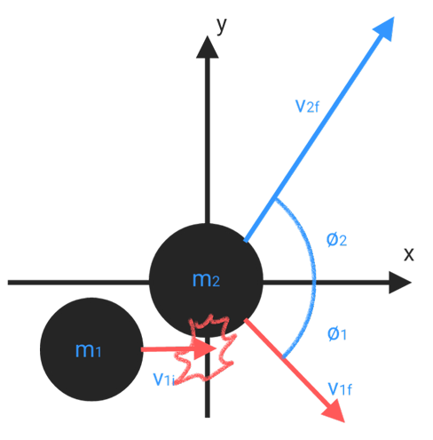

# Center of Mass & Momentum

## Center of mass

$$r_{com} =\sum\frac{m_ir_i}{m_i} $$

$$ = \frac{(m_1r_1+m_2r_2+...m_nr_n)}{(m_1+m_2+...m_n)}$$

$$ = \frac{(m_1r_1+m_2r_2+...m_nr_n)}{M}$$

$$\vec{r_i} = x_i\vec{i}+y_i\vec{j}+z_i\vec{k}$$

$$x_{com} = \sum\frac{m_ix_i}{m_i} $$

$$y_{com} = \sum\frac{m_iy_i}{m_i} $$

$$z_{com} = \sum\frac{m_iz_i}{m_i} $$

$$XYZ_{moc}(x,y,z) = \frac{1}{M}\sum{(m_ix_i,m_iy_i,m_iz_i)}$$

## Density

$$D = \frac{m}{V}$$

## Momentum and Impulse

$$\vec{F_{net}} = m\vec{a_{com}}$$
* Momentum
$$\vec{p} = m\vec{v}$$

$$\vec{F} = \frac{d\vec{p}}{dt} = \frac{md\vec{v}}{dt} = m\vec{a}$$

* Impulse
$$\vec{J} = P_i-P_f$$

$$J = \int_{t_i}^{t_f}Fdt = F{\Delta t}$$

* momentum conservation
$p_{com}$ is a constant
$p_{comi} = p_{comf}$

## Collision
$$p_1i+p_2i = p_1f+p_2f$$
* Inelastic collision

$$m_1v_{1i}+m_2v_{2i} = m_1v_{1f}+m_2v_{2f}$$

$$v_{1f}=v_{2f}$$

if$v_{2i} = 0$
$$m_1v_i = (m_1+m_2)v_f$$

$$v_f = \frac{m_1v_i}{m_1+m_2}$$

$$\vec{p_{com}} = Mv_{comi} = Mv_{comf}$$

$$\vec{p_{com}} = \vec{p_{1i}}+\vec{p_{2i}}$$

$$v_{comf} = \frac{\vec{p_{com}}}{M} = \frac{\vec{p_{com}}}{m_1+m_2}$$
* Elastic collision

if $m_1 = m_2$ and $m_{2i} = 0$ , then $v_{1i} = v_{2f}$ and $v_{1f} = 0$

if $m_1 >> m_2$ and $m_{2i} = 0$ , then $v_{1f} \simeq v_{2f} \simeq v_{1i}$ 

if $m_1 << m_2$ and $m_{2i} = 0$ , then $v_{1f} \simeq -v_{1i}$ and $v_{2f} \simeq 0$

$$K_{1i}+K_{2i} = K_{1f}+K_{2f}$$

$$m_1v_{1i}+m_2v_{2i} = m_1v_{1f}+m_2v_{2f}$$

$$m_1(v_{1i}-v_{1f}) = m_2(v_{2f}-v_{2i})\quad-(1)$$

$$v_{1f} = \frac{m_1v_{1i}+m_2(v_{2i}-v_{2f})}{m_1}\quad-(2)$$

$$v_{2f} = \frac{m_2v_{2i}+m_1(v_{1i}-v_{1f})}{m_2}\quad-(3)$$

$$\frac{1}{2}m_1v_{1i}^2+\frac{1}{2}m_2v_{2i}^2 = \frac{1}{2}m_1v_{1f}^2+\frac{1}{2}m_2v_{2f}^2$$

$$m_1v_{1i}^2+m_2v_{2i}^2 = m_1v_{1f}^2+m_2v_{2f}^2$$

$$m_1(v_{1i}^2-v_{1f}^2) = m_2(v_{2f}^2-v_{2i}^2)$$

$$(1)\Longrightarrow m_1(v_{1i}-v_{1f})(v_{1i}+v_{1f}) = m_2(v_{2i}-v_{2f})(v_{2i}+v_{2f})$$

$$v_{1i}+v_{1f} = v_{2i}+v_{2f}\quad-(4)$$

linear equation in two variables
$$(4)\Longrightarrow(2),(3)$$

## 2D collisionc (Elastic)

$$p_{1i}+p_{2i} = p_{1f}+p_{2f}$$

$$K_{1i}+K_{2i} = K_{1f}+K_{2f}$$

$$v_x^2+v_y^2 = v^2$$

* X direction
$$p_{xi} = p_{xf}$$

$$p_{1xi}+p_{2xi} = p_{1xf}+p_{2xf}$$

$$m_1v_{1xi}+m_2v_{2xi} = m_1v_{1xf}+m_2v_{2xf}$$

$$m_1(v_{1xi}-v_{1xf}) = m_2(v_{2xi}-v_{2xf})$$

* Y direction
$$p_{yi} = p_{yf}$$

$$p_{1yi}+p_{2yi} = p_{1yf}+p_{2yf}$$

$$m_1v_{1yi}+m_2v_{2yi} = m_1v_{1yf}+m_2v_{2yf}$$

$$m_1(v_{1yi}-v_{1yf}) = m_2(v_{2yi}-v_{2yf})$$

* if $v_2i = 0$ , $m_1 = m_2$ and $v_{1yi} = 0$

$$v_{1yf} = -v_{2yf}\quad-(1)$$

$$v_{1xi}-v_{1xf} = -v_{2xf}\quad-(2)$$

$$\frac{1}{2}m_1v_{1i}^2 = \frac{1}{2}m_1v_{1f}^2+\frac{1}{2}m_2v_{2f}^2$$

$$m_1v_{1i}^2 = m_1v_{1f}^2+m_2v_{2f}^2$$

$$v_{1xi}^2-v_{1f}^2 = v_{2f}^2\quad-(3)$$

$$(1),(2)\Longrightarrow(3)$$

$$v_{1xi}^2-v_{1yf}^2-v_{1xf}^2 =v_{1yf}^2+(v_{1xi}-v_{1xf})^2$$

$$v_{1xi}^2-v_{1yf}^2-v_{1xf}^2 =v_{1yf}^2+v_{1xi}^2+v_{1xf}^2-2v_{1xf}v_{1xi}$$

$$0=2(v_{1yf}^2+v_{1xf}^2-v_{1xf}v_{1xi})$$

$$v_{1xf}v_{1xi} = v_{1yf}^2+v_{1xf}^2 = v_{1f}^2$$

## Variable mass system
* rocket formula 1

$v_e =$ Exhaust gas speed
$R =m/t$ fuel loss rate (loss mass)
$$F = ma$$

$$Rv_e = ma$$

* rocket formula 2
$$\Delta v = v_eln\frac{m_i}{m_f}$$

$$P = mv = v_edm$$

$$\Delta v = \int_{m_i}^{m_f}\frac{v_e}{-m}dm = v_e\int_{m_i}^{m_f}\frac{-1}{m}dm $$

$$= v_e(ln(m_i)-ln(m_f)) = v_eln\frac{m_i}{m_f}$$

* graph (speed vs time)

