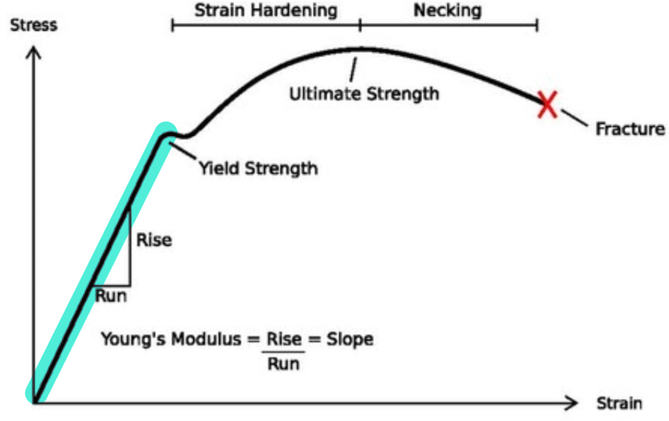
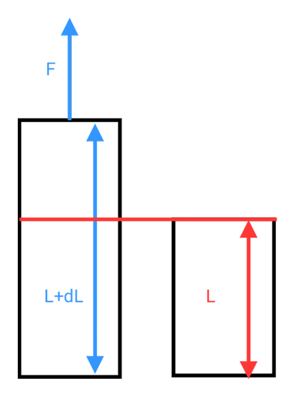
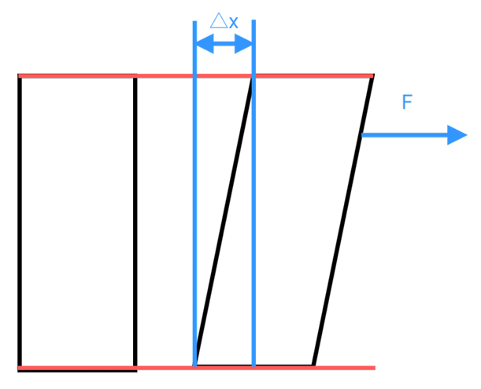
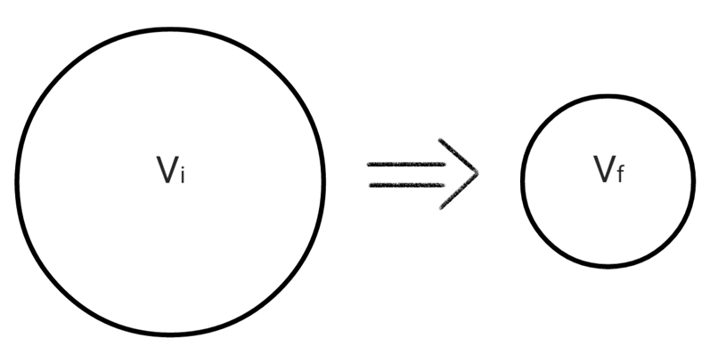

# Elasticity & Balance

## Balance

1. momentum is a constant : The system is not affected by external forces
2. Angular momentum is a constant : The system is not affected by external torque
3. $F_{net} = 0$ : force balance
4. $𝜏_{net} = 0$ : moment balance

## Elasticity

* Strain (unit deformation) : $\frac{\Delta L}{L}$
* Modulus (Ratio of stress to Strain,Is a constant) : $\frac{Stress}{strain}$
* Stress (Deformation force per unit area) : $\frac{F}{A}$

1. Tensile stress and Compressive stress 
2. Shear stress
3. Fluid stress

## Tensile stress & Compressive stress

$$F = kx$$

$E =$ elastic coefficient
$$\frac{F}{A} = E\frac{\Delta L}{L}$$

## Shear stress

$$\frac{F}{A} = G\frac{\Delta \phi}{L}$$

## Fluid stress

$$P = B\frac{\Delta V}{V}$$

* Pressure : $P$
* Bulk modulus : $B$
