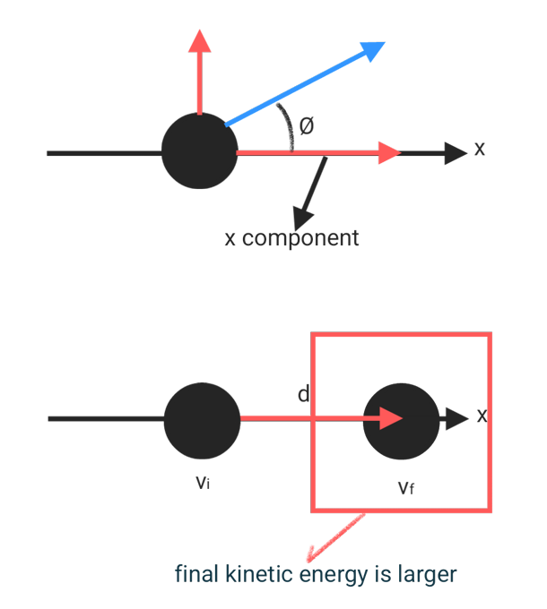
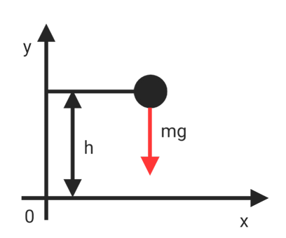
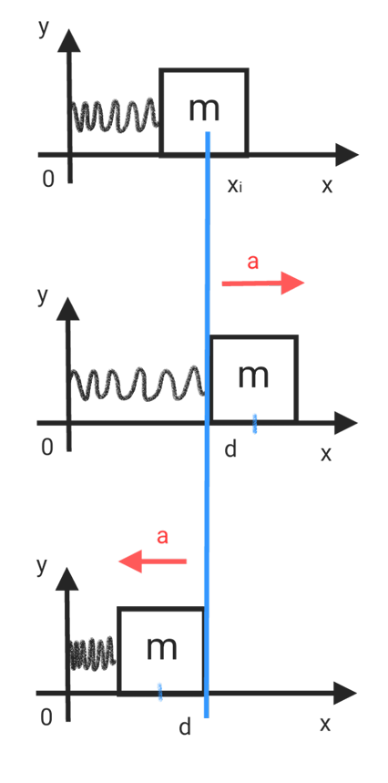
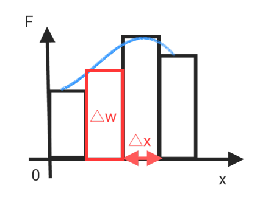
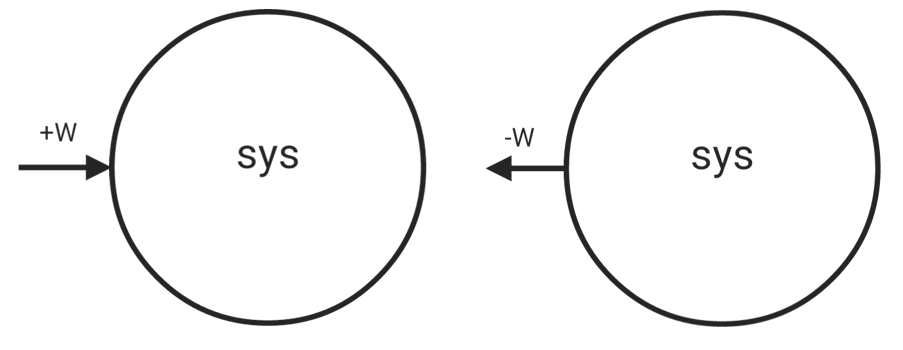
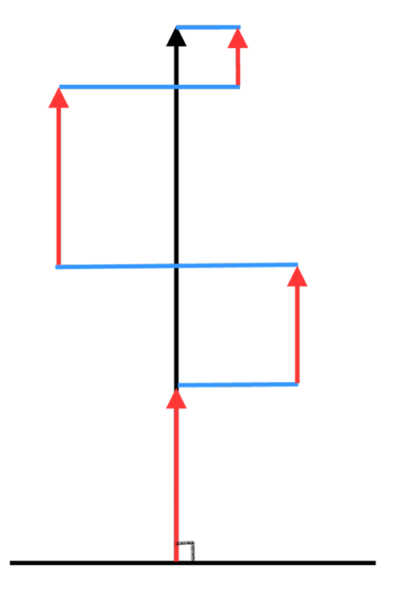
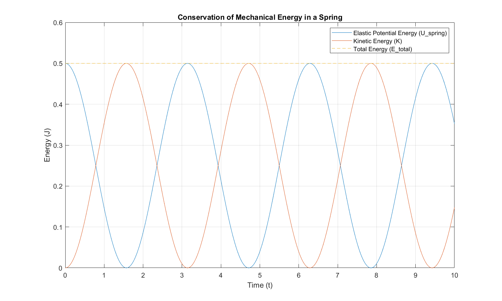

# Kinetic energy & work & potential energy

The work–energy theorem connects the work done on a body to its change in kinetic energy. Conservative forces can also be described through potential energy, simplifying suitable motion problems.

## Kinetic energy conservation

unit : $1 jonle = 1 J =kg^2⋅m^2/s^2$

$$\boxed{K = \frac{1}{2}mv^2}$$

$$ΔK = K_f-K_i$$

$$K_f = K_i+W$$

$$F_xΔx = \frac{1}{2}mv^2-\frac{1}{2}mv_i^2$$

* Useful relation : $v^2 = v_i+2ax$

## Work

$$W = F_xΔx$$

$$W = \vec{F}⋅\vec{x}$$

$$W = Fcos𝜃⋅Δx$$

$$W = ΔE$$

## Gravity work

$$W_g = mg⋅cos𝜃⋅Δx$$

* rise

$$W_g = mg⋅cos(\pi)⋅Δx = -mg⋅Δx$$

$$W_a+W_g = 0$$

$$W_a = W_g$$

* fall

$$W_g = mg⋅cos(0)⋅Δx = -mg⋅Δx$$

$$W_a-W_g = 0$$

$$W_a = -W_g$$

## Elastic work

$$F = kx$$

$$W_s = Σ-ΔFx$$

$$W_s = \int_{x_i}^{x_f}-F_x, dx$$

$$W_s = \int_{x_i}^{x_f}-kx, dx$$

$$W_s = -k\int_{x_i}^{x_f}x, dx$$

$$W_s = -\frac{1}{2}kx^2 \Big|_{x_i}^{x_f} = -\frac{1}{2}kx_f^2 + \frac{1}{2}kx_i^2$$

If $x_i = 0$

$$W_s = U_s = -\frac{1}{2}kx^2$$

$$ΔK = K_f-K_i = U_s$$

## Variables force

$$ΔW = ΔFx$$

$$W = ΣΔW = ΣΔFx$$

$$\vec{F} = F_x\vec{i}+F_y\vec{j}+F_z\vec{k}$$

$$dr = dx\vec{i}+dy\vec{j}+dz\vec{k}$$

$$dW = F⋅dr = F_x⋅dx+F_y⋅dy+F_z⋅dz$$

$$W = \int_{r_i}^{r_f}F, dr$$

$$W = \int_{x_i}^{x_f}F_x, dx+\int_{y_i}^{y_f}F_y, dy+\int_{z_i}^{z_f}F_z, dz$$

$$W = \int_{x_i}^{x_f}F(x), dx = \int_{x_i}^{x_f}ma, dx$$

$$\frac{dv}{dt} = \frac{dV}{dx}\frac{dx}{dt}$$

$$ma⋅dx = m\frac{dv}{dt}⋅dx$$

$$ma⋅dx = m\frac{dv}{dx}\frac{dx}{dt}⋅dx = mVdV$$

$$W = \int_{v_i}^{v_f}mv, dv = \frac{1}{2}m(v_f^2-v_i^2)$$

(y,z) same concept repeat

## Power

Power measures the rate of energy transfer. Use the translational or rotational expression that matches the mechanism.

unit:
$1watt = 1W = 1J/s = 0.738ft⋅1b/s$

$1hp = 55ft⋅1b/s = 746W$

$1kW⋅hr = 10^3W⋅3600s = 3.6⋅10^6J = 3.6MJ$

$$P = \frac{dW}{dt} = Fdx/dt$$

$$\boxed{P = Fv}$$

## Conservation force

$$ΔU = -W$$

* Premise of energy conservation

1. System with multiple object
2. force acting on the particle
3. System configuration for energy transfer
4. recoverable
5. $Wi = Wf$ established and Other energy is potential energy

if the condition always holds the force is conservation force

* $W_{net} = 0$
* close path

## Gravitational potential energy

$$ΔU = \int_{y_i}^{y_f}-mg, dy = mgy\Big|_{y_i}^{y_f}$$

$$ΔU = mg(y_f-y_i) = mgΔy$$

if $y_i = 0$

$$\boxed{U = mgy}$$

## elastic potential energy

$$ΔU = \int_{x_i}^{x_f}-kx, dx = -\frac{1}{2}kx^2\Big|_{y_i}^{y_f}$$

$$ΔU = -\frac{1}{2}k(x_f^2-x_i^2) = Δx$$

if $x_i = 0$

$$\boxed{U = -\frac{1}{2}kx^2}$$

## Law of conservation of mechanical energy

$$E = K+U$$

$$ΔK = W_K$$

$$ΔU = W_U$$

$$ΔK = ΔU$$

$$K_f-K_i = U_f-U_i$$

$$K_i+U_i = K_f+U_f$$

## Potential energy curve

$$ΔU(x) = F(x)Δx$$

$$U(x)+K(x) = E(x)$$

$$K(x) = E(x)-U(x)$$

* Stable equilibrium
The system resists the disturbance and returns to its original position.

* Unstable equilibrium
The system moves further away from its original position after the disturbance.

## External force does work on the system

$$W = ΔK+ΔU$$

$$W = E_{mec}$$

$$F-f_k = ma$$

$$V^2 = v_i^2+2ax$$

$$Fx = \frac{1}{2}mv_f^2-\frac{1}{2}mv_i^2+f_kx$$

$$Fx = ΔK+f_kx$$

$$Fx = E_{mec}+f_kx$$

$$E_{th} = f_kx$$

$$Fx = E_{mec}+E_{th}$$

## Law of conservation of energy

$$W = ΔE_{int}+ΔE_{mec}+ΔE_{th}$$

$$0 = ΔE_{int}+ΔE_{mec}+ΔE_{th}$$

$$ΔE_{mec2} = ΔE_{int}+ΔE_{mec1}+ΔE_{th}$$

$$P_{avg} = ΔE/Δt$$

$$P = dE/dt$$
