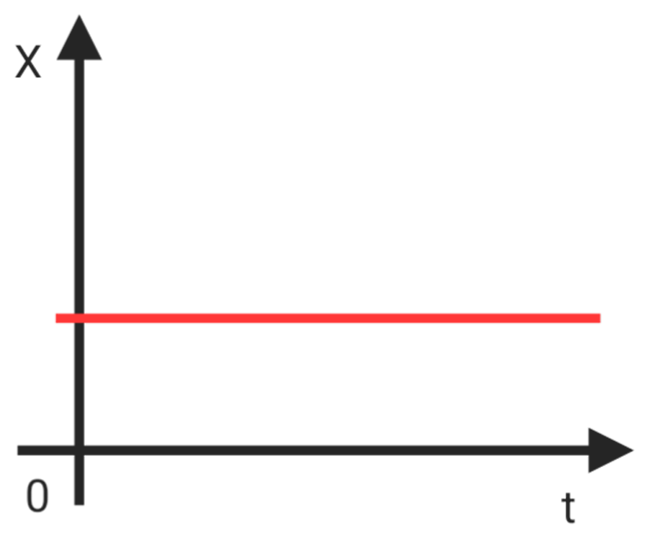
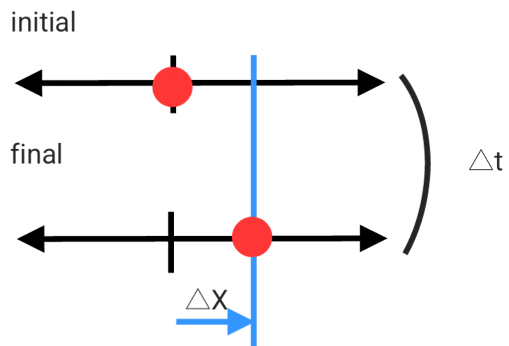
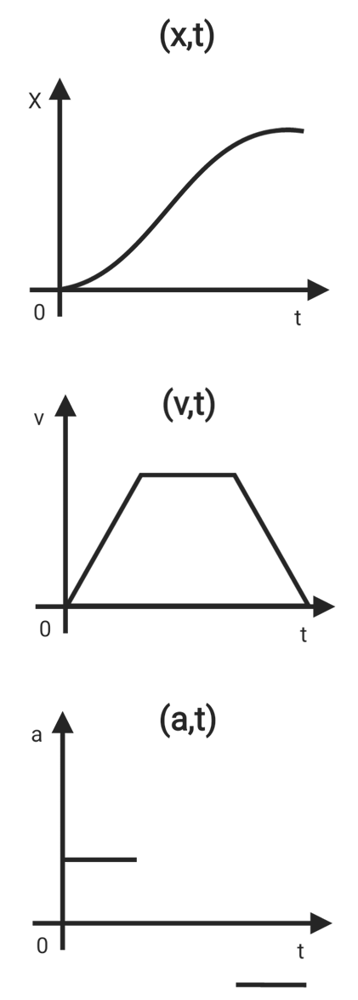

# Linear motion

Straight-line motion is described by position as a function of time. The equations and graphs connect displacement, velocity, and acceleration, including the constant-acceleration case.

## Moving distance

* Stationary or moving

The object moved　: $x_{initial} \not= x_{final}$

The object is not moving : $x_{initial} = x_{final}$

* Displacement  & path

Displacement  : Displacement  is the magnitude (length) of the displacement vector.

Path : Path length is how far the object moved as it traveled from its initial position to its final position.

## Velocity

Velocity is slope of position versus time.

$$v_{avg} = \frac{Δx}{Δt} = \frac{x_f-x_i}{t_f-t_i}$$

$$v = \lim_{Δt \to 0}\frac{Δx}{Δt} = \frac{dx}{dt}$$

* Speed & Velocity
Velocity is a vector but speed is a scalar.

$$\boxed{speed = \frac{path}{time} \qquad velocity = \frac{displacement}{time}}$$

## Acceleration

Acceleration is slope of velocity versus time.

$$a_{avg} = \frac{Δv}{Δt} = \frac{v_f-v_i}{t_f-t_i}$$

$$a = \lim_{Δt \to 0}\frac{Δv}{Δt} = \frac{dv}{dt} = \frac{d^2x}{dt^2}$$

## Relationship between position, velocity and acceleration

* if a is a constant

$$v = v_i+at$$

$$x_f-x_i = v_it+\frac{1}{2}at^2$$

$$v_f^2 = v_i^2+2a(X_f-X_i)$$

$$x_f-x_i = \frac{1}{2}(v_i+v_f)⋅t$$

$$x_f-x_i = v_ft-\frac{1}{2}at^2$$

$$a = \frac{v_f-v_i}{t}$$

* When free falling
$x_i = 0 \qquad v_i = 0 \qquad a = g$

$$x_f = x_i+v_it+\frac{1}{2}at^2 ⇒ h = \frac{1}{2}gt^2$$

## Graph

## Differentiation and Integration

The integral of acceleration with respect to time is velocity.

The integral of velocity with respect to time is position.

$$a = \frac{dv}{dt} \qquad v = ∫adt$$

$$\boxed{v = at+v_i}$$

$$x = \frac{dV}{dt} \qquad x = ∫vdt = ∫(at+v_i)dt$$

$$\boxed{x =  x_i+v_it+\frac{1}{2}at^2}$$

