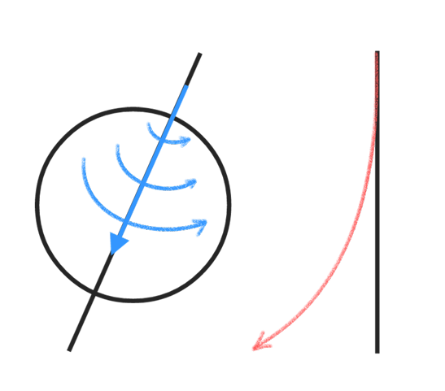
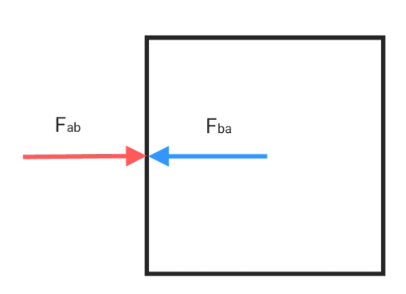

# Newton's laws of motion

Newton's laws connect inertia, acceleration, and interacting forces. Apply them in an inertial frame, or account for the additional terms required in an accelerating frame.

## Newton's first laws of motion

$$\vec{F_{net}} = 0 \qquad Δ\vec{V} = 0\qquad a = 0$$

The inertial coordinate system is based on Newton's first law of motion. However, the Earth is not a true inertial coordinate system due to its rotation and orbit. Therefore, fictitious forces such as the Coriolis force appear in the Earth's reference frame.

## Newton's second laws of motion

$$\boxed{\vec{F_{net}} = m\vec{a}}$$

$$\vec{F_{x}} = m\vec{a_x} \qquad \vec{F_{y}} = m\vec{a_y} \qquad \vec{F_{z}} = m\vec{a_z}$$

* Unit : $N$

$$N = kg⋅m⋅s^2 = \frac{kg⋅m}{s^2}$$

## Newton's third laws of motion

Action force : $F_{ab}$
Reaction force : $F_{ba}$

$$∣F_{ba}∣ = ∣F_{ab}∣ \qquad \vec{F_{ab}} = -\vec{F_{ba}}$$
