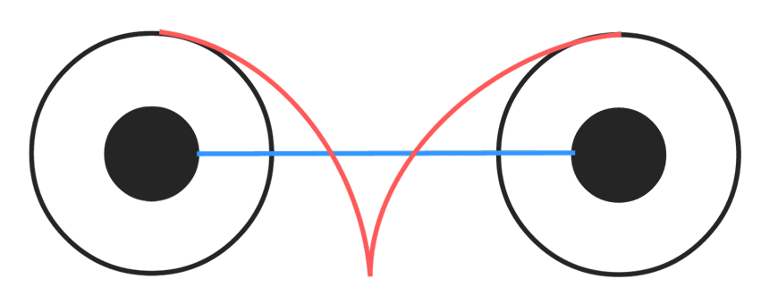
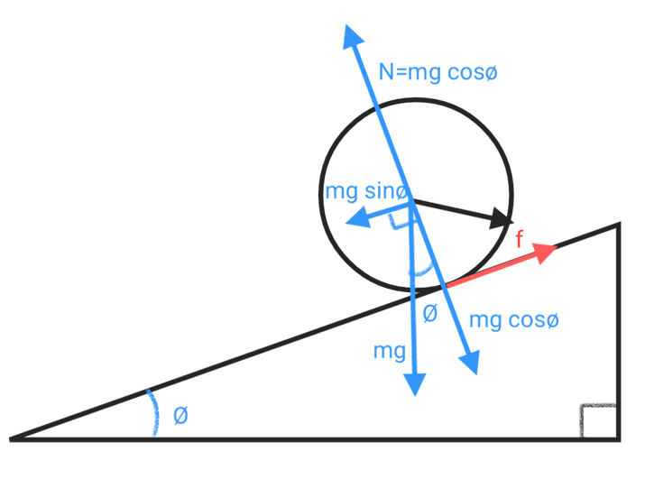
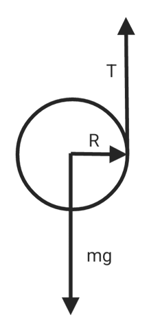
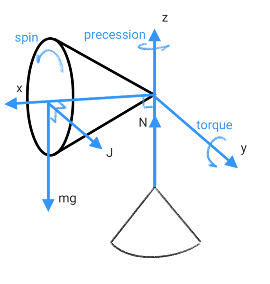
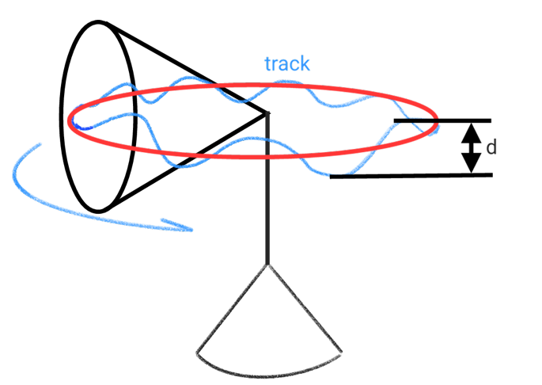

# Roll & Angular Momentum

Rolling combines translation of the center of mass with rotation about it. These notes connect the rolling constraint to angular momentum and introduce precession and nutation.

## Cylinder rolling

* center

$$v_{com} = 𝜔r$$

* vertex

$$v_{top} = 2𝜔r = 2v_{com}$$

* energy

$$\frac{1}{2}mv_{com}^2+\frac{1}{2}I_{com}^2$$

## Down hill rolling

$$f_s = \mu mg\cdot cos\theta$$

$$F_{net} = -f_s+mg\cdot sin\theta$$

$$F_{net} = -\mu mg\cdot cos\theta-mg\cdot sin\theta$$

$$a = g(sin\theta-\mu cos\theta)$$

* rolling moment

$$𝜏 = Fr = f_sr = r\mu mg\cdot cos\theta = I𝛼$$

$$f_s = \frac{Ia}{R^2}$$

$$a = (mg\cdot sin\theta-\frac{Ia}{R^2})/m$$

$$a = g\cdot sin\theta-\frac{Ia}{mR^2}$$

## YO-YO

$$𝜏 = Fr = f_sr = r\mu mg\cdot cos\theta = I𝛼$$

$$f_s = \frac{Ia}{R^2}$$

$$F_{net} = mg-\frac{Ia}{R^2}$$

$$a = F_{net}/m = \frac{Ia}{mR^2}+g$$

## Angular Momentum

$$\vec L = \vec r\times\vec p = m(\vec r\times\vec v)$$

$$L = rmvsin\theta$$

* if $\theta = \frac{\pi}{2}$

$$L = rp = rmv = I𝜔$$

$$𝜏 = \frac{dL}{dt}$$

$$F = \frac{dL}{rdt}$$

## Conservation of angular momentum

Angular momentum remains constant when the resultant external torque about the chosen reference is zero.

$$L_i = L_f$$

$$I_i𝜔_i = I_f𝜔_f$$

## Precession & Nutation

angular velocity of precession : $𝜔_p$

angular velocity of spin : $𝜔_s$

The distance from the center of mass to the axis of rotation : $r$

* Angular velocity of precession

$$𝜔_p = \frac{d\phi}{dt}$$

$$𝜏 = L_s𝜔_p$$

$$𝜏 = mgr\cdot sin\theta$$

$$mgr\cdot sin\theta = I𝜔_s𝜔_p$$

$$𝜔_p = \frac{mgr\cdot sin\theta}{I𝜔_s}$$

$$T_p = 2\pi/𝜔_p = \frac{2\pi I𝜔_s}{mgr\cdot sin\theta} = \frac{4\pi^2 I}{T_s𝜏}$$

* Angular velocity of spin

if $𝜔_p >>$ 0 and $\theta = 90^o$

$$𝜏+L_p𝜔_p = L_s𝜔_p$$

$$𝜏 = L_s𝜔_p-L_p𝜔_p$$

$$mgr= I_s𝜔_s𝜔_p-I_p𝜔_p^2$$

$$𝜔_p = \frac{-I_s𝜔_s\pm\sqrt{(I_s𝜔_s)^2-4I_pmgr}}{2I_p}$$

If precession is stable

$$(I_s𝜔_s)^2-4I_pmgr>0$$

$$𝜔_s>\frac{2\sqrt{I_pmgr}}{I_s}$$

* Angular momentum

$$L_{orb} = mv_{com}r = m𝜔_pr^2$$

$$L_{spin} = I_s𝜔_s+I_p𝜔_p$$

moment of inertia in spin : $I_s$

moment of inertia in Precession : $I_p$

$$L = I_s𝜔_s+I_p𝜔_p+m𝜔_pr^2$$

* Energy

$$E = U+K$$

$$U = mgr\cdot cos\theta$$

$$K = \frac{1}{2}I_s𝜔_s^2+\frac{1}{2}I_p𝜔_p^2+\frac{1}{2}mr^2𝜔_p^2$$

* Nutation

