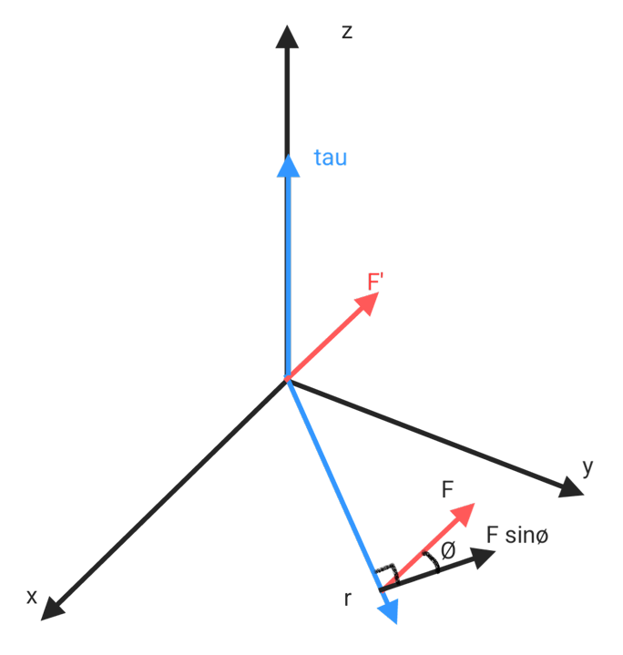

# Rotation

$$\theta = \frac{S}{r}$$

* unit
$1rev = 360^\circ = (2\pi) rad$
$1rad = 57.3^\circ = (0.159)rev$

## Angle

$$\Delta \theta = \theta_f-\theta_i$$

## Angular velocity

$$𝜔_{avg} = \frac{\Delta\theta}{\Delta t}$$

$$𝜔 = \lim_{\Delta t\to0}\frac{\Delta\theta}{\Delta t} = \frac{d\theta}{dt}$$

## Angular acceleration

$$𝛼_{avg} = \frac{\Delta\theta}{\Delta t}$$

$$𝛼 = \lim_{\Delta t\to0}\frac{\Delta𝜔}{\Delta t} = \frac{d𝜔}{dt} = \frac{d^2\theta}{dt^2}$$

## rotational energy

$$K = \frac{1}{2}mv^2$$

$$K = \frac{1}{2}\sum mv^2$$

$$v = r𝜔$$

$$K = \frac{1}{2}(\sum m_ir_i^2)𝜔^2$$

$$I = \sum m_ir_i^2$$

$$K = \frac{1}{2}I𝜔^2$$

## Moment of inertia

$$I = \sum m_ir_i^2$$

$$F = ma$$

$$𝜏 = I𝛼$$

$$Fr = I\frac{a}{r}$$

$$Fr = (mr^2)\frac{a}{r}$$

* moment of inertia of different shapes

>by University of Tennessee Knoxville

## Parallel Axis Theorem

$$K_r = \frac{1}{2}I𝜔^2$$

$$K_r^{\prime} = \frac{1}{2}I_{com}𝜔^2+\frac{1}{2}mv^2$$

$$K_r^{\prime} = \frac{1}{2}(I_{com}𝜔^2+mv^2)$$

$$K_r^{\prime} = \frac{1}{2}(I_{com}𝜔^2+m(𝜔r)^2)$$

$$K_r^{\prime} = \frac{1}{2}(I_{com}𝜔^2+m(𝜔r)^2)$$

$$K_r^{\prime} = \frac{1}{2}𝜔^2(I_{com}+mr^2)$$

$$K_r^{\prime} = \frac{1}{2}𝜔^2I^{\prime}$$

$$I^{\prime} = I_{com}+mr^2$$

## Torque

* $𝜏 = Fr$
$$𝜏 = Frsin(\theta)$$

$$\vec{𝜏} = \vec{r}\times \vec{F} = -\vec{F}\times \vec{r}$$

if $\theta = \frac{\pi}{2}$ , then $𝜏 = Fr$

* $𝜏 = I𝛼$

$$F_𝜏 = ma_𝜏$$

$$F_𝜏r = ma_𝜏r = m𝛼r^2$$

$$𝜏 = I𝛼$$

* $𝜏 = \frac{dL}{dt}$

$$p = mv$$

$$\frac{dp}{dt} = F$$

$$\frac{dpr}{dt} = Fr$$

$$\frac{dL}{dt} = 𝜏$$

## Rotation work

$$\Delta K = K_f-K_i$$

$$\Delta K = W = \frac{1}{2}I𝜔_f^2-\frac{1}{2}I𝜔_i^2$$

$$W = Fs = F(r\theta) = 𝜏\theta$$

$$P = FV = F(𝜔r) = 𝜏𝜔$$

## Formula comparison

* Dynamics

|         Linear          |            rotation            |
|:-----------------------:|:------------------------------:|
|           $x$           |         $\theta = x/r$         |
|   $v = \frac{dx}{dt}$   | $𝜔 = \frac{d\theta}{dt} = v/r$ |
|   $a = \frac{dv}{dt}$   |   $𝛼 = \frac{d𝜔}{dt} = a/r$    |
|        $p = mv$         |         $L = I\omega$          |
|           $m$           |           $I = mr^2$           |
|     $F_{net} = ma$      |      $𝜏_{net} = I𝛼 = Fr$       |
|     $W = \int F dx$     |      $W = \int 𝜏 d\theta$      |
| $K_L = \frac{1}{2}mv^2$ |    $K_r = \frac{1}{2}I𝜔^2$     |
|        $P = Fv$         |            $P = 𝜏𝜔$            |
|     $W = \Delta K$      |         $W = \Delta K$         |

* Kinematics
if $a$ and $𝛼$ is a constant

|             Linear             |            rotation            |
|:------------------------------:|:------------------------------:|
|          $v = v_i+at$          |          $𝜔 = 𝜔_i+𝛼t$          |
| $x = x_i+v_it+\frac{1}{2}at^2$ | $𝜃 = 𝜃_i+\omega_it+\frac{1}{2}𝛼t^2$ |
|   $v^2 = v_i^2+2a(\Delta x)$   |   $𝜔^2 = 𝜔_i^2+2𝛼(\Delta 𝜃)$   |
|   $Δx = \frac{1}{2}(v_i+v)t$   |   $Δ𝜃 = \frac{1}{2}(𝜔_i+𝜔)t$   |

## Circular motion

$$S = r𝜃$$

$$v = \frac{ds}{dt} = \frac{d\theta r}{dt} = r𝜔$$

* Time

$$T = \frac{2\pi r}{v} = \frac{2\pi}{𝜔}$$

* Tangential acceleration

$$a_t = 𝛼r$$

* centripetal acceleration

$$a_c = \frac{v^2}{r} = 𝜔^2r$$
