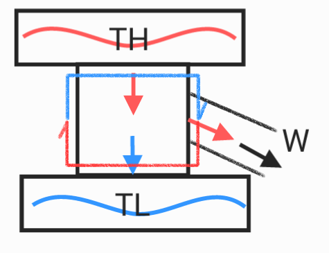
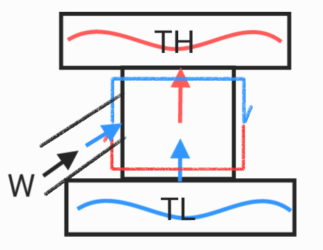

# Entropy & Second Law of Thermodynamics

* **Entropy** : the measure of a system's thermal energy per unit temperature that is unavailable for doing useful work
* Entropy is irreversible

## Entropy change definition

$$S_f-S_i = \Delta S = \int_i^f\frac{dQ}{T}$$

* isotonic

$$\Delta S \simeq \frac{Q}{T_{avg}}$$

## Entropy state function

$$dE_{int} = dQ-dW$$

$$dQ = PdV+nC_VdT$$

$$dQ = nR\frac{dV}{V}+nC_v\frac{dT}{T}$$

$$\int_i^f\frac{dQ}{T} = \int_i^fnR\frac{dV}{V}+\int_i^fnC_V\frac{dT}{T}$$

## Second Law of Thermodynamics

$$\Delta S \ge 0$$

* Endothermic
$$\Delta S_{gas} = \frac{+|Q|}{T}$$
* Exothermic
$$\Delta S_{res} = \frac{-|Q|}{T}$$

## Heat engine

It is a machine that can convert part of the heat provided by the heat source into mechanical energy output.
heat $\Longrightarrow$ work

$$dE_{int} = dQ-dW$$

$$W = |Q_H|-|Q_L|$$

$$\Delta S = \Delta S_H+\Delta S_L = \frac{|Q_H|}{T_H}-\frac{|Q_L|}{T_L}$$

$$\eta = \frac{|W|}{|Q_H|}$$

$$\eta = \frac{|Q_H|-|Q_L|}{|Q_H|} = 1-\frac{|Q_L|}{|Q_H|}$$

$$\eta = 1-\frac{T_L}{T_H}$$

$$\eta_c = 1-\frac{T_L}{T_H}$$

carnot Engine efficiency : $\eta_c$

$$\eta_e \le 1-\frac{T_L}{T_H}$$

Engine efficiency : $\eta_e$

## Heat pump

A machine that uses energy to transfer heat
work $\Longrightarrow$ heat
$$\eta = \frac{|Q_L|}{|W|}$$

$$\eta = \frac{|Q_L|}{|Q_H|-|Q_L|}$$

$$\eta = \frac{|T_L|}{|T_H|-|T_L|}$$

## Entropy statistics

if the probability of microstate is equal

$$W = \frac{N!}{n_1!n_2!}$$

* number of microstates : $W$
* number of particles : $N$
* Number of particles in different states : $n$
eg : Ground state, excited state, plasma state, Solid, liquid, gas
$$S = k\ln W$$

$$S = k\ln W = \int_i^fnR\frac{dV}{V}+\int_i^fnC_V\frac{dT}{T}$$

## Enthalpy & Free Energy

Enthalpy : Represents the total heat content of the system
$$H = E_{int}+PV$$

* Enthalpy : $H$

$$dH = dE_{int}+PdV+VdP$$

The degree to which heat influx increases enthalpy
$$dQ = dE_{int}+PdV$$

$$dQ = dH-VdP$$

$$H = \left(\frac{\partial H}{\partial T}\right)_PdT+\left(\frac{\partial H}{\partial P}\right)_TdP$$

$$dQ = \left(\frac{\partial H}{\partial T}\right)_PdT+\left(\frac{\partial H}{\partial P}-V\right)_TdP$$

$$dQ = C_pn\Delta T $$

$$C_p = \left(\frac{\partial H}{\partial T}\right)_P$$

## Helmholtz Free Energy

The maximum work that a system can do under constant temperature and Isovolumetric condition.

* Helmholtz Free Energy : $F$

$$F = E_{int}-TS$$

$$dF = -PdV-SdT$$

$$P = -\left(\frac{\partial F}{\partial V}\right)_T$$

$$S = -\left(\frac{\partial F}{\partial T}\right)_V$$

## Gibbs Free Energy

The maximum work that a system can do under constant temperature and Constant pressure condition.

* Gibbs Free Energy : $G$

$$G = H-TS  = E_{int}+PV-TS$$

$$dG = VP-SdT$$

$$V = \left(\frac{\partial G}{\partial P}\right)_T$$

$$S = -\left(\frac{\partial G}{\partial T}\right)_P$$

## Maxwell's Equation

* $H = H(S,P)$
* $F = F(T,V)$
* $G = G(T,P)$
* $E_{int} = E_{int}(S,V)$

1. from internal energy:
$dE_{int} = TdS-PdV$
$$\left(\frac{\partial T}{\partial V}\right)_S = -\left(\frac{\partial P}{\partial S}\right)_V$$
2. from enthalpy:
$dH = TdS+VdP$
$$\left(\frac{\partial T}{\partial P}\right)_S = \left(\frac{\partial V}{\partial S}\right)_P$$
3. from Helmholtz free energy:
$dF = -SdT-PdV$
$$\left(\frac{\partial S}{\partial V}\right)_T = \left(\frac{\partial P}{\partial T}\right)_V$$
4. from Gibbs free energy:
$dG = -SdT+VdP$

$$\left(\frac{\partial S}{\partial P}\right)_T = -\left(\frac{\partial V}{\partial T}\right)_P$$

## consider Van der Waals force

$$(P+\frac{a}{V^2})(V-b) = RT$$

* pressure : $P$
* volume : $V$
* temperature : $T$
* Gas constant : $R$
* Van der Waals constant : $a,b$

$$\left(\frac{\partial T}{\partial V}\right)_S = \frac{-a}{C_VV^2}$$
