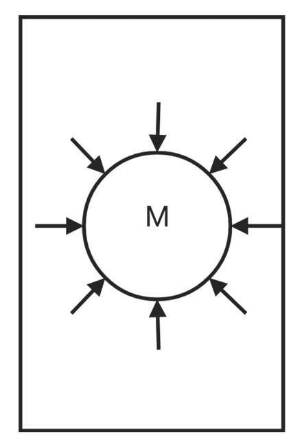
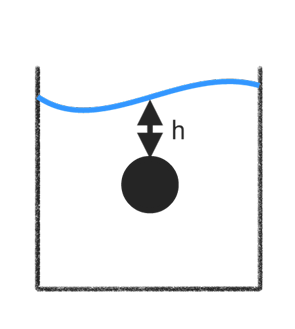
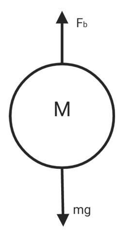
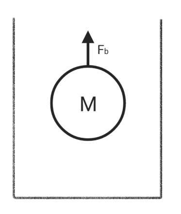

# Fluid

## Density

$$\rho = \frac{M}{V}$$

## Pressure

$$P = \frac{F}{A}$$

$$F_1 = P_1A$$

$$F_2 = P_2A$$

$$P_2A = P_1+\rho Ag(y_1-y_2)$$

$$P_2 = P_1+\rho g(y_1-y_2)$$

$$P_2 = P_1+Dgh$$

$$\Delta P = \rho gh$$

## Communicating vessels

* if $h_1 = h_2$ then $P_1 = P_2$
* $h_{max1} = h_{max2}$

## Pascal

$$\frac{F_i}{A_i} = \frac{F_f}{A_f}$$

$$F_f = F_i\frac{Af}{Ai}$$

$$V = A_id_i = A_fd_f$$

$$W = F_fd_f = (F_i\frac{A_f}{A_i})(d_i\frac{A_i}{A_f}) = F_id_i$$

## Archimedes principle

$$F_b = V\rho$$

* fluid density : $\rho$
* underwater volume : $V$

if $mg > F_b$ , (float)

if $F_b > mg$ , (sink)

if $mg = F_b$ , (submersible)

* float body : $F_b = mg$

$$visualweight = actualweight - buoyancy$$

$$weight_{app} = weight-F_b$$