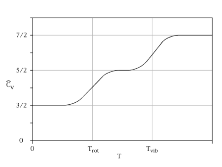

# Kinetic theory of gases

## Mole

$$n = \frac{N}{N_{A}}$$

* number of moles : $n$
* Number of particles : $N$
* Avogadro constant : $N_A = 6.02\times 10^{23}$

$$M = N_Am = \frac{N}{n}m$$
* mass : $m$
* molar mass : $M$
$$N_A = \frac Nn$$

$$m = M\frac{n}{N} = \frac M{N_A}$$
## Ideal gas law
$$PV = nRT$$
* pressure : $P$
* volume : $V$
* number of moles : $n$
* gas constant : $R = 8.31J/mol\cdot K$
* temperature : $T$
$$k = \frac R{N_A} = \frac{8.31J/mol\cdot K}{6.02\times 10^{23}mol^{-1}} = 1.3\times 10^{-23}J/K$$

Boltzmann constant : $k$

$$PV = NkT$$

$$P = \frac{nRT}{V}$$
## Ideal gas work
$$W = \int_{V_i}^{V_f}PdV = \int_{V_i}^{V_f}\frac{nRT}{V}dV$$

$$= nRT\int_{V_i}^{V_f}\frac{dV}{V}$$

$$= nRT(ln(V_df)-ln(V_i))$$

$$= nRT\cdot ln(\frac{V_f}{V_i})$$
## Root mean square speed
Gas can move in all directions
1. Left ($x_+$)
1. Right ($x_-$)
1. Front($y_+$)
1. back($y_-$) 
1. up($z_+$)
1. down($z_-$)

Assume $x_+ = x_- = y_+ = y_- = z_+ = z_-$

$$v_{x_+} = \frac {x_+}t = v$$

Because of different particles, $v_+$ &$v_-$ cannot be added together.

$$p_x = mv_x = m\frac xt$$

$$F_x = \frac{dp_x}{dt} = \frac{mx}{t^2} = \frac{mv_x^2}{x}$$

* momentum of x : $p_x$

$$v_x^2 = v_{x_+}^2+v_{x_-}^2 = 2v^2$$

Use $v^2$ to prevent directional issues

$$F_x = \frac{2mv^2}{x}$$

Assume $F_x = F_y = F_z$

$$F = F_x+F_y+F_z$$

$$F_x = F_y = F_z = \frac13F$$

$$F = \frac13\frac{2mv^2}{x}+\frac13\frac{2mv^2}{y}+\frac13\frac{2mv^2}{z}$$

assume that the volume is symmetrical about its three dimensions. 

$$x = y = z = L$$

* length : $L$

$$F = \frac{2mv^2}{L}$$

$$P = N\frac F{A_{xyz}} = \frac{2mv^2}{L}\frac N{A_{xyz}}$$

* pressure : $P$
* Number of particles : $N$
* Surface area of $xyz$ : $A_{xyz}$

$$A_{xyz} = 2xy+2yz+2xz = 6L^2$$

let $L^2 = A$ , then $A_{xyz} = 6A$

$$P = N\frac F{6A} = \frac{2mv^2}{L}\frac N{6A}$$

$$P = \frac{mv^2}{L}\frac N{3A}$$

$$V = LA$$

$$PV = \frac N3mv^2$$

$$PV = NkT$$

$$NkT = \frac N3mv^2$$

$$kT = \frac m3v^2$$

$$\frac{3kT}{m} = v^2$$

$$\sqrt{\frac{3kT}{m}} = v$$

$$PV = NkT = nRT$$

$$\frac Nn = \frac{RT}{kT} = M$$

* molar mass : $M$

$$v_{rms} = \sqrt{\frac{3RT}{M}}$$

* Root mean square velocity : $v_{rms}$
## gas kinetic energy
$$K = \frac12mv^2$$

* kinetic energy : $K$

$$v_{avg}^2 = \frac{3kT}{m}$$

$$K = N\frac12m\frac{3kT}{m}$$
* number of particles : $N$
$$K = \frac{3N}2kT$$

## mean free path
mean free path is the average distance over which a moving particle travels before substantially changing its direction.

$$\lambda = \frac{\text {path length}}{\text {number of collisions}}$$

$$\lambda = \frac lN$$

* mean free path : $\lambda$
* There are as many collisions as there are particles $N$.

$$N = V\frac NV$$

$$v_{1}\Delta t = l$$

* path length : $l$
* The velocity of particle 1 : $v_1$

When the two particles collide, the distance between them is $r+r = 2r = d$

$$A = \pi d^2$$

$$V = Av_{rel}\Delta t$$

* relative velocity : $v_{rel}$

$$V = Av_{rel}\Delta t = \pi d^2v_{rel}\Delta t$$

assume $|v_1| = |v_2| = |v_{rms}|$

$$(\vec v_1-\vec v_2)^2 = \vec v_1^2+\vec v_2^2-2\vec v_1\cdot \vec v_2$$

In equilibrium $v_1$ & $v_2$ are uncorrelated,v_{rms} therefore assume $\vec v_1\cdot \vec v_2 \simeq 0$

$$(\vec v_1-\vec v_2)^2 \simeq \vec v_1^2+\vec v_2^2 = 2(v_{rms}^2)$$

$$v_{rel}^2 \simeq (v_1-v_2)^2 = 2(v_{rms}^2)$$

$$v_{rel} \simeq \sqrt{2(v_{rms}^2)} = \sqrt2v_{rms}$$

$$V =  \pi d^2\sqrt2v_{rms}\Delta t$$

$$\lambda = \frac {v_{1}\Delta t}{N\frac VN} = \frac {v_{rms}\Delta t}{V\frac NV}$$

$$\lambda = \frac {v_{rms}\Delta t}{\pi d^2\sqrt2v_{rms}\Delta t\frac NV} = \frac {1}{\pi d^2\sqrt2\frac NV}$$

$$PV = NkT$$

$$N/V = P/kT$$

$$N = (P/kT)V$$

$$\lambda = \frac {V}{\pi d^2\sqrt2N} = \frac {V}{\pi d^2\sqrt2(P/kT)V}$$

$$\lambda = \frac {1}{\pi d^2\sqrt2(P/kT)} = \frac {kT}{\sqrt2\pi d^2P}$$
## [Maxwell–Boltzmann distribution](../../../Special/Maxwell-Boltzmann_distribution.md)

* Maxwell–Boltzmann distribution is a Probability density function (PDF).
$$f(v) = (\frac{m}{2\pi kT})^{\frac{3}{2}}4\pi v^2e^{(-mv^2/2kT)}$$

### Most probable speed (by Maxwell–Boltzmann distribution)
The maximum value occurs when the slope is 0
$$\frac{df(v)}{dv} = 0$$

$$((\frac{m}{2\pi kT})^{\frac{3}{2}}4\pi)\frac{d v^2e^{(-mv^2/2kT)}}{dv} = 0$$

$$\frac{d v^2e^{(-mv^2/2kT)}}{dv} = 0$$

let $-mv^2/2kT = u$

$$\frac{du}{dv} = \frac{-mv}{kT} = $$

$$\frac{d v^2e^{u}}{dv} = 2ve^{u}+v^2e^{u}u' = 0$$

$$2ve^{u}+v^2e^{u}\frac{-mv}{kT} = e^{u}v(2+\frac{-mv^2}{kT}) =0$$

$$2+\frac{-mv^2}{kT} = 0$$

$$2 = \frac{mv^2}{kT}$$

$$v^2 = \frac{2kT}{m}$$

$$v_{p} = \sqrt{\frac{2kT}{m}}$$

$$PV = NkT = nRT$$

$$\frac Nn = \frac{RT}{kT} = M$$

* molar mass : $M$

$$v_{rms} = \sqrt{\frac{2RT}{M}}$$
### Average speed (by Maxwell–Boltzmann distribution)
$$v_{avg} = \sum_{i=1}^{n} v_i \cdot P_i$$

* Probability : $P$

$$ P(a \leq v \leq b) = \int_a^b f(v) \, dv $$

$$v_{avg} = \int_0^\infty vf(v)dv$$

$$v_{avg} = \int_0^\infty v(\frac{m}{2\pi kT})^{3/2}4\pi v^2e^{(-mv^2/2kT)} dv$$

$$v_{avg} = (\frac{m}{2 \pi kT})^{3/2}4\pi\int_0^\infty v^3e^{(-mv^2/2kT)}dv$$

let $u = \frac{mv^2}{2kT}$ then $v = \sqrt{\frac{2kT}{m}u}$

$$dv = \frac{d}{du}\sqrt{\frac{2kT}{m}}(\sqrt{u})du = \sqrt{\frac{2kT}{m}}(\frac{1}{2\sqrt{u}})du$$

$$dv = \sqrt{\frac{kT}{2m}}(\frac{1}{\sqrt{u}})du$$

$$v_{avg} = (\frac{m}{2 \pi kT})^{3/2}4\pi\int_0^\infty (\sqrt{\frac{2kT}{m}u})^3e^{(-u)}\sqrt{\frac{kT}{2m}}(\frac{1}{\sqrt{u}})du$$

$$v_{avg} = (\frac{m}{2 \pi kT})^{3/2}4\pi(\frac{2kT}{m})^{3/2}(\frac{kT}{2m})^{1/2}\int_0^\infty(u)^{3/2}e^{(-u)}(\frac{1}{\sqrt{u}})du$$

$$\int_0^\infty(u)^{3/2}e^{(-u)}(\frac{1}{\sqrt{u}})du = \int_0^\infty ue^{(-u)}du$$

* by Gamma function $(\Gamma)$ , $\Gamma(n) = \int_0^\infty t^{n-1} e^{-t}  dt = (n-1)!$

$$v_{avg} = (\frac{8kT}{m\pi})^{1/2}\times\Gamma(2)$$

$$v_{avg} = (\frac{8kT}{m\pi})^{1/2}\times1!$$

$$v_{avg} = \sqrt{\frac{8RT}{\pi m}}$$

$$PV = NkT = nRT$$

$$\frac Nn = \frac{RT}{kT} = M$$

* molar mass : $M$

$$v_{rms} = \sqrt{\frac{8RT}{\pi M}}$$
###  Root mean square speed(by Maxwell–Boltzmann distribution)

$$v_{rms} = \sqrt{v^2} = (\int_0^\infty v^2f(v)dv)^{1/2}$$

$$v_{rms}^2 = \int_0^\infty v^2(\frac{m}{2\pi kT})^{3/2}4\pi v^2e^{(-mv^2/2kT)} dv$$

$$v_{rms}^2 = (\frac{m}{2\pi kT})^{3/2}4\pi \int_0^\infty v^4e^{(-mv^2/2kT)} dv$$

let $u = \frac{mv^2}{2kT}$ then $v = \sqrt{\frac{2kT}{m}u}$

$$dv = \sqrt{\frac{kT}{2m}}(\frac{1}{\sqrt{u}})du$$

$$v_{rms}^2 = (\frac{m}{2\pi kT})^{3/2}4\pi \int_0^\infty (\frac{2kT}{m})^2u^2e^{-u} \sqrt{\frac{kT}{2m}}u^{-1/2}du$$

$$v_{rms}^2 = (\frac{m}{2\pi kT})^{3/2}4\pi\sqrt{\frac{kT}{2m}}(\frac{2kT}{m})^2 \int_0^\infty u^{3/2}e^{-u}du$$

$$v_{rms}^2 = \pi^{-3/2}\pi(\frac{kT}{m})^{-3/2}(\frac{kT}{m})^{1/2}(\frac{kT}{m})^22^22^{1/2}2^{-3/2}2^2 \int_0^\infty u^{3/2}e^{-u}du$$

$$v_{rms}^2 = \pi^{(-3/2+1)}(\frac{kT}{m})^{(-3/2+1/2+2)}2^{(2-1/2-3/2+2)}\int_0^\infty u^{3/2}e^{-u}du$$

$$v_{rms}^2 = \pi^{-1/2}(\frac{kT}{m})2^2\int_0^\infty u^{3/2}e^{-u}du$$

* by Gamma function $(\Gamma)$ , $\Gamma(n) = \int_0^\infty t^{n-1} e^{-t}  dt = (n-1)!$

$$v_{rms}^2 = \pi^{-1/2}(\frac{kT}{m})2^2\Gamma(\frac52)$$

* by Gamma function $(\Gamma)$ , $\Gamma(n+1) =n\Gamma(n)$

$$\Gamma(\frac52) = \frac32\Gamma(\frac32)$$

$$\Gamma(\frac32) = \frac12\Gamma(\frac12)$$

* by Gamma function $(\Gamma)$ , $\Gamma(\frac12) = \sqrt{\pi}$

$$\Gamma(\frac52) = \frac32\frac12\sqrt{\pi} = \frac34\sqrt{\pi}$$

$$v_{rms}^2 = \pi^{-1/2}(\frac{kT}{m})2^2\frac34\sqrt{\pi}$$

$$v_{rms}^2 = \frac{3kT}{m}$$

$$v_{rms} = \sqrt{\frac{3kT}{m}}$$

$$PV = NkT = nRT$$

$$\frac Nn = \frac{RT}{kT} = M$$

* molar mass : $M$

$$v_{rms} = \sqrt{\frac{3RT}{M}}$$
## Ideal gas specific heat (monatomic ideal gas)
**Isochoric Process** : the volume of the system remains constant. so $\Delta V = 0$ and $E_{int} = Q$ 
$$PV = NkT$$

$$E_{int} = K = \frac32NkT = \frac12Nmv^2$$

* change in internal energy : $E_{int}$
* kinetic energy : $K$

$$PV = \frac23K = \frac{Nmv^2}{3}$$

$$E_{int} = K = \frac32NkT = \frac32nRT = \frac32PV$$

$$\Delta E_{int} = Q = C_Vn\Delta T$$

* The Specific heat capacity at constant volume : $C_V$

$$\Delta E_{int} = C_Vn\Delta T = \frac{3}{2}Nk\Delta T $$

$$C_V = \frac{3}{2}\frac{Nk}{n}$$

* because of $Nk = nR$

$$C_V = \frac{3Nk}{n2} = \frac{3}{2}R$$
**Adiabatic Process** : No heat is exchanged with the surroundings. so $PV = NkT$ is a constant.
$$ \Delta E_{int} = Q - W $$

First Laws of Thermodynamics : $Q = \Delta E_{int} + P \Delta V$

$$ Q = \Delta E_{int} + P \Delta V = \frac{3}{2} n R \Delta T + n R \Delta T $$

$$C_pn\Delta T = \frac{3}{2}nR\Delta T+n R \Delta T$$

$$C_P = \frac{5}{2}R$$

$$C_P = C_V+R$$
## Degrees of freedom and molar heat capacity

|  Molecule  |      Gas      | Movement | Rotation | Degrees of Freedom($f$) |
|:----------:|:-------------:|:--------:|:--------:|:-----------------------:|
| monatomic  |  $\text{He}$  |    3     |    0     |          3           |
|  diatomic  | $\text{O}_2$  |    3     |    2     |          5           |
| polyatomic | $\text{CH}_4$ |    3     |    3     |          6 $+f_v$           |

Vibration Degrees of freedom ($f_v$) (Polyatomic molecules)
Nonlinear Molecules : $f_v = 3N-6$
Linear molecules : $f_v = 3N-5$

$$C_V = \frac{f}{2}R$$

$$C_P = C_V+R$$

$$C_P = \frac{f}{2}R+R$$

## Temperature vs Degrees of Freedom

## Ideal gas adiabatic expansion

$$PV^{\gamma} = \text{constant}$$

$$\frac{nRT}{V}V^{\gamma} = \text{constant}$$

* $n\ \And\ R$ are constant

$$TV^{\gamma-1} = \text{constant}$$