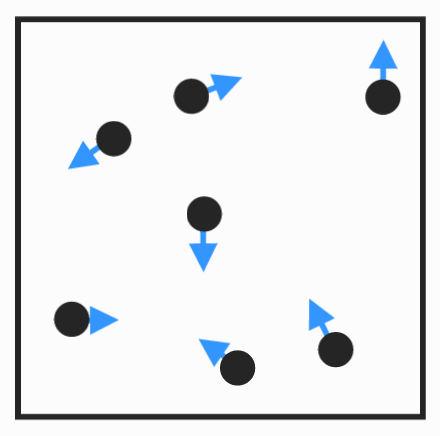

# What is statistical mechanics ?

Statistical Mechanics is a branch of physics that uses statistical methods to study the microscopic properties of matter. It links the behavior of microscopic particles with macroscopic physical properties, thereby understanding and predicting the properties and evolution of matter.
## concept
#### 1. Microscopic and Macroscopic
* Microscopic : Consists of the movement and interaction of a large number of particles.
* Macroscopic : The overall properties of matter are determined by the statistical behavior of microscopic particles.
#### 2. **statistics**
Statistical mechanics does not directly study the motion of individual particles, but rather the statistical behavior of large numbers of particles.
#### 3. **Phase Space**
The state of each particle is determined by its position and momentum. The state of the entire system can be viewed as a point in a multidimensional phase space.
#### 4. Distribution Function
* Maxwell-Boltzmann distribution
* Fermi-Dirac distribution
* Bose-Einstein distribution
## application
* **Fundamentals of Thermodynamics** : Explain internal energy, entropy, etc.
* **Condensed matter physics** : the study of the properties of solids, liquids, and gases
* **Chemical equilibrium and reaction kinetics** : Explain the distribution and transformation of energy during chemical reactions.
* **Cosmology and Astrophysics** : Describing the statistical properties of galaxies, black holes, and the early universe.
## significance
Statistical mechanics seeks macroscopic laws from microscopic complexity and uses mathematics to describe statistical phenomena.