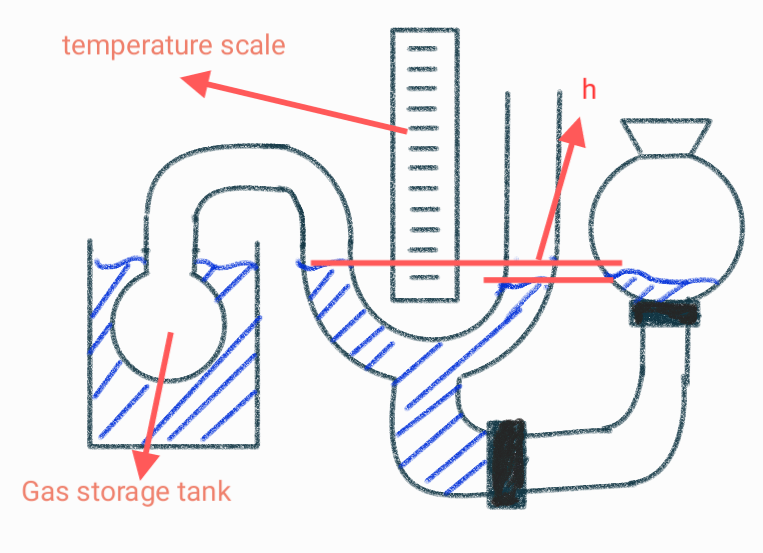
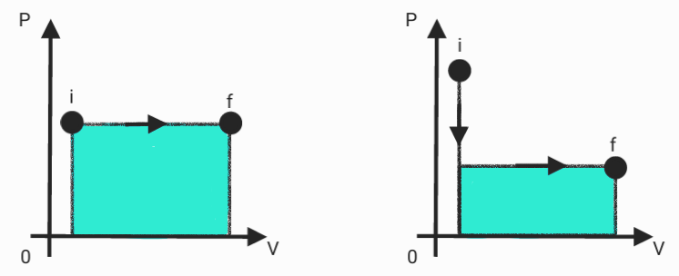
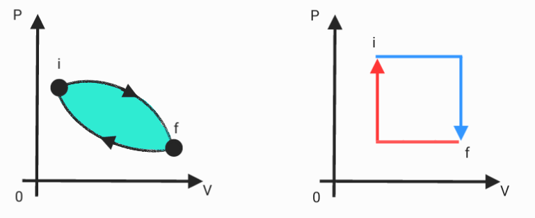
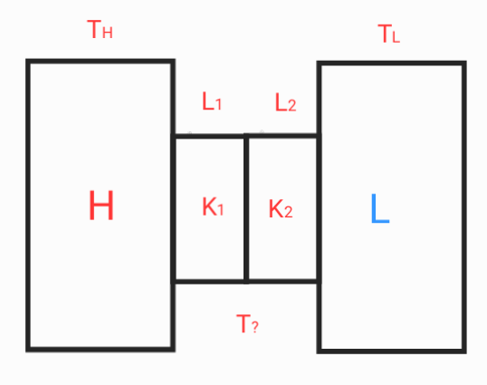
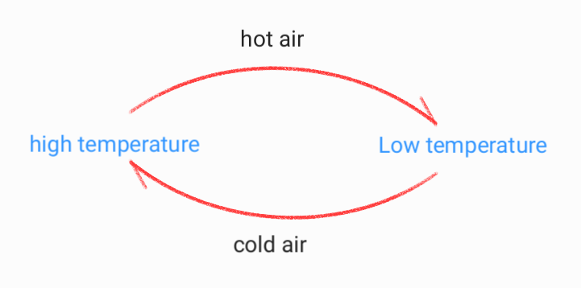

# Zeroth & First Laws of Thermodynamics

## The Zeroth Laws of Thermodynamics

Any object has a property called temperature.  When two objects reach thermal equilibrium, we say that the temperature is equal.

## Triple point

* the temperature at which the triple point of water (solid, liquid, gas) coexists : $T3$

$T3=273.16K$ (extrapolation method)
$$T = CP$$

* barometric pressure : $P$

$$P = P_0-\rho gh$$

$$T_3 = Cp_3$$

$$T = T_3(\frac{P}{P_3})$$

## Ideal temperature

The temperature measured by continuously reducing the air pressure approximates the ideal temperature.

## Conversion of temperature 

$$F = \frac95C+32$$

$$K = 273.15+C$$

$$K = (F-32)(\frac59)+273.15$$

## Thermal expansion

**linear**
$$\alpha_L = \frac{1}{L}\frac{dL}{dT}$$

$$\Delta L = L\alpha_L\Delta T$$

* linear thermal expansion : $\alpha_{L}$
* length : ${L}$
* change in length : ${\Delta L}$
* change in temperature : ${\Delta T}$

**volumetric**
$$\alpha_V = \frac{1}{V}\frac{dV}{dT}$$
$$\Delta V = V\alpha_V\Delta T$$

* volumetric thermal expansion : $\alpha_{V}$
* volume : ${V}$
* change in volume : ${\Delta V}$

$$\alpha_{V} \simeq 3\alpha_{L}$$

## Heat capacity &Specific heat

$$C = \lim_{\Delta T \to 0}\frac{\Delta Q}{\Delta T}$$

$$Q = C\Delta T$$

* Heat capacity : $C$
* change in Heat Energy : $\Delta 𝑄$
* change in temperature : ${\Delta T}$

$$C = c\cdot m$$

$$Q = cm\Delta T$$

* Specific heat : $c$

## First Laws of Thermodynamics

$$W = \int Fdx = \int P dV$$

$$dW = F(dx) = PA(dx) = P(dV)$$

$$\Delta E_{int} = Q - W $$

* change in internal energy : $\Delta E_{int}$
* heat added : $Q$
* work done by the system : $W$

## A special case of the first law of thermodynamics

1. **Adiabatic Process**

No heat is exchanged with the surroundings.

$$P V^\gamma = C$$

* constant : $C$
$$\gamma = \frac{C_P}{C_V}$$
* The Specific heat capacity at constant pressure : $C_P$
* The Specific heat capacity at constant volume : $C_V$
* adiabatic index : $\gamma$

$$Q = C_Vn\Delta T$$
$$Q = C_Pn\Delta T$$

* The number of moles of gas : $n$

2. **Isochoric Process**

the volume of the system remains constant.

$$W = P \Delta V$$

$$\Delta V = 0 \qquad W = 0$$

$$Q = \Delta E_{int}$$

3. **Cyclic Process**

return a system to its initial state in a cycle.

$$\oint dE_{int} = 0$$

$$\oint dQ = \oint dW$$

where the integral is over the complete cycle

4. **Free Expansion**

An irreversible process in which a gas expands into an evacuated space without doing work, without any heat exchange and no change in internal energy.

$$\Delta E_{int} = 0$$

$$Q = 0 \qquad W = 0$$

## Heat transfer rate

$$P = \dot{Q} = \frac Qt$$

1. **Heat Conduction**

$$P_{cond} = KA\frac{T_H-T_L}{L}$$

* thermal conductivity : $K$
* distance between the two isothermal planes : $L$
* area of the surface : $A$
* temperature : $T$
$$K =\frac{P_{cond} L}{A \Delta T}$$

2. **convection**

$$ P_{conv} = hA\Delta T $$

* heat transfer coefficient : $h$
* difference in temperature between a solid surface and surrounding fluid : $\Delta T$
* area of the surface : $A$
$$h = \frac {P_{conv}}{A\Delta T}$$

3. **radiation**

$$P_{rad} = \sigma\varepsilon AT^4$$

* The Stefan-Boltzmann Constant : $\sigma$
* emissivity coefficient of the object "(1) for a black body" : $\varepsilon$
* area of the surface : $A$
* temperature : $T$