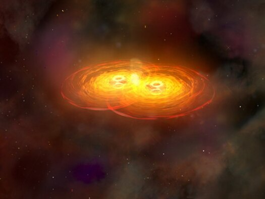

# Black hole thermodynamics

This conceptual overview draws parallels between black-hole properties and thermodynamic laws. Pay attention to the unit conventions when interpreting the displayed relations.

## Black hole

## The zeroth law

The horizon has constant surface gravity for a stationary black hole.

## The first law

$$E = mc^2$$

$$\boxed{dE = \frac{\kappa}{8\pi}dA+\Omega dJ+\Phi dQ = T_HdS_{BH}+\Omega dJ}$$

* energy : $E$
* surface gravity : $\kappa$
* horizon area : $A$
* black hole angular velocity : $\Omega$
* black hole angular momentum : $J$
* black hole electrostatic potential : $\Phi$
* electric charge : $Q$

$$dW = \Omega dJ$$

* work : $W$

$$S_{BH} = \frac{kA}{4l_p^2}$$

* Planck length : $l_p = \sqrt{G\bar h/c^3}$
* Boltzmann constant : $k$

## The second law

$$\frac{dA}{dt}$$

* the horizon area : $A$

## The third law

$$\kappa \not= 0$$

* surface gravity : $\kappa$
